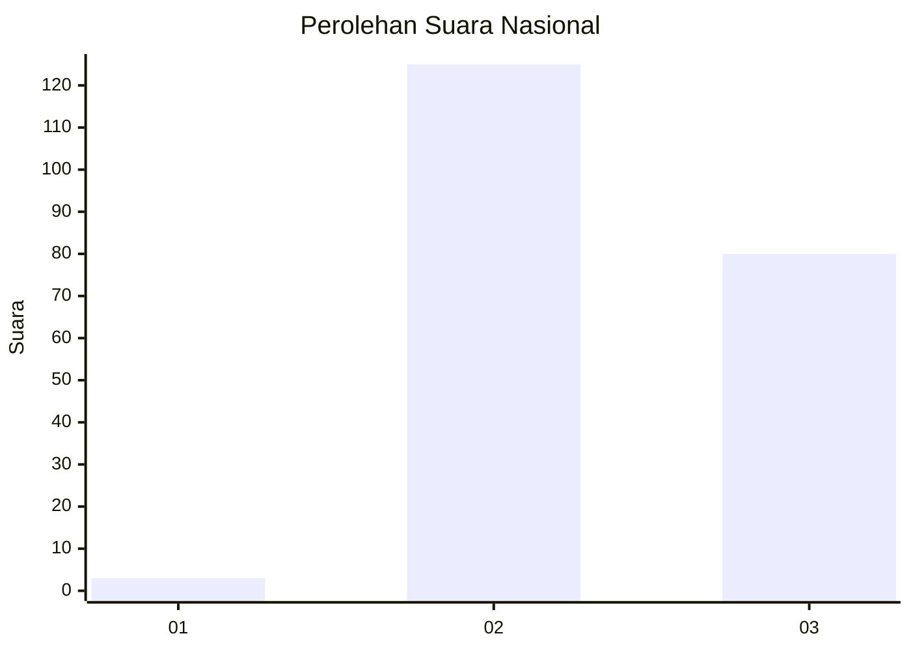
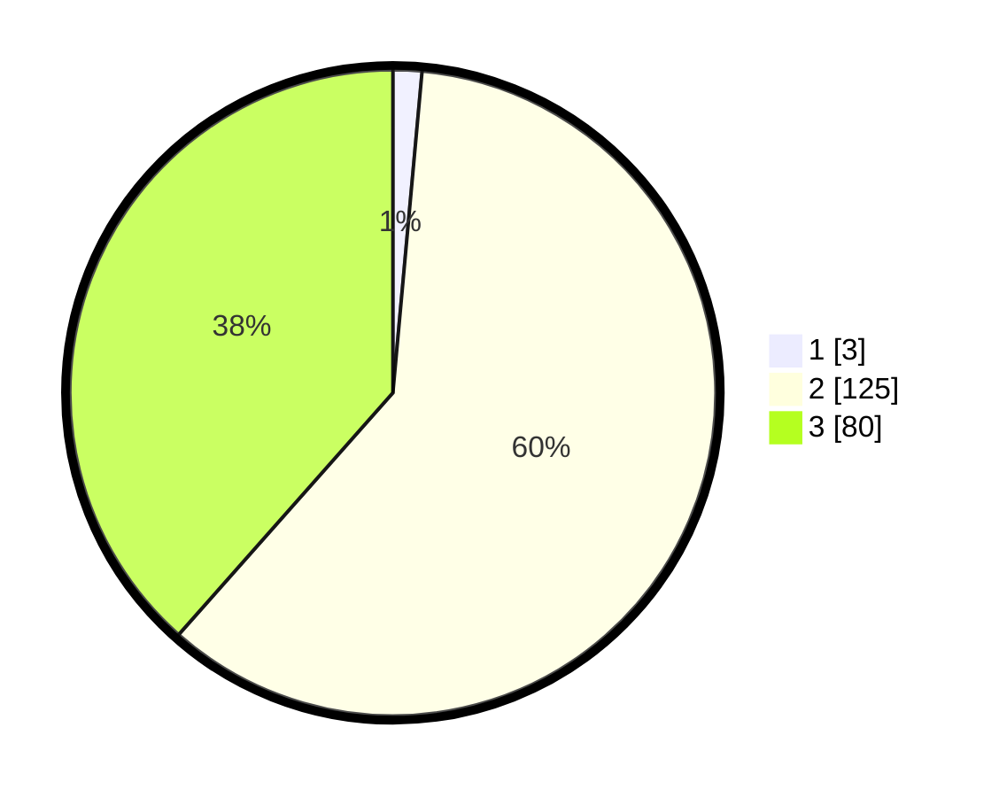

# Hasil

## Grafik

## Tabel

| No. | Nama Paslon    | Suara | Suara (raw) | Persentase |
|:--- |:-------------- | -----:| -----------:| ----------:|
| 1   | ANIES MUHAIMIN | 3     | [3][p-1]    | 1,44       |
| 2   | PRABOWO GIBRAN | 125   | [125][p-2]  | 60,10      |
| 3   | GANJAR MAHFUD  | 80    | [80][p-3]   | 38,46      |

[p-1]: https://github.com/gigit-pemilu/pemilu-2024/blob/main/pilpres/hitung-suara/sub/51-bali/sub/08-buleleng/sub/02-seririt/sub/2001-unggahan/sub/007-tps/sub/paslon-1.txt
[p-2]: https://github.com/gigit-pemilu/pemilu-2024/blob/main/pilpres/hitung-suara/sub/51-bali/sub/08-buleleng/sub/02-seririt/sub/2001-unggahan/sub/007-tps/sub/paslon-2.txt
[p-3]: https://github.com/gigit-pemilu/pemilu-2024/blob/main/pilpres/hitung-suara/sub/51-bali/sub/08-buleleng/sub/02-seririt/sub/2001-unggahan/sub/007-tps/sub/paslon-3.txt

## Foto C Plano

https://sirekap-obj-formc.kpu.go.id/e49b/pemilu/ppwp/51/08/02/20/01/5108022001007-20240214-220921--91028cc4-b527-48b4-89bc-3d5551073f58.jpg

https://sirekap-obj-formc.kpu.go.id/e49b/pemilu/ppwp/51/08/02/20/01/5108022001007-20240214-221247--5f0c8b00-71dd-42b3-8b69-34dc87a5f764.jpg

https://sirekap-obj-formc.kpu.go.id/e49b/pemilu/ppwp/51/08/02/20/01/5108022001007-20240214-221537--070df0f5-6113-4da9-a236-50edf7d271e4.jpg

## Metadata

| Key        | Value               |
| ---------- | ------------------- |
| Time Stamp | 2024-02-24 22:31:28 |

