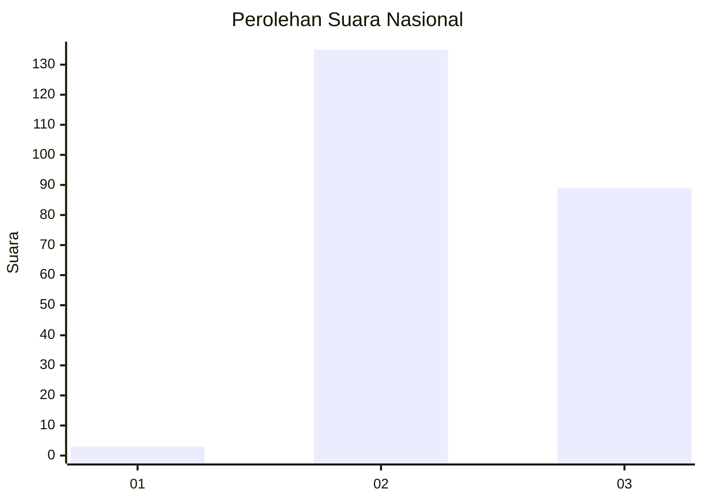
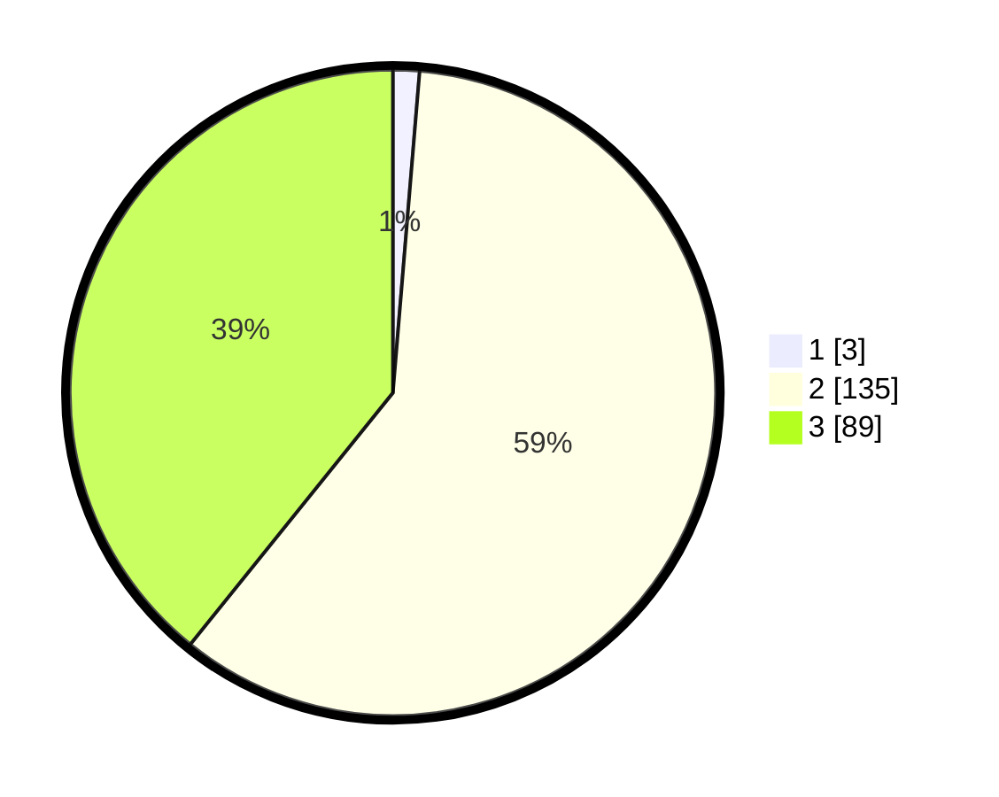

# Hasil

## Grafik

## Tabel

| No. | Nama Paslon    | Suara | Suara (raw) | Persentase |
|:--- |:-------------- | -----:| -----------:| ----------:|
| 1   | ANIES MUHAIMIN | 3     | [3][p-1]    | 1,32       |
| 2   | PRABOWO GIBRAN | 135   | [135][p-2]  | 59,47      |
| 3   | GANJAR MAHFUD  | 89    | [89][p-3]   | 39,21      |

[p-1]: https://github.com/gigit-pemilu/pemilu-2024/blob/main/pilpres/hitung-suara/sub/51-bali/sub/08-buleleng/sub/02-seririt/sub/2001-unggahan/sub/009-tps/sub/paslon-1.txt
[p-2]: https://github.com/gigit-pemilu/pemilu-2024/blob/main/pilpres/hitung-suara/sub/51-bali/sub/08-buleleng/sub/02-seririt/sub/2001-unggahan/sub/009-tps/sub/paslon-2.txt
[p-3]: https://github.com/gigit-pemilu/pemilu-2024/blob/main/pilpres/hitung-suara/sub/51-bali/sub/08-buleleng/sub/02-seririt/sub/2001-unggahan/sub/009-tps/sub/paslon-3.txt

## Foto C Plano

https://sirekap-obj-formc.kpu.go.id/90b4/pemilu/ppwp/51/08/02/20/01/5108022001009-20240214-220803--c66d7098-6516-4c1c-a299-de4c4fa12619.jpg

https://sirekap-obj-formc.kpu.go.id/90b4/pemilu/ppwp/51/08/02/20/01/5108022001009-20240214-220835--f49b3ad0-2e1c-41f8-8759-6dfade114a9a.jpg

https://sirekap-obj-formc.kpu.go.id/90b4/pemilu/ppwp/51/08/02/20/01/5108022001009-20240214-220924--50874dbb-57fd-4a52-a560-6bb5747e2a17.jpg

## Metadata

| Key        | Value               |
| ---------- | ------------------- |
| Time Stamp | 2024-02-24 22:31:28 |

