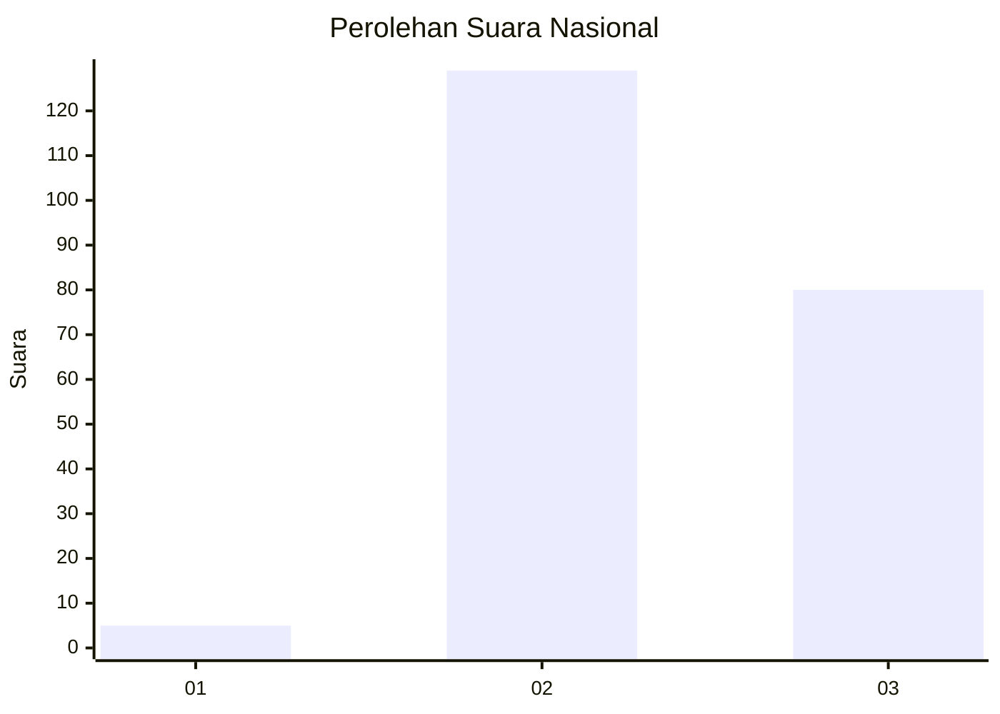
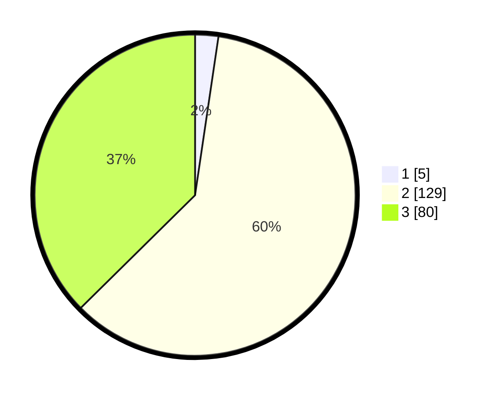

# Hasil

## Grafik

## Tabel

| No. | Nama Paslon    | Suara | Suara (raw) | Persentase |
|:--- |:-------------- | -----:| -----------:| ----------:|
| 1   | ANIES MUHAIMIN | 5     | [5][p-1]    | 2,34       |
| 2   | PRABOWO GIBRAN | 129   | [129][p-2]  | 60,28      |
| 3   | GANJAR MAHFUD  | 80    | [80][p-3]   | 37,38      |

[p-1]: https://github.com/gigit-pemilu/pemilu-2024/blob/main/pilpres/hitung-suara/sub/51-bali/sub/08-buleleng/sub/02-seririt/sub/2003-ringdikit/sub/002-tps/sub/paslon-1.txt
[p-2]: https://github.com/gigit-pemilu/pemilu-2024/blob/main/pilpres/hitung-suara/sub/51-bali/sub/08-buleleng/sub/02-seririt/sub/2003-ringdikit/sub/002-tps/sub/paslon-2.txt
[p-3]: https://github.com/gigit-pemilu/pemilu-2024/blob/main/pilpres/hitung-suara/sub/51-bali/sub/08-buleleng/sub/02-seririt/sub/2003-ringdikit/sub/002-tps/sub/paslon-3.txt

## Foto C Plano

https://sirekap-obj-formc.kpu.go.id/ec56/pemilu/ppwp/51/08/02/20/03/5108022003002-20240215-030102--4b1cf8fe-2d3f-4b84-818c-6f03e6c57763.jpg

https://sirekap-obj-formc.kpu.go.id/ec56/pemilu/ppwp/51/08/02/20/03/5108022003002-20240215-030205--df3a8fd5-33bd-4858-a30e-aa67868d01e7.jpg

https://sirekap-obj-formc.kpu.go.id/ec56/pemilu/ppwp/51/08/02/20/03/5108022003002-20240215-030321--ac54efee-f2ca-400c-98a7-1a99ad10a3b3.jpg

## Metadata

| Key        | Value               |
| ---------- | ------------------- |
| Time Stamp | 2024-02-24 22:31:28 |

