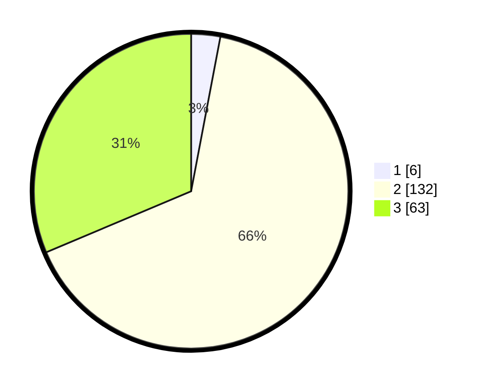

# Hasil

## Grafik

## Tabel

| No. | Nama Paslon    | Suara | Suara (raw) | Persentase |
|:--- |:-------------- | -----:| -----------:| ----------:|
| 1   | ANIES MUHAIMIN | 6     | [6][p-1]    | 2,99       |
| 2   | PRABOWO GIBRAN | 132   | [132][p-2]  | 65,67      |
| 3   | GANJAR MAHFUD  | 63    | [63][p-3]   | 31,34      |

[p-1]: https://github.com/gigit-pemilu/pemilu-2024-51-bali/blob/main/pilpres/hitung-suara/sub/51-bali/sub/08-buleleng/sub/02-seririt/sub/2003-ringdikit/sub/004-tps/sub/paslon-1.txt
[p-2]: https://github.com/gigit-pemilu/pemilu-2024-51-bali/blob/main/pilpres/hitung-suara/sub/51-bali/sub/08-buleleng/sub/02-seririt/sub/2003-ringdikit/sub/004-tps/sub/paslon-2.txt
[p-3]: https://github.com/gigit-pemilu/pemilu-2024-51-bali/blob/main/pilpres/hitung-suara/sub/51-bali/sub/08-buleleng/sub/02-seririt/sub/2003-ringdikit/sub/004-tps/sub/paslon-3.txt

## Foto C Plano

https://sirekap-obj-formc.kpu.go.id/b52f/pemilu/ppwp/51/08/02/20/03/5108022003004-20240214-214228--2a1b7074-12de-4e9e-a7ef-9659b6ea5270.jpg

https://sirekap-obj-formc.kpu.go.id/b52f/pemilu/ppwp/51/08/02/20/03/5108022003004-20240214-205126--40722792-2db1-4e8a-a1cc-55c66b112ba6.jpg

https://sirekap-obj-formc.kpu.go.id/b52f/pemilu/ppwp/51/08/02/20/03/5108022003004-20240214-235742--e6253ed3-432e-47f4-93c9-4c453ddf0e10.jpg

## Metadata

| Key        | Value               |
| ---------- | ------------------- |
| Time Stamp | 2024-02-25 14:00:00 |

