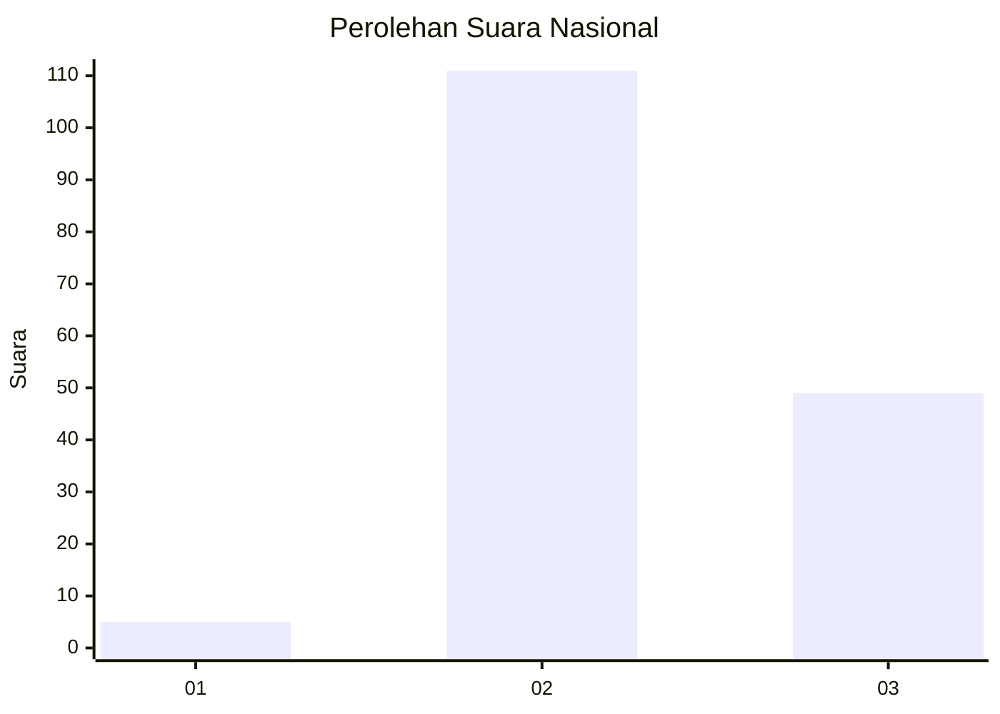

# Hasil

## Grafik

## Tabel

| No. | Nama Paslon    | Suara | Suara (raw) | Persentase |
|:--- |:-------------- | -----:| -----------:| ----------:|
| 1   | ANIES MUHAIMIN | 5     | [5][p-1]    | 3,03       |
| 2   | PRABOWO GIBRAN | 111   | [111][p-2]  | 67,27      |
| 3   | GANJAR MAHFUD  | 49    | [49][p-3]   | 29,70      |

[p-1]: https://github.com/gigit-pemilu/pemilu-2024/blob/main/pilpres/hitung-suara/sub/51-bali/sub/08-buleleng/sub/02-seririt/sub/2003-ringdikit/sub/005-tps/sub/paslon-1.txt
[p-2]: https://github.com/gigit-pemilu/pemilu-2024/blob/main/pilpres/hitung-suara/sub/51-bali/sub/08-buleleng/sub/02-seririt/sub/2003-ringdikit/sub/005-tps/sub/paslon-2.txt
[p-3]: https://github.com/gigit-pemilu/pemilu-2024/blob/main/pilpres/hitung-suara/sub/51-bali/sub/08-buleleng/sub/02-seririt/sub/2003-ringdikit/sub/005-tps/sub/paslon-3.txt

## Foto C Plano

https://sirekap-obj-formc.kpu.go.id/4a96/pemilu/ppwp/51/08/02/20/03/5108022003005-20240215-002515--57b054a7-cded-4afb-95ce-c019f0d3516d.jpg

https://sirekap-obj-formc.kpu.go.id/4a96/pemilu/ppwp/51/08/02/20/03/5108022003005-20240215-044543--68c7c1be-381b-44c6-b865-e04cace85828.jpg

https://sirekap-obj-formc.kpu.go.id/4a96/pemilu/ppwp/51/08/02/20/03/5108022003005-20240215-044632--d47332f1-c7e2-4988-8920-6212896718e4.jpg

## Metadata

| Key        | Value               |
| ---------- | ------------------- |
| Time Stamp | 2024-02-24 22:31:28 |

