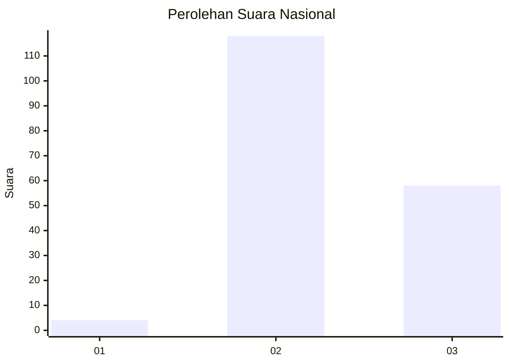
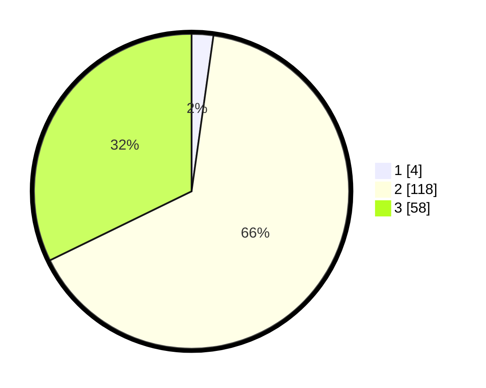

# Hasil

## Grafik

## Tabel

| No. | Nama Paslon    | Suara | Suara (raw) | Persentase |
|:--- |:-------------- | -----:| -----------:| ----------:|
| 1   | ANIES MUHAIMIN | 4     | [4][p-1]    | 2,22       |
| 2   | PRABOWO GIBRAN | 118   | [118][p-2]  | 65,56      |
| 3   | GANJAR MAHFUD  | 58    | [58][p-3]   | 32,22      |

[p-1]: https://github.com/gigit-pemilu/pemilu-2024/blob/main/pilpres/hitung-suara/sub/51-bali/sub/08-buleleng/sub/02-seririt/sub/2003-ringdikit/sub/007-tps/sub/paslon-1.txt
[p-2]: https://github.com/gigit-pemilu/pemilu-2024/blob/main/pilpres/hitung-suara/sub/51-bali/sub/08-buleleng/sub/02-seririt/sub/2003-ringdikit/sub/007-tps/sub/paslon-2.txt
[p-3]: https://github.com/gigit-pemilu/pemilu-2024/blob/main/pilpres/hitung-suara/sub/51-bali/sub/08-buleleng/sub/02-seririt/sub/2003-ringdikit/sub/007-tps/sub/paslon-3.txt

## Foto C Plano

https://sirekap-obj-formc.kpu.go.id/b21b/pemilu/ppwp/51/08/02/20/03/5108022003007-20240214-141802--2a5e163b-5b9e-4178-a429-fdc06f60d183.jpg

https://sirekap-obj-formc.kpu.go.id/b21b/pemilu/ppwp/51/08/02/20/03/5108022003007-20240214-141337--475c64bc-66eb-4d93-b81a-a87af2f6ab4a.jpg

https://sirekap-obj-formc.kpu.go.id/b21b/pemilu/ppwp/51/08/02/20/03/5108022003007-20240214-141341--61b4cf02-ad40-46f9-823c-93b75abe8364.jpg

## Metadata

| Key        | Value               |
| ---------- | ------------------- |
| Time Stamp | 2024-02-15 19:30:26 |

## DATA PEMILIH TETAP

Jumlah pemilih dalam DPT: **290**.
 * L: **153**.
 * P: **137**.

## DATA PENGGUNA HAK PILIH

Jumlah pengguna hak pilih dalam DPT: **180**.
 * L: **103**.
 * P: **77**.

Jumlah pengguna hak pilih dalam DPTb: **0**.
 * L: **0**.
 * P: **0**.

Jumlah pengguna hak pilih dalam DPK: **2**.
 * L: **0**.
 * P: **2**.

Jumlah pengguna hak pilih: **182**.
 * L: **103**.
 * P: **79**.

## JUMLAH SUARA SAH DAN TIDAK SAH

JUMLAH SELURUH SUARA SAH: **180**.

JUMLAH SUARA TIDAK SAH: **2**.

JUMLAH SELURUH SUARA SAH DAN SUARA TIDAK SAH: **182**.

