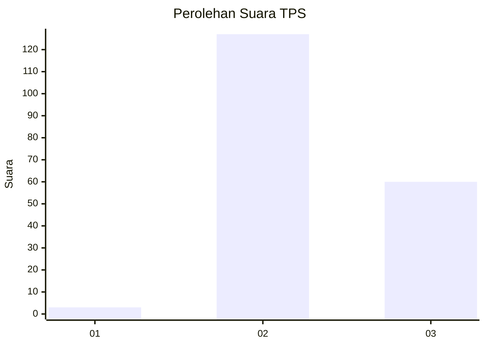
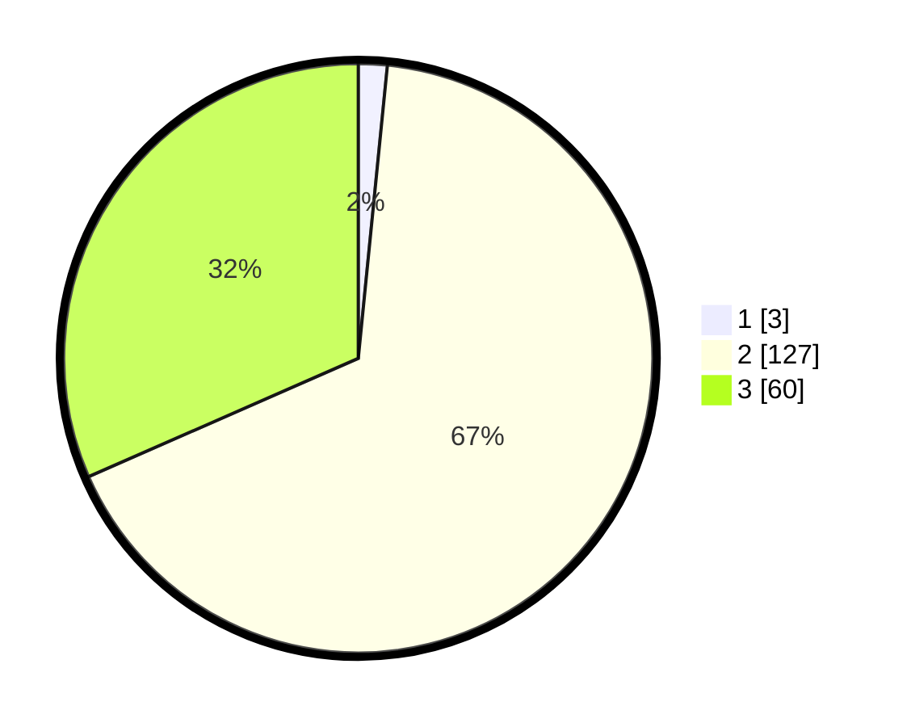

# Hasil

## Grafik

## Tabel

| No. | Nama Paslon    | Suara | Suara (raw) | Persentase |
|:--- |:-------------- | -----:| -----------:| ----------:|
| 1   | ANIES MUHAIMIN | 3     | [3][p-1]    | 1,58       |
| 2   | PRABOWO GIBRAN | 127   | [127][p-2]  | 66,84      |
| 3   | GANJAR MAHFUD  | 60    | [60][p-3]   | 31,58      |

[p-1]: https://github.com/gigit-pemilu/pemilu-2024-51-bali/blob/main/pilpres/hitung-suara/sub/51-bali/sub/08-buleleng/sub/02-seririt/sub/2003-ringdikit/sub/011-tps/sub/paslon-1.txt
[p-2]: https://github.com/gigit-pemilu/pemilu-2024-51-bali/blob/main/pilpres/hitung-suara/sub/51-bali/sub/08-buleleng/sub/02-seririt/sub/2003-ringdikit/sub/011-tps/sub/paslon-2.txt
[p-3]: https://github.com/gigit-pemilu/pemilu-2024-51-bali/blob/main/pilpres/hitung-suara/sub/51-bali/sub/08-buleleng/sub/02-seririt/sub/2003-ringdikit/sub/011-tps/sub/paslon-3.txt

## Foto C Plano

https://sirekap-obj-formc.kpu.go.id/49e1/pemilu/ppwp/51/08/02/20/03/5108022003011-20240215-023307--dc6ea500-348f-45b6-b8fb-5a586a5c1269.jpg

https://sirekap-obj-formc.kpu.go.id/49e1/pemilu/ppwp/51/08/02/20/03/5108022003011-20240215-023639--b08e543a-c8f7-4248-8e8e-75e0203efcf4.jpg

https://sirekap-obj-formc.kpu.go.id/49e1/pemilu/ppwp/51/08/02/20/03/5108022003011-20240215-023827--cd08a7bb-b08f-4b2c-9c31-8eea989e1b10.jpg

## Metadata

| Key        | Value               |
| ---------- | ------------------- |
| Time Stamp | 2024-02-24 22:31:28 |

