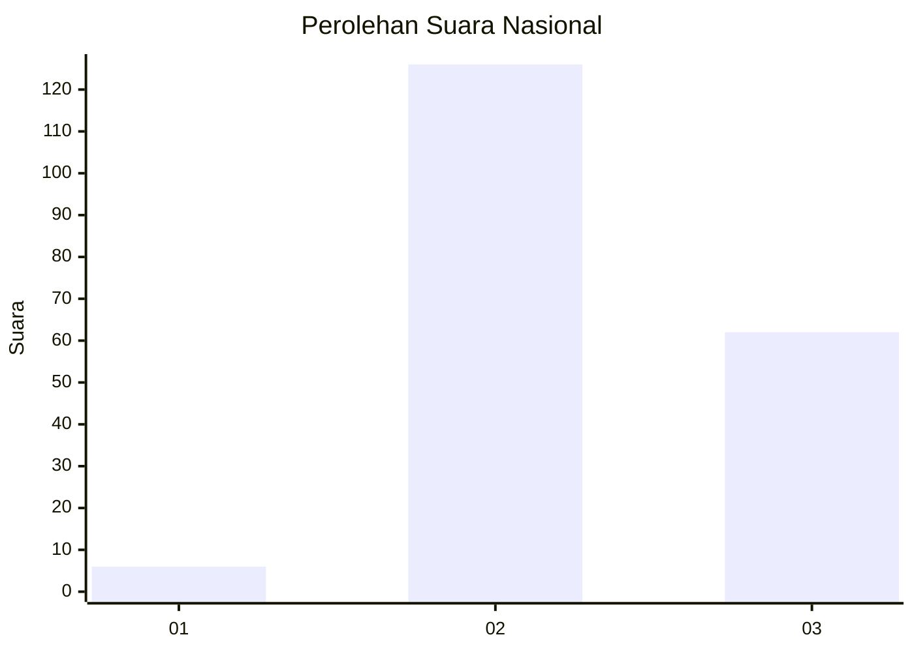
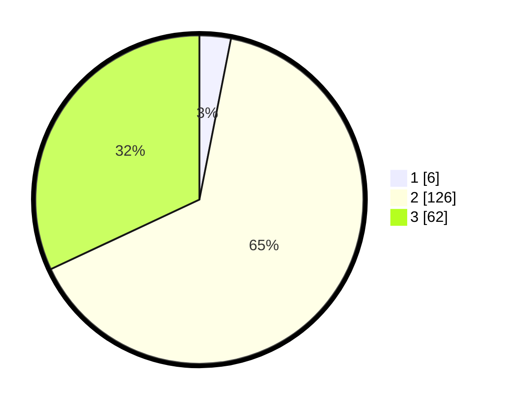

# Hasil

## Grafik

## Tabel

| No. | Nama Paslon    | Suara | Suara (raw) | Persentase |
|:--- |:-------------- | -----:| -----------:| ----------:|
| 1   | ANIES MUHAIMIN | 6     | [6][p-1]    | 3,09       |
| 2   | PRABOWO GIBRAN | 126   | [126][p-2]  | 64,95      |
| 3   | GANJAR MAHFUD  | 62    | [62][p-3]   | 31,96      |

[p-1]: https://github.com/gigit-pemilu/pemilu-2024/blob/main/pilpres/hitung-suara/sub/51-bali/sub/08-buleleng/sub/02-seririt/sub/2003-ringdikit/sub/012-tps/sub/paslon-1.txt
[p-2]: https://github.com/gigit-pemilu/pemilu-2024/blob/main/pilpres/hitung-suara/sub/51-bali/sub/08-buleleng/sub/02-seririt/sub/2003-ringdikit/sub/012-tps/sub/paslon-2.txt
[p-3]: https://github.com/gigit-pemilu/pemilu-2024/blob/main/pilpres/hitung-suara/sub/51-bali/sub/08-buleleng/sub/02-seririt/sub/2003-ringdikit/sub/012-tps/sub/paslon-3.txt

## Foto C Plano

https://sirekap-obj-formc.kpu.go.id/6724/pemilu/ppwp/51/08/02/20/03/5108022003012-20240214-224840--549fdccb-21d5-4cf2-9e70-5025e49a233f.jpg

https://sirekap-obj-formc.kpu.go.id/6724/pemilu/ppwp/51/08/02/20/03/5108022003012-20240214-224943--5cafa519-f077-4ec9-99c0-11dd9eb8a5ff.jpg

https://sirekap-obj-formc.kpu.go.id/6724/pemilu/ppwp/51/08/02/20/03/5108022003012-20240214-225023--23ca0aeb-6aa5-4f82-80bb-59d5f343e5d1.jpg

## Metadata

| Key        | Value               |
| ---------- | ------------------- |
| Time Stamp | 2024-02-25 17:00:00 |

