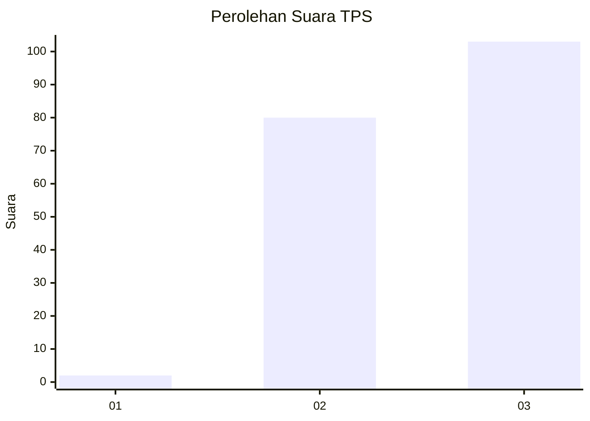
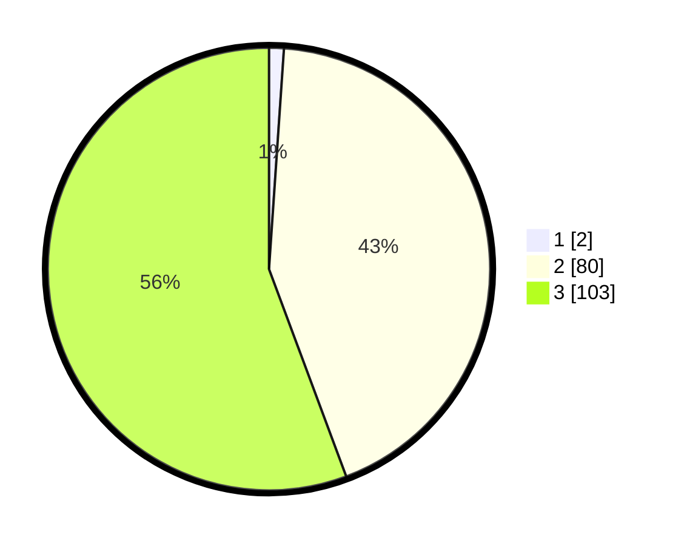

# Hasil

## Grafik

## Tabel

| No. | Nama Paslon    | Suara | Suara (raw) | Persentase |
|:--- |:-------------- | -----:| -----------:| ----------:|
| 1   | ANIES MUHAIMIN | 2     | [2][p-1]    | 1,08       |
| 2   | PRABOWO GIBRAN | 80    | [80][p-2]   | 43,24      |
| 3   | GANJAR MAHFUD  | 103   | [103][p-3]  | 55,68      |

[p-1]: https://github.com/gigit-pemilu/pemilu-2024-51-bali/blob/main/pilpres/hitung-suara/sub/51-bali/sub/08-buleleng/sub/02-seririt/sub/2004-rangdu/sub/001-tps/sub/paslon-1.txt
[p-2]: https://github.com/gigit-pemilu/pemilu-2024-51-bali/blob/main/pilpres/hitung-suara/sub/51-bali/sub/08-buleleng/sub/02-seririt/sub/2004-rangdu/sub/001-tps/sub/paslon-2.txt
[p-3]: https://github.com/gigit-pemilu/pemilu-2024-51-bali/blob/main/pilpres/hitung-suara/sub/51-bali/sub/08-buleleng/sub/02-seririt/sub/2004-rangdu/sub/001-tps/sub/paslon-3.txt

## Foto C Plano

https://sirekap-obj-formc.kpu.go.id/9bd1/pemilu/ppwp/51/08/02/20/04/5108022004001-20240215-002607--3d66da4d-aa63-4bd3-b5b6-83b0bd5ecbfd.jpg

https://sirekap-obj-formc.kpu.go.id/9bd1/pemilu/ppwp/51/08/02/20/04/5108022004001-20240215-002808--535e2d42-1c83-45f1-964d-1cc1c92ac378.jpg

https://sirekap-obj-formc.kpu.go.id/9bd1/pemilu/ppwp/51/08/02/20/04/5108022004001-20240215-002958--1fedf339-265f-4ab4-88f4-00e81ffd9336.jpg

## Metadata

| Key        | Value               |
| ---------- | ------------------- |
| Time Stamp | 2024-02-24 22:31:28 |

