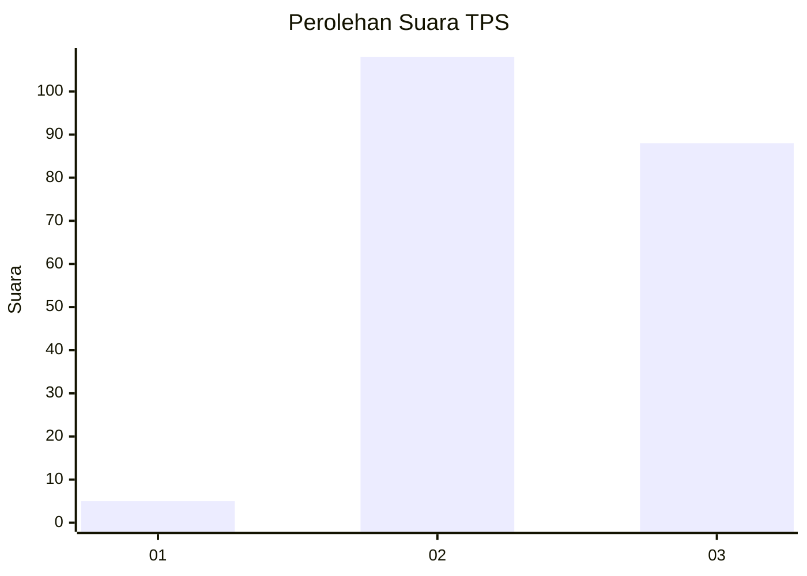
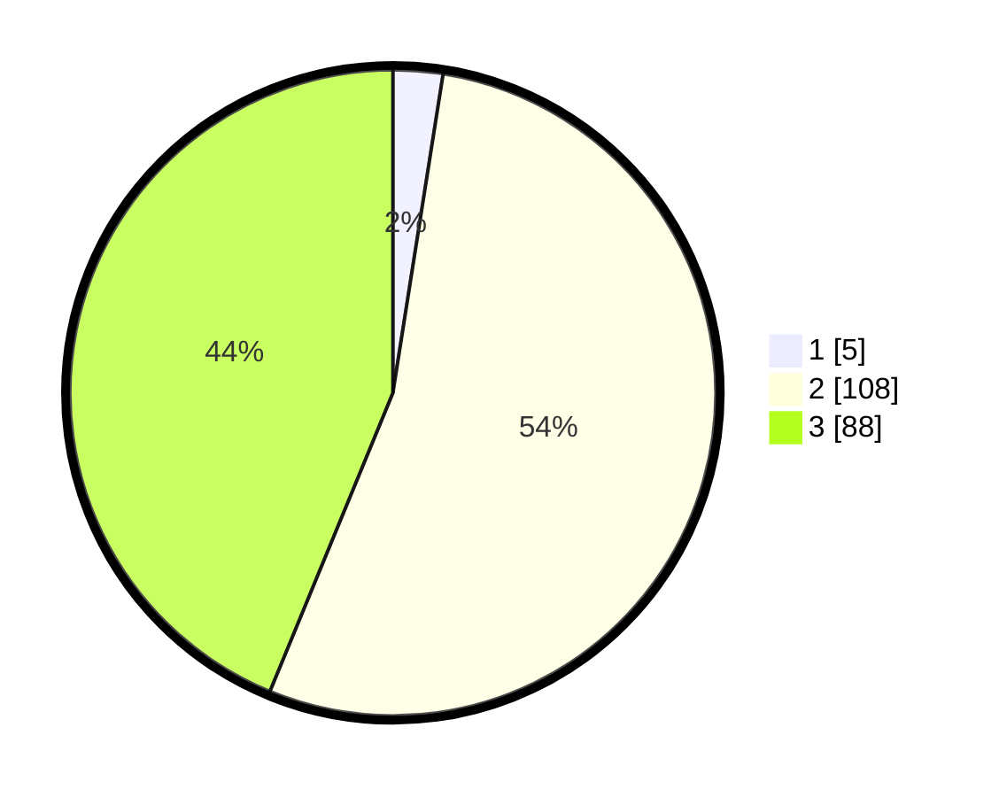

# Hasil

## Grafik

## Tabel

| No. | Nama Paslon    | Suara | Suara (raw) | Persentase |
|:--- |:-------------- | -----:| -----------:| ----------:|
| 1   | ANIES MUHAIMIN | 5     | [5][p-1]    | 2,49       |
| 2   | PRABOWO GIBRAN | 108   | [108][p-2]  | 53,73      |
| 3   | GANJAR MAHFUD  | 88    | [88][p-3]   | 43,78      |

[p-1]: https://github.com/gigit-pemilu/pemilu-2024-51-bali/blob/main/pilpres/hitung-suara/sub/51-bali/sub/08-buleleng/sub/02-seririt/sub/2004-rangdu/sub/002-tps/sub/paslon-1.txt
[p-2]: https://github.com/gigit-pemilu/pemilu-2024-51-bali/blob/main/pilpres/hitung-suara/sub/51-bali/sub/08-buleleng/sub/02-seririt/sub/2004-rangdu/sub/002-tps/sub/paslon-2.txt
[p-3]: https://github.com/gigit-pemilu/pemilu-2024-51-bali/blob/main/pilpres/hitung-suara/sub/51-bali/sub/08-buleleng/sub/02-seririt/sub/2004-rangdu/sub/002-tps/sub/paslon-3.txt

## Foto C Plano

https://sirekap-obj-formc.kpu.go.id/e046/pemilu/ppwp/51/08/02/20/04/5108022004002-20240215-014036--fc0f66bf-eec5-4665-903d-833c88521c5e.jpg

https://sirekap-obj-formc.kpu.go.id/e046/pemilu/ppwp/51/08/02/20/04/5108022004002-20240215-014043--9affa712-da58-4d85-8a10-ff1a8f4808a7.jpg

https://sirekap-obj-formc.kpu.go.id/e046/pemilu/ppwp/51/08/02/20/04/5108022004002-20240215-014052--f9eadd70-031e-4018-880d-659eae4a6679.jpg

## Metadata

| Key        | Value               |
| ---------- | ------------------- |
| Time Stamp | 2024-02-15 16:00:26 |

