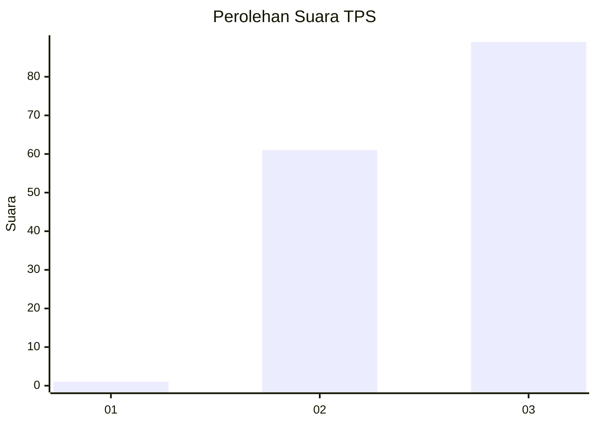
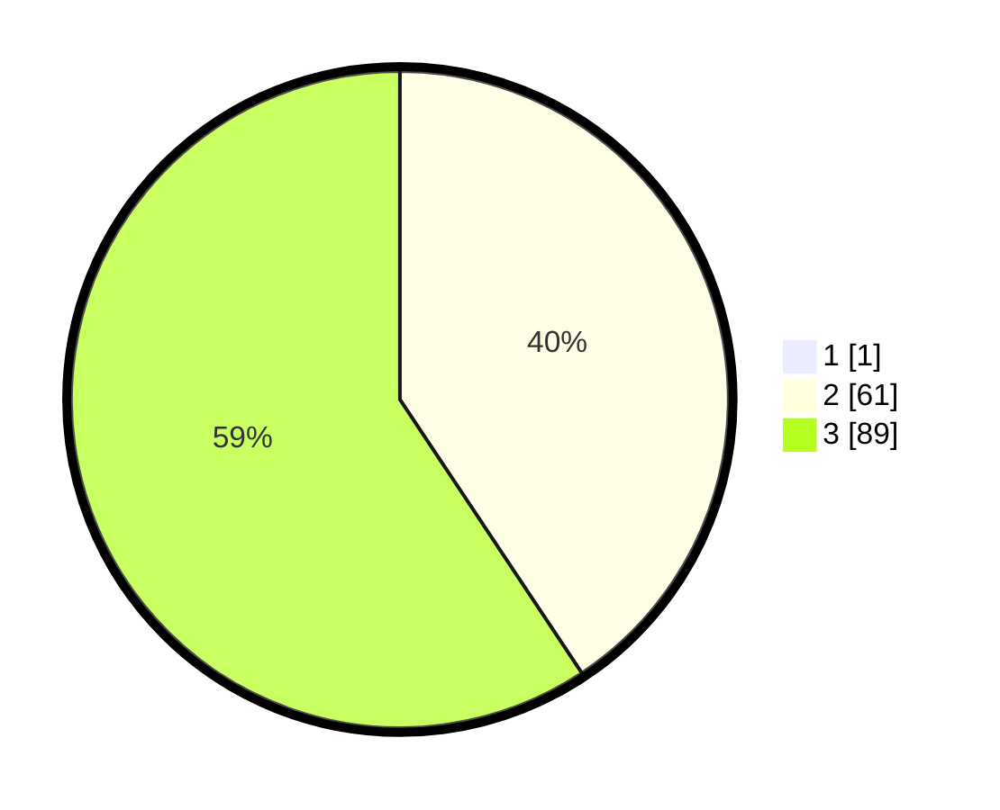

# Hasil

## Grafik

## Tabel

| No. | Nama Paslon    | Suara | Suara (raw) | Persentase |
|:--- |:-------------- | -----:| -----------:| ----------:|
| 1   | ANIES MUHAIMIN | 1     | [1][p-1]    | 0,66       |
| 2   | PRABOWO GIBRAN | 61    | [61][p-2]   | 40,40      |
| 3   | GANJAR MAHFUD  | 89    | [89][p-3]   | 58,94      |

[p-1]: https://github.com/gigit-pemilu/pemilu-2024-51-bali/blob/main/pilpres/hitung-suara/sub/51-bali/sub/08-buleleng/sub/02-seririt/sub/2004-rangdu/sub/003-tps/sub/paslon-1.txt
[p-2]: https://github.com/gigit-pemilu/pemilu-2024-51-bali/blob/main/pilpres/hitung-suara/sub/51-bali/sub/08-buleleng/sub/02-seririt/sub/2004-rangdu/sub/003-tps/sub/paslon-2.txt
[p-3]: https://github.com/gigit-pemilu/pemilu-2024-51-bali/blob/main/pilpres/hitung-suara/sub/51-bali/sub/08-buleleng/sub/02-seririt/sub/2004-rangdu/sub/003-tps/sub/paslon-3.txt

## Foto C Plano

https://sirekap-obj-formc.kpu.go.id/dd9a/pemilu/ppwp/51/08/02/20/04/5108022004003-20240214-235934--f5492fee-3a27-4299-9fea-0e4ed44679e5.jpg

https://sirekap-obj-formc.kpu.go.id/dd9a/pemilu/ppwp/51/08/02/20/04/5108022004003-20240215-000054--f8a774fe-b0d2-42a7-a5d6-6eceafd5148f.jpg

https://sirekap-obj-formc.kpu.go.id/dd9a/pemilu/ppwp/51/08/02/20/04/5108022004003-20240215-000550--acebf4e4-0d1c-4404-8f71-15e8f65cec7c.jpg

## Metadata

| Key        | Value               |
| ---------- | ------------------- |
| Time Stamp | 2024-02-24 22:31:28 |

