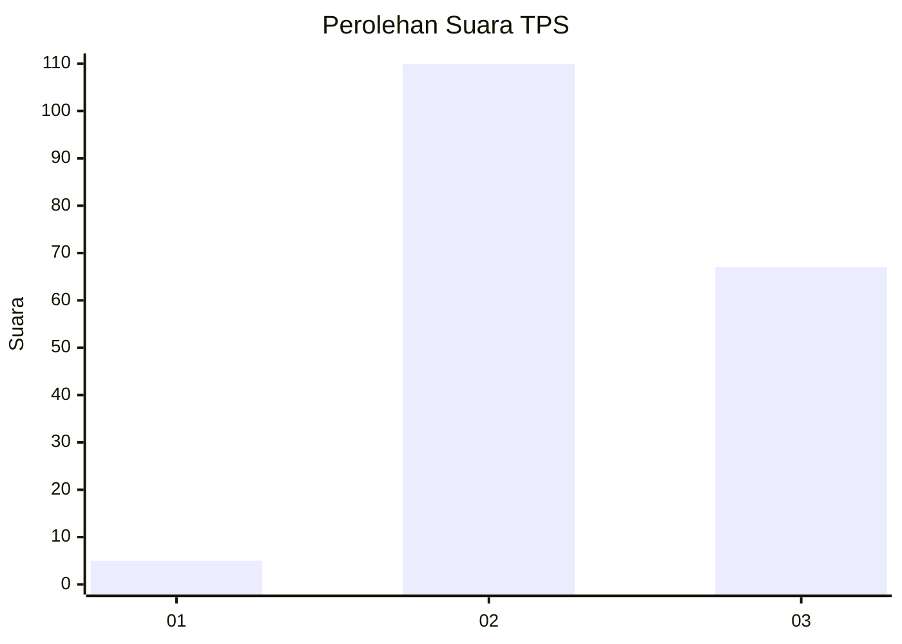
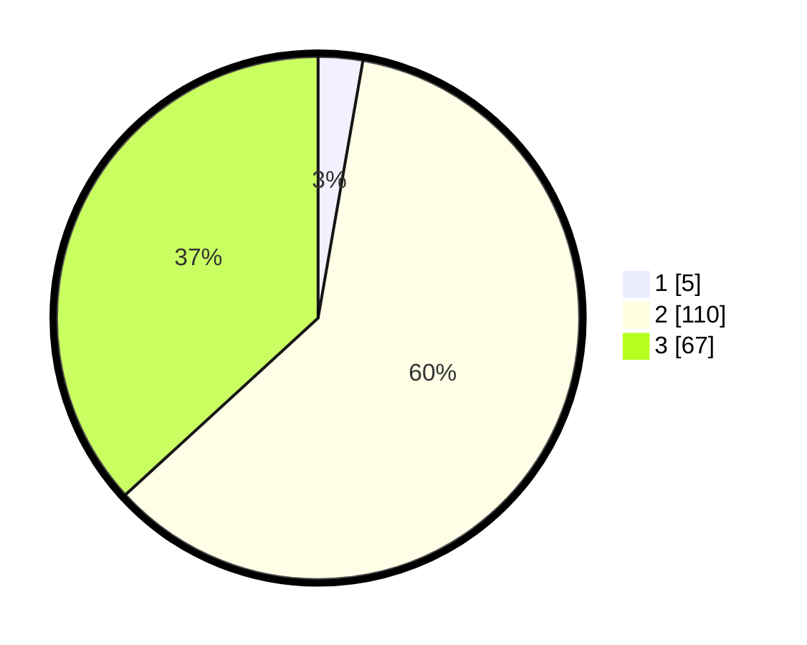

# Hasil

## Grafik

## Tabel

| No. | Nama Paslon    | Suara | Suara (raw) | Persentase |
|:--- |:-------------- | -----:| -----------:| ----------:|
| 1   | ANIES MUHAIMIN | 5     | [5][p-1]    | 2,75       |
| 2   | PRABOWO GIBRAN | 110   | [110][p-2]  | 60,44      |
| 3   | GANJAR MAHFUD  | 67    | [67][p-3]   | 36,81      |

[p-1]: https://github.com/gigit-pemilu/pemilu-2024-51-bali/blob/main/pilpres/hitung-suara/sub/51-bali/sub/08-buleleng/sub/02-seririt/sub/2005-mayong/sub/002-tps/sub/paslon-1.txt
[p-2]: https://github.com/gigit-pemilu/pemilu-2024-51-bali/blob/main/pilpres/hitung-suara/sub/51-bali/sub/08-buleleng/sub/02-seririt/sub/2005-mayong/sub/002-tps/sub/paslon-2.txt
[p-3]: https://github.com/gigit-pemilu/pemilu-2024-51-bali/blob/main/pilpres/hitung-suara/sub/51-bali/sub/08-buleleng/sub/02-seririt/sub/2005-mayong/sub/002-tps/sub/paslon-3.txt

## Foto C Plano

https://sirekap-obj-formc.kpu.go.id/72b3/pemilu/ppwp/51/08/02/20/05/5108022005002-20240215-025406--72b90e9b-fbb7-4327-890f-2dbd273df649.jpg

https://sirekap-obj-formc.kpu.go.id/72b3/pemilu/ppwp/51/08/02/20/05/5108022005002-20240215-025430--2fd1bdc0-134d-422b-a0fc-1a432798522f.jpg

https://sirekap-obj-formc.kpu.go.id/72b3/pemilu/ppwp/51/08/02/20/05/5108022005002-20240215-025517--b9dc0b57-7980-48e2-a949-f4191b21a560.jpg

## Metadata

| Key        | Value               |
| ---------- | ------------------- |
| Time Stamp | 2024-02-24 22:31:28 |

