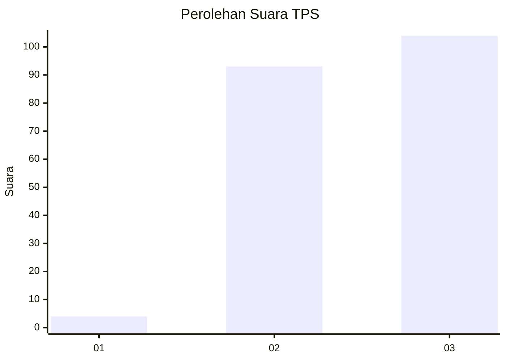
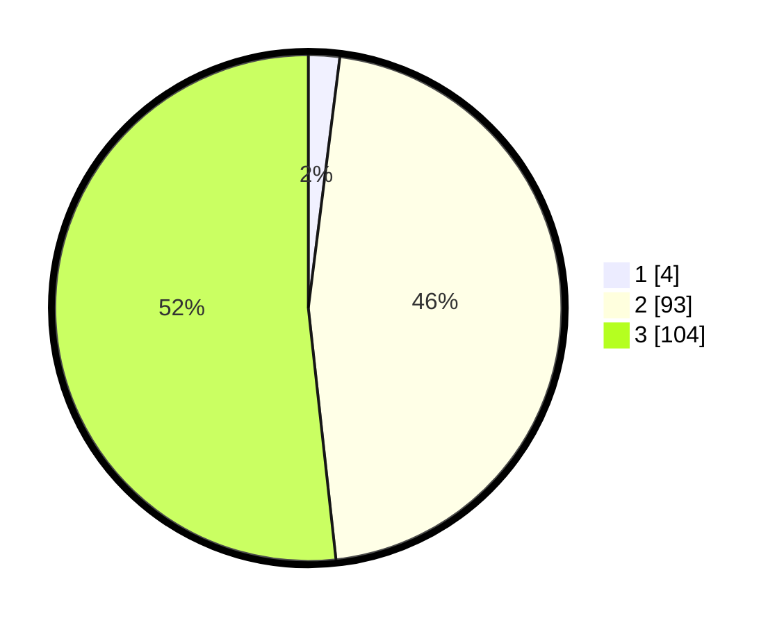

# Hasil

## Grafik

## Tabel

| No. | Nama Paslon    | Suara | Suara (raw) | Persentase |
|:--- |:-------------- | -----:| -----------:| ----------:|
| 1   | ANIES MUHAIMIN | 4     | [4][p-1]    | 1,99       |
| 2   | PRABOWO GIBRAN | 93    | [93][p-2]   | 46,27      |
| 3   | GANJAR MAHFUD  | 104   | [104][p-3]  | 51,74      |

[p-1]: https://github.com/gigit-pemilu/pemilu-2024-51-bali/blob/main/pilpres/hitung-suara/sub/51-bali/sub/08-buleleng/sub/02-seririt/sub/2005-mayong/sub/004-tps/sub/paslon-1.txt
[p-2]: https://github.com/gigit-pemilu/pemilu-2024-51-bali/blob/main/pilpres/hitung-suara/sub/51-bali/sub/08-buleleng/sub/02-seririt/sub/2005-mayong/sub/004-tps/sub/paslon-2.txt
[p-3]: https://github.com/gigit-pemilu/pemilu-2024-51-bali/blob/main/pilpres/hitung-suara/sub/51-bali/sub/08-buleleng/sub/02-seririt/sub/2005-mayong/sub/004-tps/sub/paslon-3.txt

## Foto C Plano

https://sirekap-obj-formc.kpu.go.id/9589/pemilu/ppwp/51/08/02/20/05/5108022005004-20240214-225645--274a34c8-f18e-4c84-bd1c-a6cb802628bd.jpg

https://sirekap-obj-formc.kpu.go.id/9589/pemilu/ppwp/51/08/02/20/05/5108022005004-20240214-225726--81737948-4af3-490f-979b-48282653cb87.jpg

https://sirekap-obj-formc.kpu.go.id/9589/pemilu/ppwp/51/08/02/20/05/5108022005004-20240215-004827--36272d1f-d30d-4275-9798-5ea8a100ab1d.jpg

## Metadata

| Key        | Value               |
| ---------- | ------------------- |
| Time Stamp | 2024-02-15 03:06:03 |

