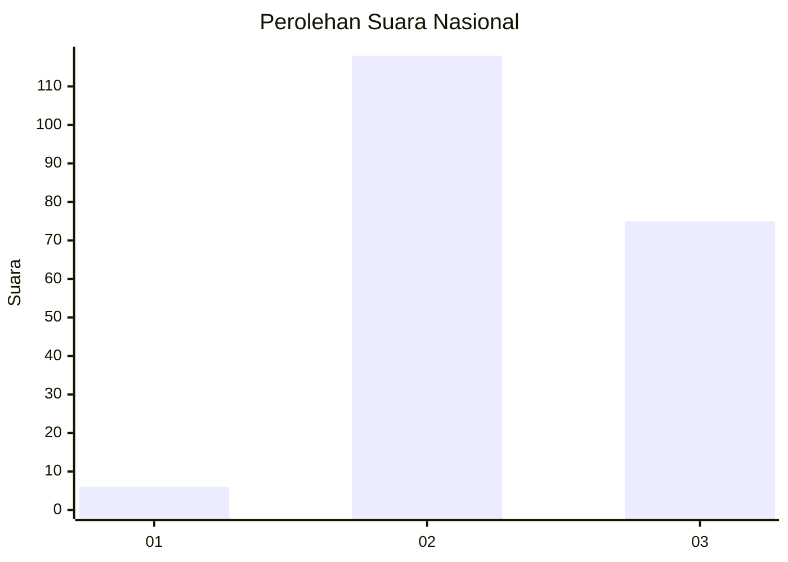
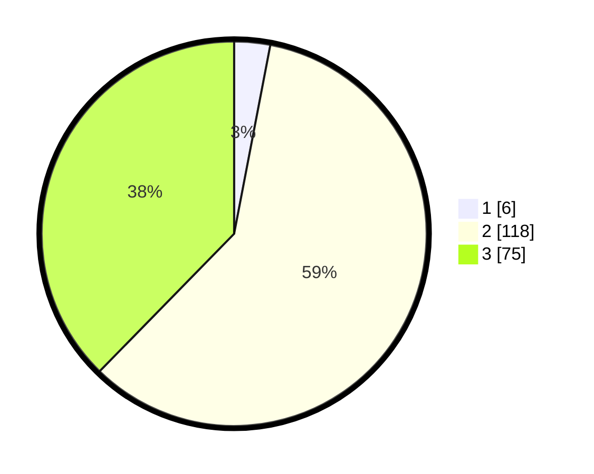

# Hasil

## Grafik

## Tabel

| No. | Nama Paslon    | Suara | Suara (raw) | Persentase |
|:--- |:-------------- | -----:| -----------:| ----------:|
| 1   | ANIES MUHAIMIN | 6     | [6][p-1]    | 3,02       |
| 2   | PRABOWO GIBRAN | 118   | [118][p-2]  | 59,30      |
| 3   | GANJAR MAHFUD  | 75    | [75][p-3]   | 37,69      |

[p-1]: https://github.com/gigit-pemilu/pemilu-2024/blob/main/pilpres/hitung-suara/sub/51-bali/sub/08-buleleng/sub/02-seririt/sub/2005-mayong/sub/005-tps/sub/paslon-1.txt
[p-2]: https://github.com/gigit-pemilu/pemilu-2024/blob/main/pilpres/hitung-suara/sub/51-bali/sub/08-buleleng/sub/02-seririt/sub/2005-mayong/sub/005-tps/sub/paslon-2.txt
[p-3]: https://github.com/gigit-pemilu/pemilu-2024/blob/main/pilpres/hitung-suara/sub/51-bali/sub/08-buleleng/sub/02-seririt/sub/2005-mayong/sub/005-tps/sub/paslon-3.txt

## Foto C Plano

https://sirekap-obj-formc.kpu.go.id/c1ee/pemilu/ppwp/51/08/02/20/05/5108022005005-20240214-233629--79bece9e-35f5-4e6d-a52e-75c35a67fc99.jpg

https://sirekap-obj-formc.kpu.go.id/c1ee/pemilu/ppwp/51/08/02/20/05/5108022005005-20240214-233959--4ca8d545-4574-462d-bbff-b3345eb377ae.jpg

https://sirekap-obj-formc.kpu.go.id/c1ee/pemilu/ppwp/51/08/02/20/05/5108022005005-20240214-234155--203fc15f-ba2b-40f1-a556-1d16d932b9b3.jpg

## Metadata

| Key        | Value               |
| ---------- | ------------------- |
| Time Stamp | 2024-02-24 22:31:28 |

