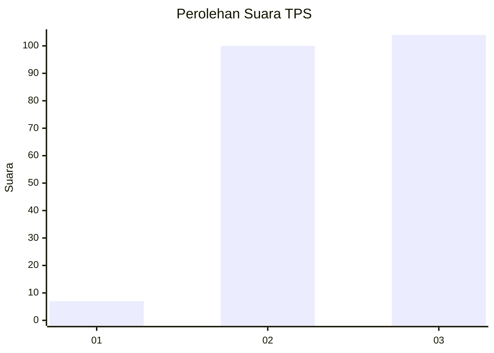
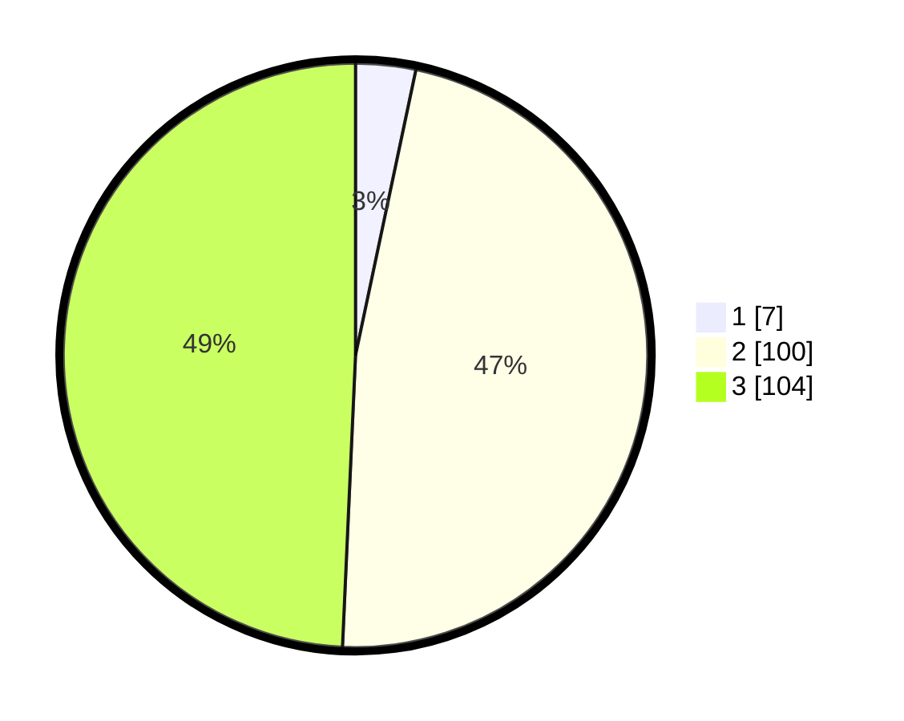

# Hasil

## Grafik

## Tabel

| No. | Nama Paslon    | Suara | Suara (raw) | Persentase |
|:--- |:-------------- | -----:| -----------:| ----------:|
| 1   | ANIES MUHAIMIN | 7     | [7][p-1]    | 3,32       |
| 2   | PRABOWO GIBRAN | 100   | [100][p-2]  | 47,39      |
| 3   | GANJAR MAHFUD  | 104   | [104][p-3]  | 49,29      |

[p-1]: https://github.com/gigit-pemilu/pemilu-2024-51-bali/blob/main/pilpres/hitung-suara/sub/51-bali/sub/08-buleleng/sub/02-seririt/sub/2005-mayong/sub/011-tps/sub/paslon-1.txt
[p-2]: https://github.com/gigit-pemilu/pemilu-2024-51-bali/blob/main/pilpres/hitung-suara/sub/51-bali/sub/08-buleleng/sub/02-seririt/sub/2005-mayong/sub/011-tps/sub/paslon-2.txt
[p-3]: https://github.com/gigit-pemilu/pemilu-2024-51-bali/blob/main/pilpres/hitung-suara/sub/51-bali/sub/08-buleleng/sub/02-seririt/sub/2005-mayong/sub/011-tps/sub/paslon-3.txt

## Foto C Plano

https://sirekap-obj-formc.kpu.go.id/3fa0/pemilu/ppwp/51/08/02/20/05/5108022005011-20240215-014530--f2838fc1-f08d-4ce6-9cdc-0edf9367677c.jpg

https://sirekap-obj-formc.kpu.go.id/3fa0/pemilu/ppwp/51/08/02/20/05/5108022005011-20240215-014704--2631ba86-658e-4f8e-9ea2-16fb2882069c.jpg

https://sirekap-obj-formc.kpu.go.id/3fa0/pemilu/ppwp/51/08/02/20/05/5108022005011-20240215-014814--9ddd2a5e-a1f3-4437-ac01-fcd0d6059b54.jpg

## Metadata

| Key        | Value               |
| ---------- | ------------------- |
| Time Stamp | 2024-02-24 22:31:28 |

