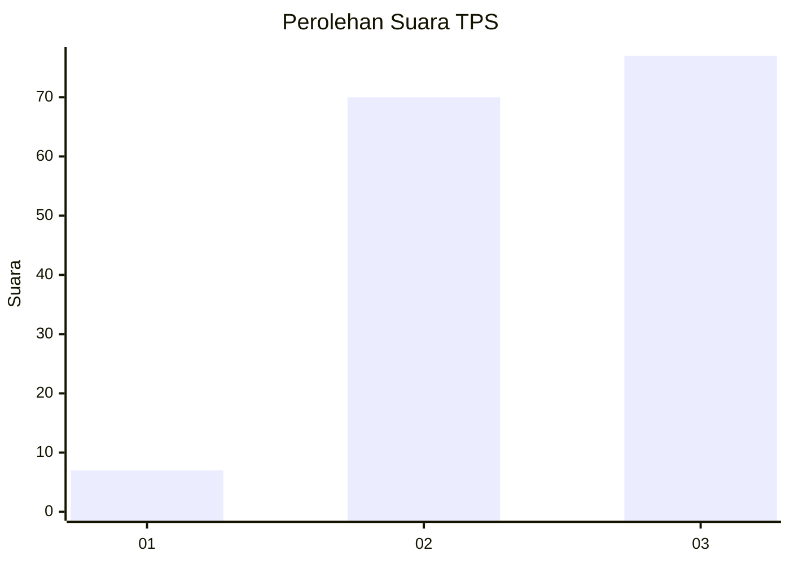
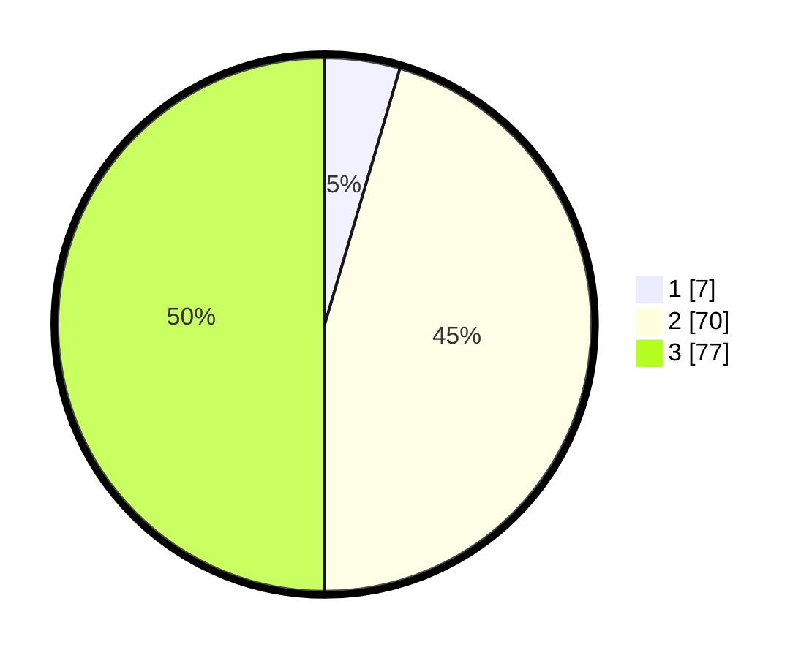

# Hasil

## Grafik

## Tabel

| No. | Nama Paslon    | Suara | Suara (raw) | Persentase |
|:--- |:-------------- | -----:| -----------:| ----------:|
| 1   | ANIES MUHAIMIN | 7     | [7][p-1]    | 4,55       |
| 2   | PRABOWO GIBRAN | 70    | [70][p-2]   | 45,45      |
| 3   | GANJAR MAHFUD  | 77    | [77][p-3]   | 50,00      |

[p-1]: https://github.com/gigit-pemilu/pemilu-2024-51-bali/blob/main/pilpres/hitung-suara/sub/51-bali/sub/08-buleleng/sub/02-seririt/sub/2006-gunungsari/sub/001-tps/sub/paslon-1.txt
[p-2]: https://github.com/gigit-pemilu/pemilu-2024-51-bali/blob/main/pilpres/hitung-suara/sub/51-bali/sub/08-buleleng/sub/02-seririt/sub/2006-gunungsari/sub/001-tps/sub/paslon-2.txt
[p-3]: https://github.com/gigit-pemilu/pemilu-2024-51-bali/blob/main/pilpres/hitung-suara/sub/51-bali/sub/08-buleleng/sub/02-seririt/sub/2006-gunungsari/sub/001-tps/sub/paslon-3.txt

## Foto C Plano

https://sirekap-obj-formc.kpu.go.id/1af5/pemilu/ppwp/51/08/02/20/06/5108022006001-20240215-002640--32e3b1aa-bec4-4863-ad0a-66d298f0a4b6.jpg

https://sirekap-obj-formc.kpu.go.id/1af5/pemilu/ppwp/51/08/02/20/06/5108022006001-20240215-003048--6786059b-9829-4104-899d-5d120010148c.jpg

https://sirekap-obj-formc.kpu.go.id/1af5/pemilu/ppwp/51/08/02/20/06/5108022006001-20240215-003251--b70ed40b-b70b-45a3-b92f-404dea54bafe.jpg

## Metadata

| Key        | Value               |
| ---------- | ------------------- |
| Time Stamp | 2024-02-15 19:00:26 |

