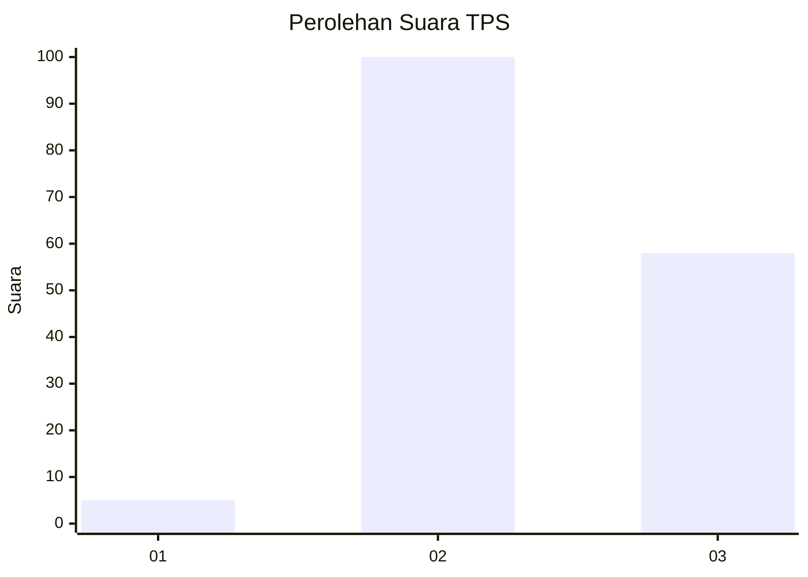
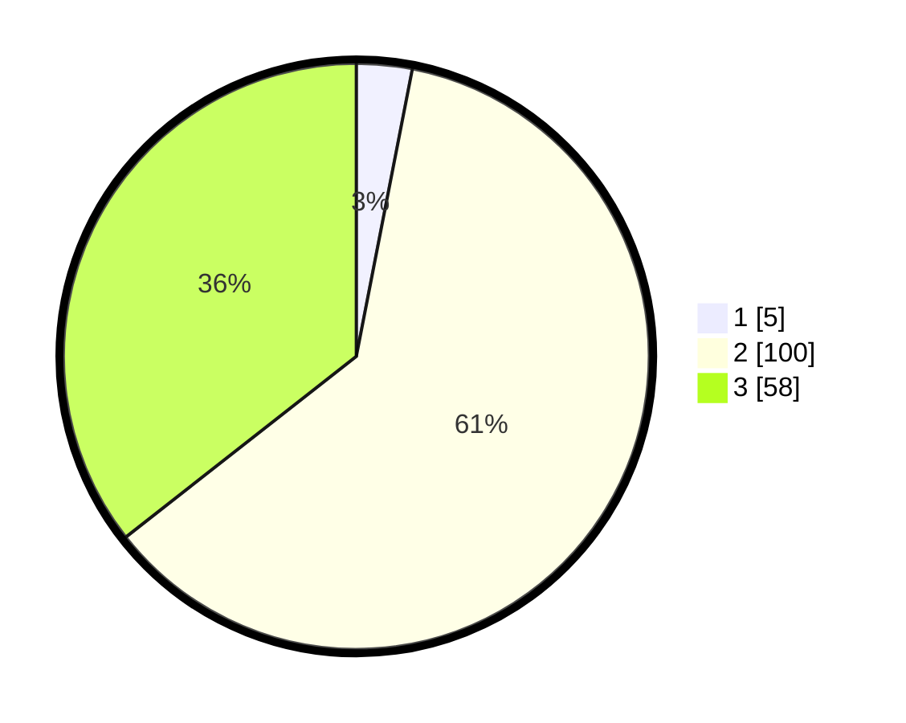

# Hasil

## Grafik

## Tabel

| No. | Nama Paslon    | Suara | Suara (raw) | Persentase |
|:--- |:-------------- | -----:| -----------:| ----------:|
| 1   | ANIES MUHAIMIN | 5     | [5][p-1]    | 3,07       |
| 2   | PRABOWO GIBRAN | 100   | [100][p-2]  | 61,35      |
| 3   | GANJAR MAHFUD  | 58    | [58][p-3]   | 35,58      |

[p-1]: https://github.com/gigit-pemilu/pemilu-2024-51-bali/blob/main/pilpres/hitung-suara/sub/51-bali/sub/08-buleleng/sub/02-seririt/sub/2006-gunungsari/sub/002-tps/sub/paslon-1.txt
[p-2]: https://github.com/gigit-pemilu/pemilu-2024-51-bali/blob/main/pilpres/hitung-suara/sub/51-bali/sub/08-buleleng/sub/02-seririt/sub/2006-gunungsari/sub/002-tps/sub/paslon-2.txt
[p-3]: https://github.com/gigit-pemilu/pemilu-2024-51-bali/blob/main/pilpres/hitung-suara/sub/51-bali/sub/08-buleleng/sub/02-seririt/sub/2006-gunungsari/sub/002-tps/sub/paslon-3.txt

## Foto C Plano

https://sirekap-obj-formc.kpu.go.id/41e1/pemilu/ppwp/51/08/02/20/06/5108022006002-20240214-214551--2db7d3c2-2de9-41d1-aa8e-af5333f56c6e.jpg

https://sirekap-obj-formc.kpu.go.id/41e1/pemilu/ppwp/51/08/02/20/06/5108022006002-20240214-214812--68ce32cd-8b9b-4bd0-aa17-dbeb23ceccef.jpg

https://sirekap-obj-formc.kpu.go.id/41e1/pemilu/ppwp/51/08/02/20/06/5108022006002-20240214-214949--6e585226-cf67-41e5-a9d9-2299424ce100.jpg

## Metadata

| Key        | Value               |
| ---------- | ------------------- |
| Time Stamp | 2024-02-24 22:31:28 |

