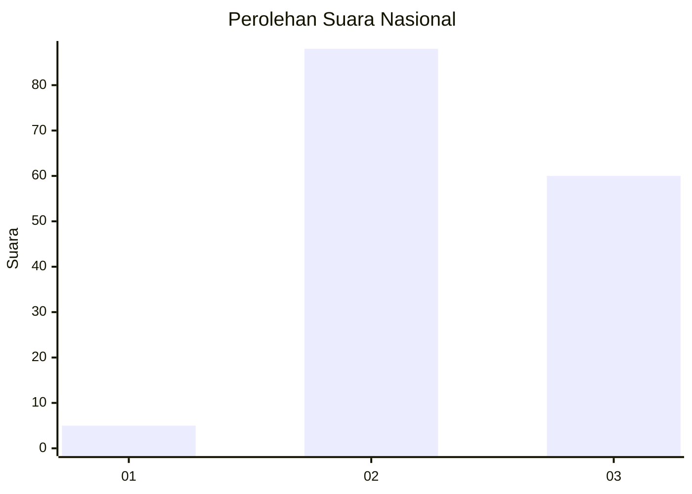
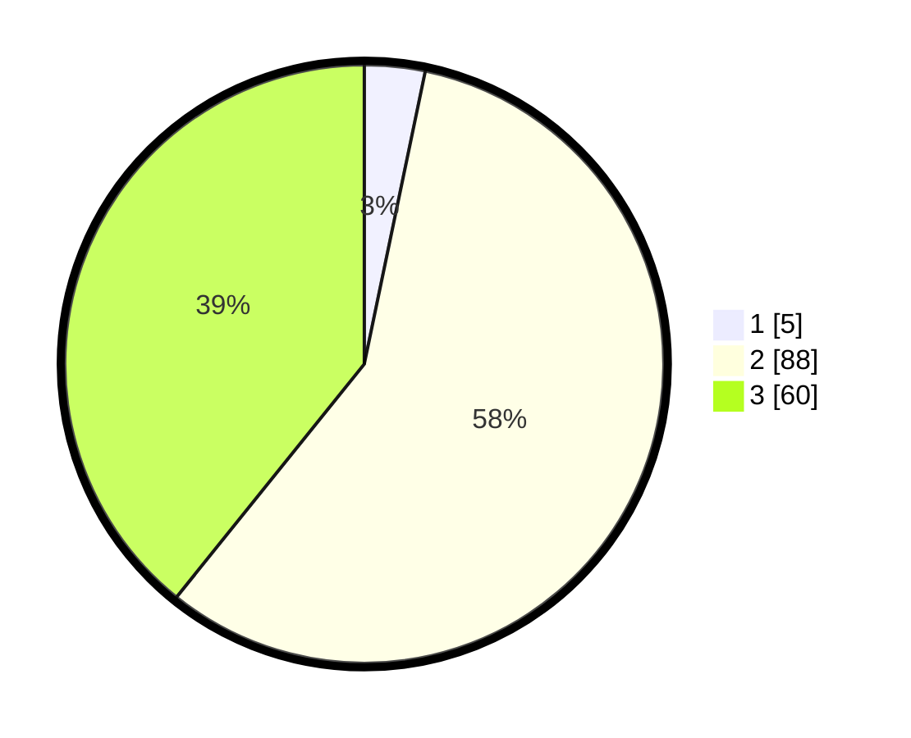

# Hasil

## Grafik

## Tabel

| No. | Nama Paslon    | Suara | Suara (raw) | Persentase |
|:--- |:-------------- | -----:| -----------:| ----------:|
| 1   | ANIES MUHAIMIN | 5     | [5][p-1]    | 3,27       |
| 2   | PRABOWO GIBRAN | 88    | [88][p-2]   | 57,52      |
| 3   | GANJAR MAHFUD  | 60    | [60][p-3]   | 39,22      |

[p-1]: https://github.com/gigit-pemilu/pemilu-2024/blob/main/pilpres/hitung-suara/sub/51-bali/sub/08-buleleng/sub/02-seririt/sub/2006-gunungsari/sub/003-tps/sub/paslon-1.txt
[p-2]: https://github.com/gigit-pemilu/pemilu-2024/blob/main/pilpres/hitung-suara/sub/51-bali/sub/08-buleleng/sub/02-seririt/sub/2006-gunungsari/sub/003-tps/sub/paslon-2.txt
[p-3]: https://github.com/gigit-pemilu/pemilu-2024/blob/main/pilpres/hitung-suara/sub/51-bali/sub/08-buleleng/sub/02-seririt/sub/2006-gunungsari/sub/003-tps/sub/paslon-3.txt

## Foto C Plano

https://sirekap-obj-formc.kpu.go.id/0fc2/pemilu/ppwp/51/08/02/20/06/5108022006003-20240214-234646--2f46b451-82b9-4460-be35-23c884cc8cd5.jpg

https://sirekap-obj-formc.kpu.go.id/0fc2/pemilu/ppwp/51/08/02/20/06/5108022006003-20240215-000901--fca731cb-57ea-44d1-b579-4fd1ea90bd4b.jpg

https://sirekap-obj-formc.kpu.go.id/0fc2/pemilu/ppwp/51/08/02/20/06/5108022006003-20240215-001115--17509fea-8588-4352-9fe2-9d2893e25169.jpg

## Metadata

| Key        | Value               |
| ---------- | ------------------- |
| Time Stamp | 2024-02-24 22:31:28 |

