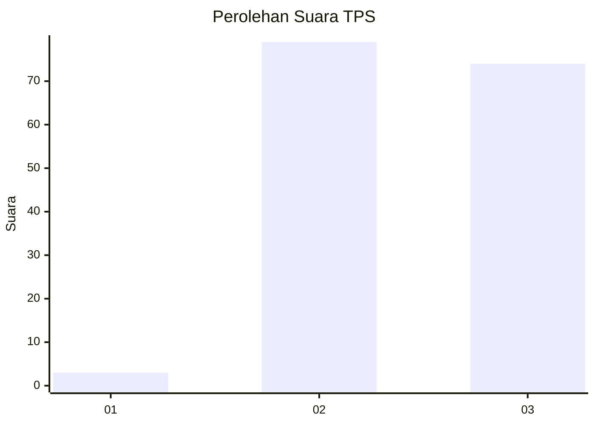
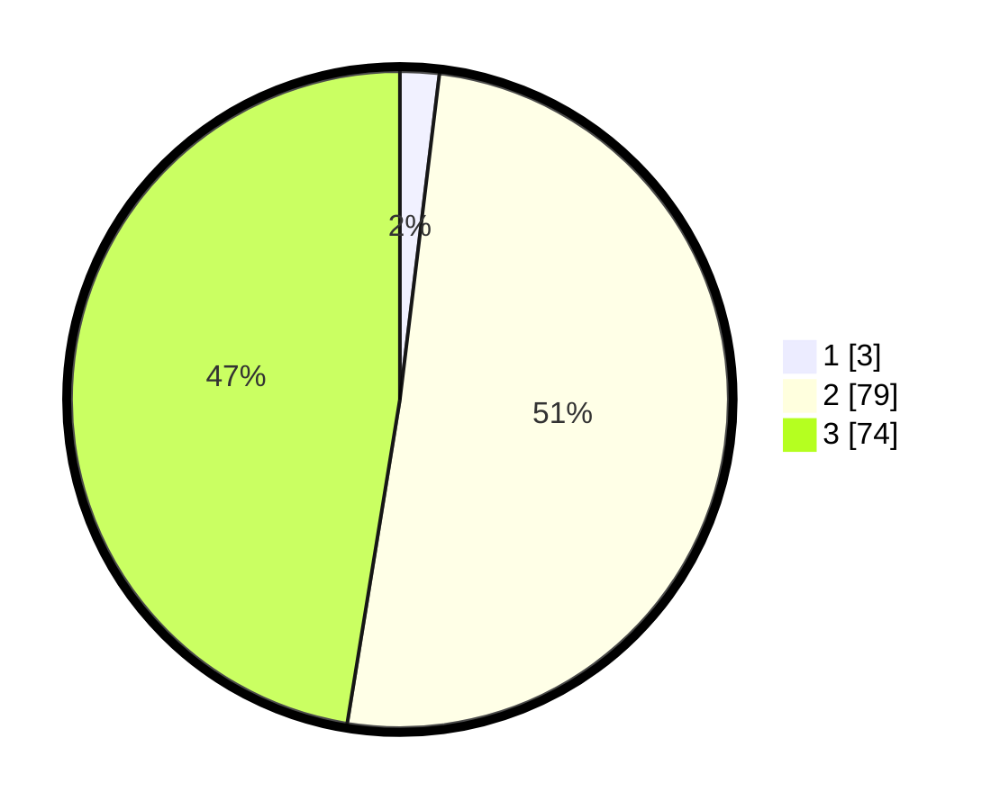

# Hasil

## Grafik

## Tabel

| No. | Nama Paslon    | Suara | Suara (raw) | Persentase |
|:--- |:-------------- | -----:| -----------:| ----------:|
| 1   | ANIES MUHAIMIN | 3     | [3][p-1]    | 1,92       |
| 2   | PRABOWO GIBRAN | 79    | [79][p-2]   | 50,64      |
| 3   | GANJAR MAHFUD  | 74    | [74][p-3]   | 47,44      |

[p-1]: https://github.com/gigit-pemilu/pemilu-2024-51-bali/blob/main/pilpres/hitung-suara/sub/51-bali/sub/08-buleleng/sub/02-seririt/sub/2006-gunungsari/sub/005-tps/sub/paslon-1.txt
[p-2]: https://github.com/gigit-pemilu/pemilu-2024-51-bali/blob/main/pilpres/hitung-suara/sub/51-bali/sub/08-buleleng/sub/02-seririt/sub/2006-gunungsari/sub/005-tps/sub/paslon-2.txt
[p-3]: https://github.com/gigit-pemilu/pemilu-2024-51-bali/blob/main/pilpres/hitung-suara/sub/51-bali/sub/08-buleleng/sub/02-seririt/sub/2006-gunungsari/sub/005-tps/sub/paslon-3.txt

## Foto C Plano

https://sirekap-obj-formc.kpu.go.id/25f4/pemilu/ppwp/51/08/02/20/06/5108022006005-20240215-004153--7abc4a5d-a2e8-4a82-a94a-643b44b5e987.jpg

https://sirekap-obj-formc.kpu.go.id/25f4/pemilu/ppwp/51/08/02/20/06/5108022006005-20240215-004356--efd32cd6-f04e-4841-b83b-6fa3d9d609c1.jpg

https://sirekap-obj-formc.kpu.go.id/25f4/pemilu/ppwp/51/08/02/20/06/5108022006005-20240215-004549--9195dc48-5aed-4224-a8a8-55d8b17671f2.jpg

## Metadata

| Key        | Value               |
| ---------- | ------------------- |
| Time Stamp | 2024-02-24 22:31:28 |

