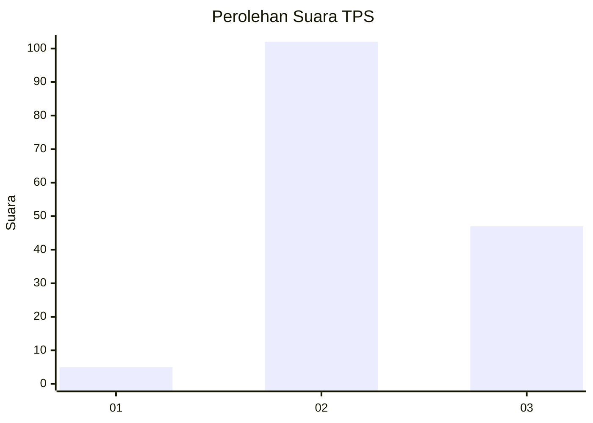

# Hasil

## Grafik

## Tabel

| No. | Nama Paslon    | Suara | Suara (raw) | Persentase |
|:--- |:-------------- | -----:| -----------:| ----------:|
| 1   | ANIES MUHAIMIN | 5     | [5][p-1]    | 3,25       |
| 2   | PRABOWO GIBRAN | 102   | [102][p-2]  | 66,23      |
| 3   | GANJAR MAHFUD  | 47    | [47][p-3]   | 30,52      |

[p-1]: https://github.com/gigit-pemilu/pemilu-2024-51-bali/blob/main/pilpres/hitung-suara/sub/51-bali/sub/08-buleleng/sub/02-seririt/sub/2006-gunungsari/sub/008-tps/sub/paslon-1.txt
[p-2]: https://github.com/gigit-pemilu/pemilu-2024-51-bali/blob/main/pilpres/hitung-suara/sub/51-bali/sub/08-buleleng/sub/02-seririt/sub/2006-gunungsari/sub/008-tps/sub/paslon-2.txt
[p-3]: https://github.com/gigit-pemilu/pemilu-2024-51-bali/blob/main/pilpres/hitung-suara/sub/51-bali/sub/08-buleleng/sub/02-seririt/sub/2006-gunungsari/sub/008-tps/sub/paslon-3.txt

## Foto C Plano

https://sirekap-obj-formc.kpu.go.id/5353/pemilu/ppwp/51/08/02/20/06/5108022006008-20240214-235207--4f29e6f1-e07c-4a7f-8775-3aa4bbfaec49.jpg

https://sirekap-obj-formc.kpu.go.id/5353/pemilu/ppwp/51/08/02/20/06/5108022006008-20240214-235306--75985277-139e-4840-bf5d-5227ffe5a534.jpg

https://sirekap-obj-formc.kpu.go.id/5353/pemilu/ppwp/51/08/02/20/06/5108022006008-20240214-235444--762cf3a7-9f4d-4133-b752-5e5fdcb11796.jpg

## Metadata

| Key        | Value               |
| ---------- | ------------------- |
| Time Stamp | 2024-02-24 22:31:28 |

