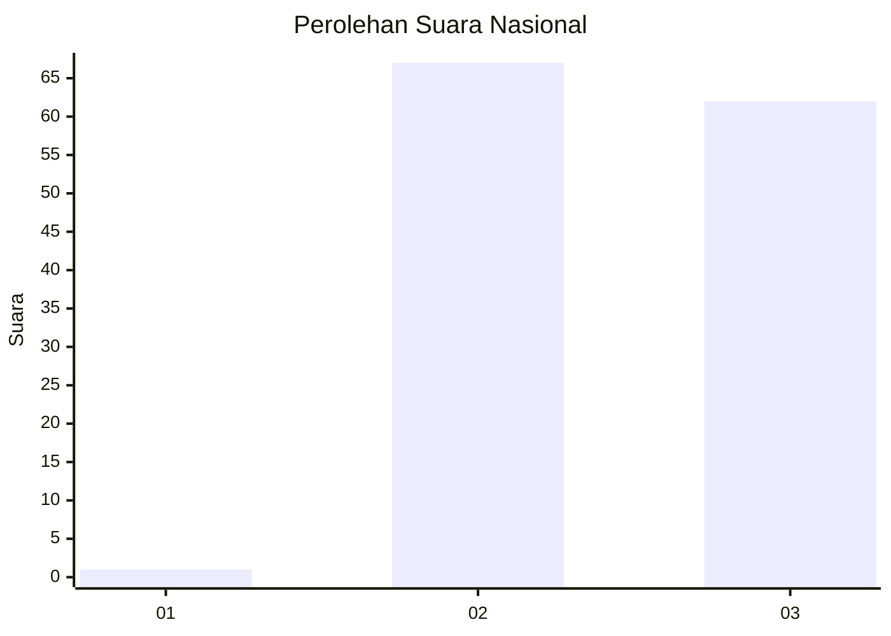
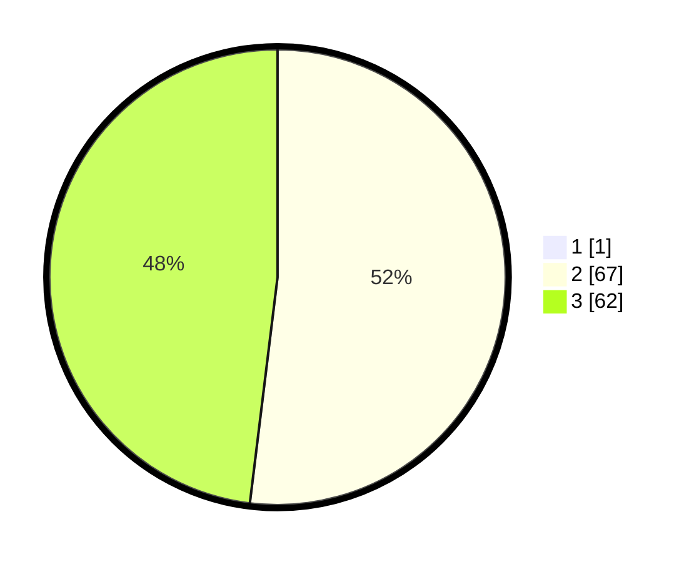

# Hasil

## Grafik

## Tabel

| No. | Nama Paslon    | Suara | Suara (raw) | Persentase |
|:--- |:-------------- | -----:| -----------:| ----------:|
| 1   | ANIES MUHAIMIN | 1     | [1][p-1]    | 0,77       |
| 2   | PRABOWO GIBRAN | 67    | [67][p-2]   | 51,54      |
| 3   | GANJAR MAHFUD  | 62    | [62][p-3]   | 47,69      |

[p-1]: https://github.com/gigit-pemilu/pemilu-2024/blob/main/pilpres/hitung-suara/sub/51-bali/sub/08-buleleng/sub/02-seririt/sub/2006-gunungsari/sub/009-tps/sub/paslon-1.txt
[p-2]: https://github.com/gigit-pemilu/pemilu-2024/blob/main/pilpres/hitung-suara/sub/51-bali/sub/08-buleleng/sub/02-seririt/sub/2006-gunungsari/sub/009-tps/sub/paslon-2.txt
[p-3]: https://github.com/gigit-pemilu/pemilu-2024/blob/main/pilpres/hitung-suara/sub/51-bali/sub/08-buleleng/sub/02-seririt/sub/2006-gunungsari/sub/009-tps/sub/paslon-3.txt

## Foto C Plano

https://sirekap-obj-formc.kpu.go.id/13c6/pemilu/ppwp/51/08/02/20/06/5108022006009-20240214-231400--5b761143-4a71-4d69-a635-315c5b74721f.jpg

https://sirekap-obj-formc.kpu.go.id/13c6/pemilu/ppwp/51/08/02/20/06/5108022006009-20240214-231622--a2cb3491-a333-4957-ab1e-34566cbd2a34.jpg

https://sirekap-obj-formc.kpu.go.id/13c6/pemilu/ppwp/51/08/02/20/06/5108022006009-20240214-233356--eb3defbf-e9c2-457e-b103-be5aa1fca43e.jpg

## Metadata

| Key        | Value               |
| ---------- | ------------------- |
| Time Stamp | 2024-02-24 22:31:28 |

