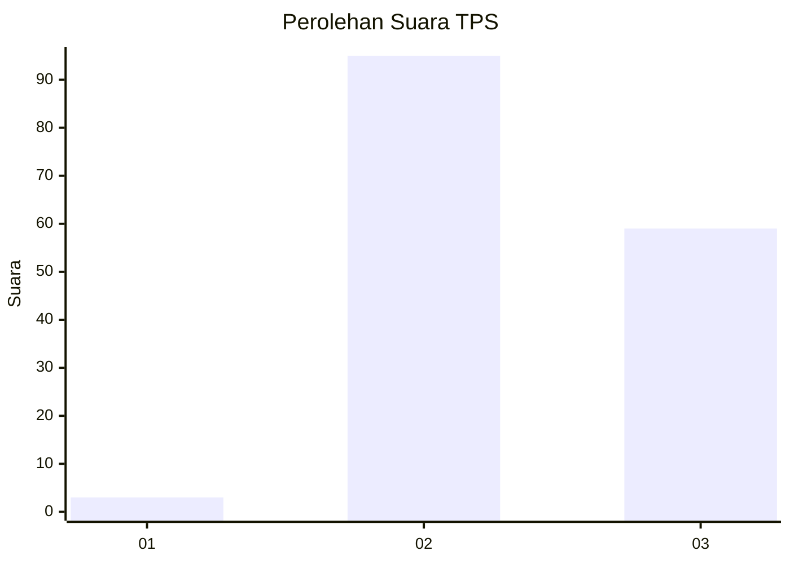
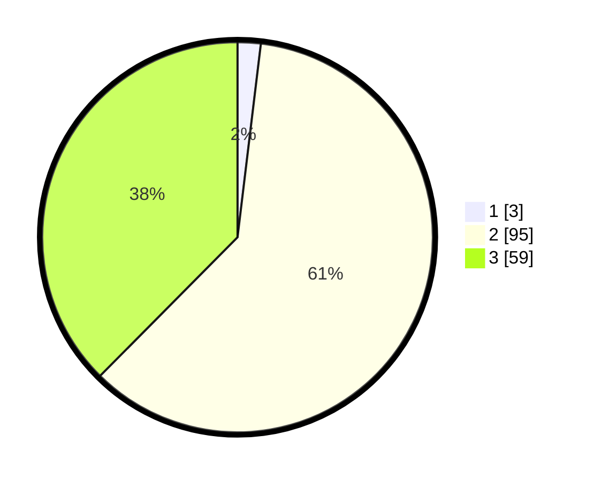

# Hasil

## Grafik

## Tabel

| No. | Nama Paslon    | Suara | Suara (raw) | Persentase |
|:--- |:-------------- | -----:| -----------:| ----------:|
| 1   | ANIES MUHAIMIN | 3     | [3][p-1]    | 1,91       |
| 2   | PRABOWO GIBRAN | 95    | [95][p-2]   | 60,51      |
| 3   | GANJAR MAHFUD  | 59    | [59][p-3]   | 37,58      |

[p-1]: https://github.com/gigit-pemilu/pemilu-2024-51-bali/blob/main/pilpres/hitung-suara/sub/51-bali/sub/08-buleleng/sub/02-seririt/sub/2006-gunungsari/sub/010-tps/sub/paslon-1.txt
[p-2]: https://github.com/gigit-pemilu/pemilu-2024-51-bali/blob/main/pilpres/hitung-suara/sub/51-bali/sub/08-buleleng/sub/02-seririt/sub/2006-gunungsari/sub/010-tps/sub/paslon-2.txt
[p-3]: https://github.com/gigit-pemilu/pemilu-2024-51-bali/blob/main/pilpres/hitung-suara/sub/51-bali/sub/08-buleleng/sub/02-seririt/sub/2006-gunungsari/sub/010-tps/sub/paslon-3.txt

## Foto C Plano

https://sirekap-obj-formc.kpu.go.id/2113/pemilu/ppwp/51/08/02/20/06/5108022006010-20240215-013352--790dc760-1a58-4a60-a678-1949033230ba.jpg

https://sirekap-obj-formc.kpu.go.id/2113/pemilu/ppwp/51/08/02/20/06/5108022006010-20240215-013538--d6a4cbc7-f3dc-45f1-b154-bf8ca596f973.jpg

https://sirekap-obj-formc.kpu.go.id/2113/pemilu/ppwp/51/08/02/20/06/5108022006010-20240215-013712--c29c18bc-d37d-4da1-83a8-862de6504bf4.jpg

## Metadata

| Key        | Value               |
| ---------- | ------------------- |
| Time Stamp | 2024-02-24 22:31:28 |

