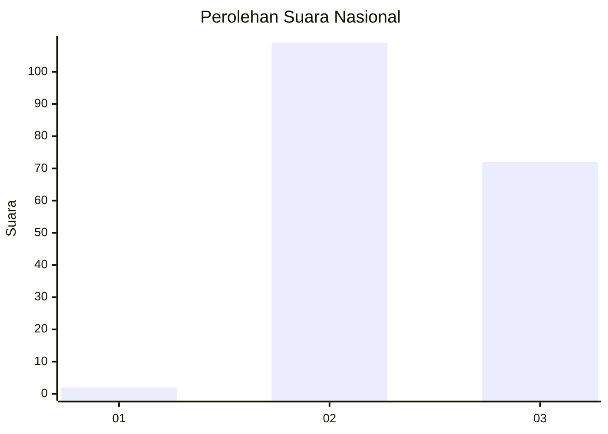
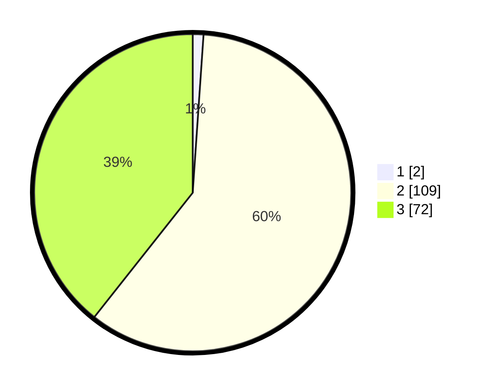

# Hasil

## Grafik

## Tabel

| No. | Nama Paslon    | Suara | Suara (raw) | Persentase |
|:--- |:-------------- | -----:| -----------:| ----------:|
| 1   | ANIES MUHAIMIN | 2     | [2][p-1]    | 1,09       |
| 2   | PRABOWO GIBRAN | 109   | [109][p-2]  | 59,56      |
| 3   | GANJAR MAHFUD  | 72    | [72][p-3]   | 39,34      |

[p-1]: https://github.com/gigit-pemilu/pemilu-2024/blob/main/pilpres/hitung-suara/sub/51-bali/sub/08-buleleng/sub/02-seririt/sub/2007-munduk-bestala/sub/001-tps/sub/paslon-1.txt
[p-2]: https://github.com/gigit-pemilu/pemilu-2024/blob/main/pilpres/hitung-suara/sub/51-bali/sub/08-buleleng/sub/02-seririt/sub/2007-munduk-bestala/sub/001-tps/sub/paslon-2.txt
[p-3]: https://github.com/gigit-pemilu/pemilu-2024/blob/main/pilpres/hitung-suara/sub/51-bali/sub/08-buleleng/sub/02-seririt/sub/2007-munduk-bestala/sub/001-tps/sub/paslon-3.txt

## Foto C Plano

https://sirekap-obj-formc.kpu.go.id/597b/pemilu/ppwp/51/08/02/20/07/5108022007001-20240214-214855--7718f6fa-987c-4b5e-ad93-6289de10c4e4.jpg

https://sirekap-obj-formc.kpu.go.id/597b/pemilu/ppwp/51/08/02/20/07/5108022007001-20240214-220750--cf7878b4-ab95-4953-8bc5-44be57d5d0a3.jpg

## Metadata

| Key        | Value               |
| ---------- | ------------------- |
| Time Stamp | 2024-02-24 22:31:28 |

