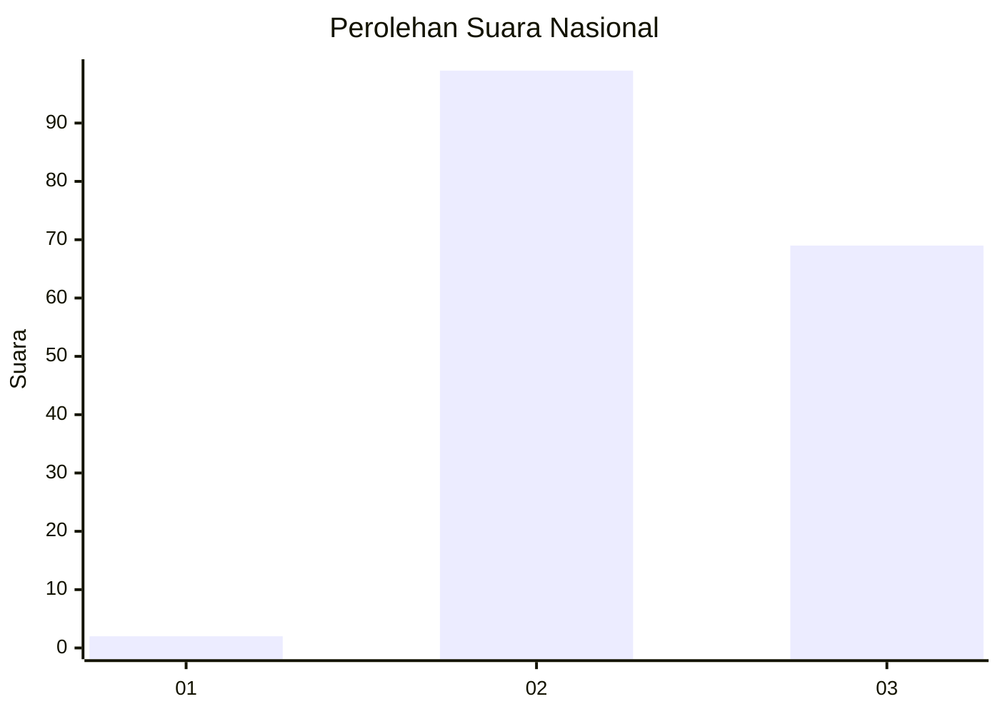
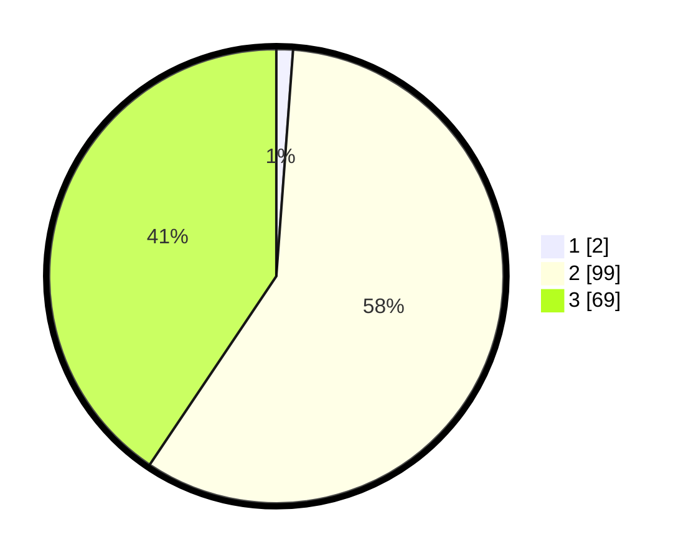

# Hasil

## Grafik

## Tabel

| No. | Nama Paslon    | Suara | Suara (raw) | Persentase |
|:--- |:-------------- | -----:| -----------:| ----------:|
| 1   | ANIES MUHAIMIN | 2     | [2][p-1]    | 1,18       |
| 2   | PRABOWO GIBRAN | 99    | [99][p-2]   | 58,24      |
| 3   | GANJAR MAHFUD  | 69    | [69][p-3]   | 40,59      |

[p-1]: https://github.com/gigit-pemilu/pemilu-2024/blob/main/pilpres/hitung-suara/sub/51-bali/sub/08-buleleng/sub/02-seririt/sub/2007-munduk-bestala/sub/002-tps/sub/paslon-1.txt
[p-2]: https://github.com/gigit-pemilu/pemilu-2024/blob/main/pilpres/hitung-suara/sub/51-bali/sub/08-buleleng/sub/02-seririt/sub/2007-munduk-bestala/sub/002-tps/sub/paslon-2.txt
[p-3]: https://github.com/gigit-pemilu/pemilu-2024/blob/main/pilpres/hitung-suara/sub/51-bali/sub/08-buleleng/sub/02-seririt/sub/2007-munduk-bestala/sub/002-tps/sub/paslon-3.txt

## Foto C Plano

https://sirekap-obj-formc.kpu.go.id/ddae/pemilu/ppwp/51/08/02/20/07/5108022007002-20240214-225455--fc1d8c10-59da-41c8-82c6-cf75280d41d9.jpg

https://sirekap-obj-formc.kpu.go.id/ddae/pemilu/ppwp/51/08/02/20/07/5108022007002-20240214-225519--78d990a3-44e1-4929-9507-b293acc2aefd.jpg

https://sirekap-obj-formc.kpu.go.id/ddae/pemilu/ppwp/51/08/02/20/07/5108022007002-20240214-225536--ea0ae0c8-dc11-493a-854f-54f8f05694ce.jpg

## Metadata

| Key        | Value               |
| ---------- | ------------------- |
| Time Stamp | 2024-02-25 12:00:00 |

