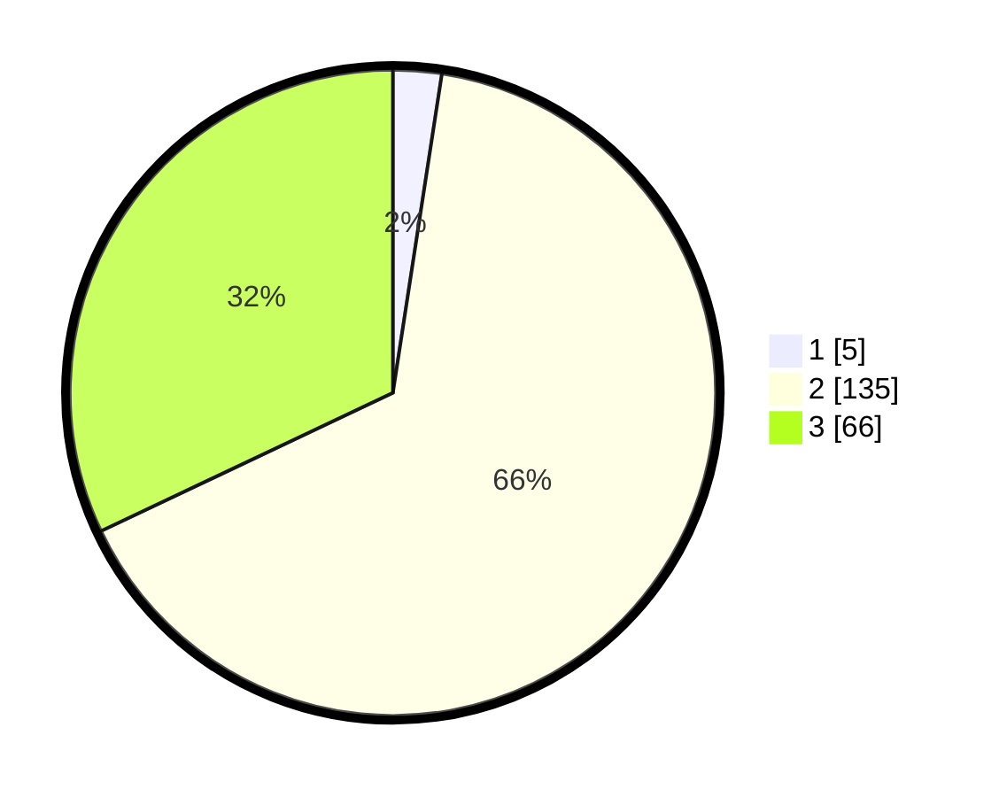

# Hasil

## Grafik

## Tabel

| No. | Nama Paslon    | Suara | Suara (raw) | Persentase |
|:--- |:-------------- | -----:| -----------:| ----------:|
| 1   | ANIES MUHAIMIN | 5     | [5][p-1]    | 2,43       |
| 2   | PRABOWO GIBRAN | 135   | [135][p-2]  | 65,53      |
| 3   | GANJAR MAHFUD  | 66    | [66][p-3]   | 32,04      |

[p-1]: https://github.com/gigit-pemilu/pemilu-2024-51-bali/blob/main/pilpres/hitung-suara/sub/51-bali/sub/08-buleleng/sub/02-seririt/sub/2008-bestala/sub/003-tps/sub/paslon-1.txt
[p-2]: https://github.com/gigit-pemilu/pemilu-2024-51-bali/blob/main/pilpres/hitung-suara/sub/51-bali/sub/08-buleleng/sub/02-seririt/sub/2008-bestala/sub/003-tps/sub/paslon-2.txt
[p-3]: https://github.com/gigit-pemilu/pemilu-2024-51-bali/blob/main/pilpres/hitung-suara/sub/51-bali/sub/08-buleleng/sub/02-seririt/sub/2008-bestala/sub/003-tps/sub/paslon-3.txt

## Foto C Plano

https://sirekap-obj-formc.kpu.go.id/b130/pemilu/ppwp/51/08/02/20/08/5108022008003-20240214-140941--4be9e14c-5839-46ca-82e7-2bc1465b086d.jpg

https://sirekap-obj-formc.kpu.go.id/b130/pemilu/ppwp/51/08/02/20/08/5108022008003-20240214-141044--feca5075-f84b-483e-a224-1c054b673e3e.jpg

https://sirekap-obj-formc.kpu.go.id/b130/pemilu/ppwp/51/08/02/20/08/5108022008003-20240214-141823--85df793e-a6d4-4f73-829b-9c95178d6e28.jpg

## Metadata

| Key        | Value               |
| ---------- | ------------------- |
| Time Stamp | 2024-02-14 21:46:01 |

