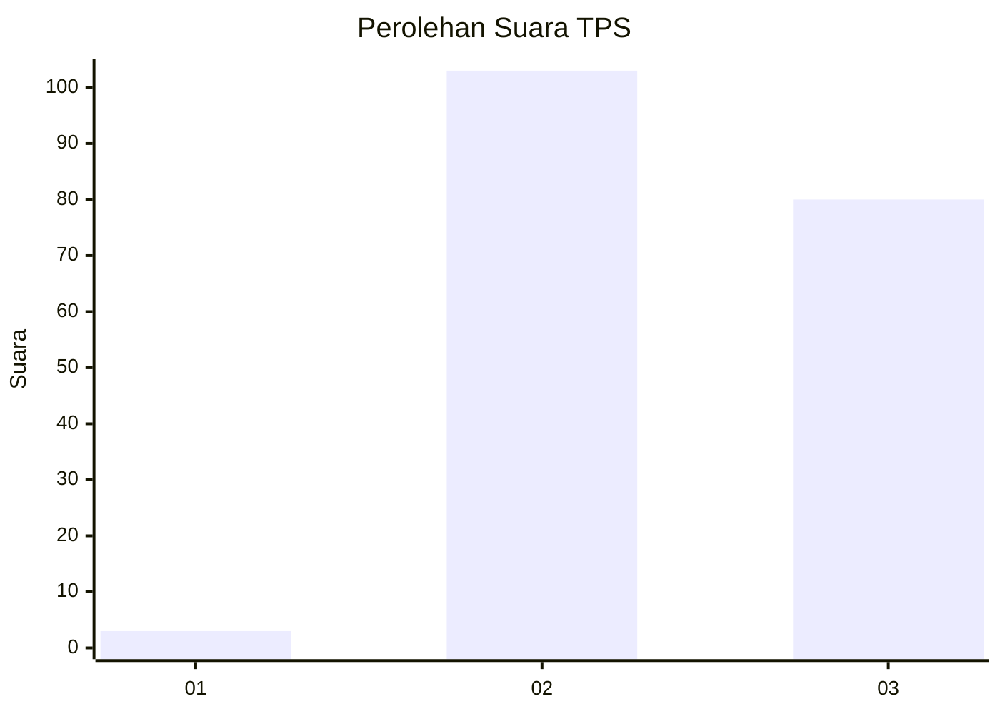
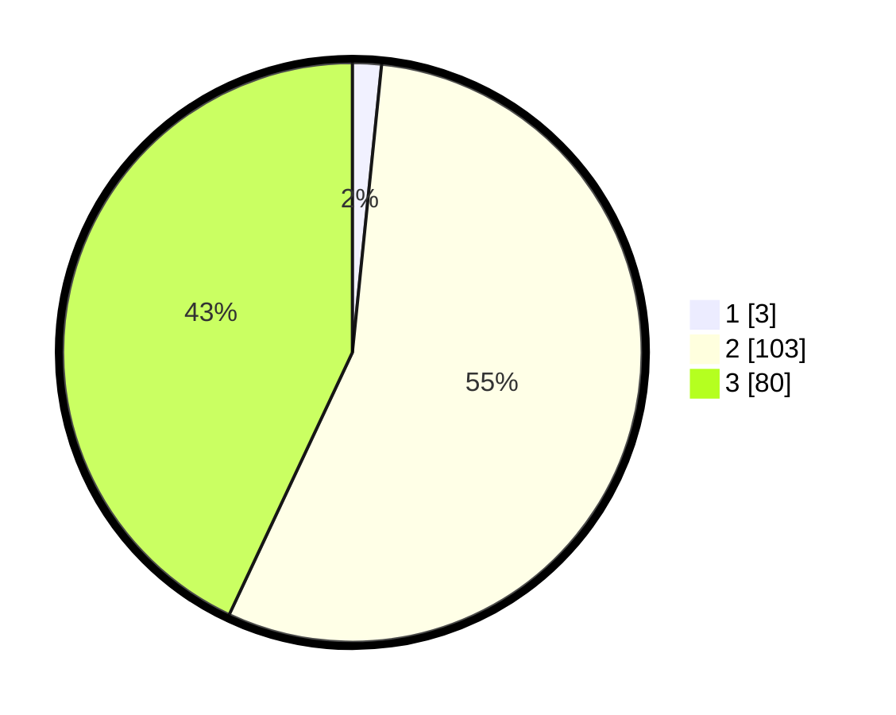

# Hasil

## Grafik

## Tabel

| No. | Nama Paslon    | Suara | Suara (raw) | Persentase |
|:--- |:-------------- | -----:| -----------:| ----------:|
| 1   | ANIES MUHAIMIN | 3     | [3][p-1]    | 1,61       |
| 2   | PRABOWO GIBRAN | 103   | [103][p-2]  | 55,38      |
| 3   | GANJAR MAHFUD  | 80    | [80][p-3]   | 43,01      |

[p-1]: https://github.com/gigit-pemilu/pemilu-2024-51-bali/blob/main/pilpres/hitung-suara/sub/51-bali/sub/08-buleleng/sub/02-seririt/sub/2008-bestala/sub/004-tps/sub/paslon-1.txt
[p-2]: https://github.com/gigit-pemilu/pemilu-2024-51-bali/blob/main/pilpres/hitung-suara/sub/51-bali/sub/08-buleleng/sub/02-seririt/sub/2008-bestala/sub/004-tps/sub/paslon-2.txt
[p-3]: https://github.com/gigit-pemilu/pemilu-2024-51-bali/blob/main/pilpres/hitung-suara/sub/51-bali/sub/08-buleleng/sub/02-seririt/sub/2008-bestala/sub/004-tps/sub/paslon-3.txt

## Foto C Plano

https://sirekap-obj-formc.kpu.go.id/acd4/pemilu/ppwp/51/08/02/20/08/5108022008004-20240214-214514--281954aa-0459-45ff-92e4-c9a197e43f8e.jpg

https://sirekap-obj-formc.kpu.go.id/acd4/pemilu/ppwp/51/08/02/20/08/5108022008004-20240214-215221--bd0d6e21-35d9-4b22-b51d-0e18f20e8b32.jpg

https://sirekap-obj-formc.kpu.go.id/acd4/pemilu/ppwp/51/08/02/20/08/5108022008004-20240214-215400--27282786-ed01-4367-a73f-c1035cb843f4.jpg

## Metadata

| Key        | Value               |
| ---------- | ------------------- |
| Time Stamp | 2024-02-24 22:31:28 |

