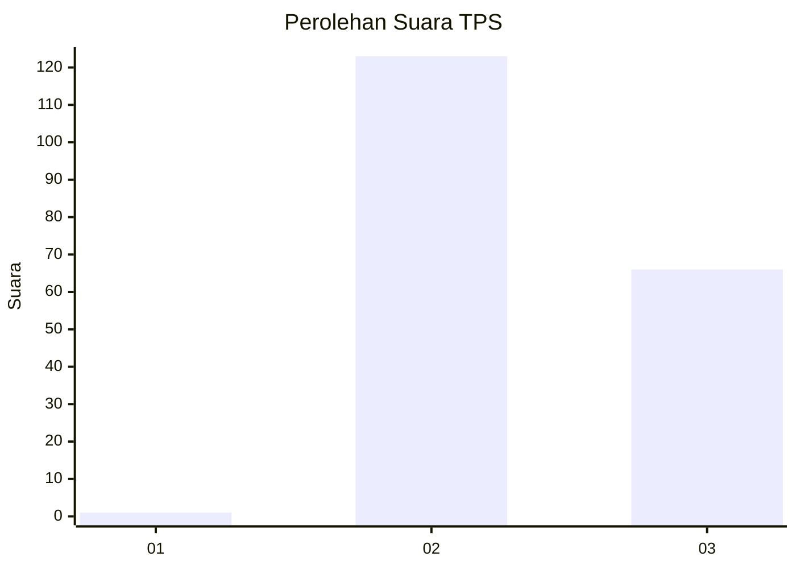
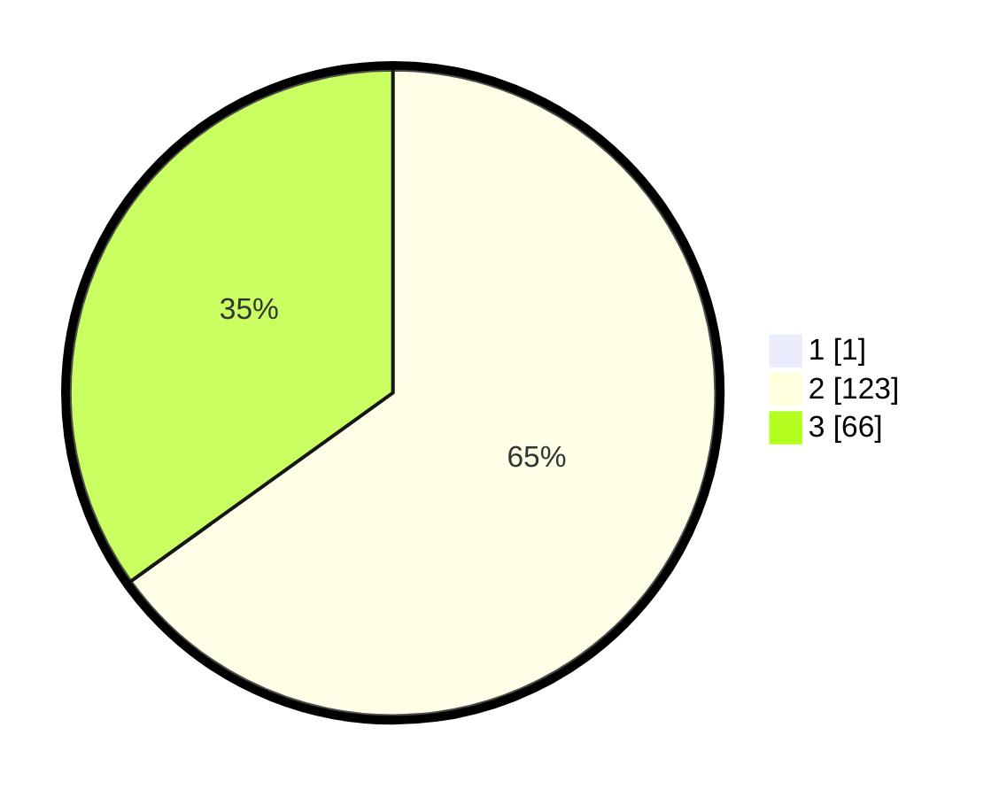

# Hasil

## Grafik

## Tabel

| No. | Nama Paslon    | Suara | Suara (raw) | Persentase |
|:--- |:-------------- | -----:| -----------:| ----------:|
| 1   | ANIES MUHAIMIN | 1     | [1][p-1]    | 0,53       |
| 2   | PRABOWO GIBRAN | 123   | [123][p-2]  | 64,74      |
| 3   | GANJAR MAHFUD  | 66    | [66][p-3]   | 34,74      |

[p-1]: https://github.com/gigit-pemilu/pemilu-2024-51-bali/blob/main/pilpres/hitung-suara/sub/51-bali/sub/08-buleleng/sub/02-seririt/sub/2009-kalianget/sub/001-tps/sub/paslon-1.txt
[p-2]: https://github.com/gigit-pemilu/pemilu-2024-51-bali/blob/main/pilpres/hitung-suara/sub/51-bali/sub/08-buleleng/sub/02-seririt/sub/2009-kalianget/sub/001-tps/sub/paslon-2.txt
[p-3]: https://github.com/gigit-pemilu/pemilu-2024-51-bali/blob/main/pilpres/hitung-suara/sub/51-bali/sub/08-buleleng/sub/02-seririt/sub/2009-kalianget/sub/001-tps/sub/paslon-3.txt

## Foto C Plano

https://sirekap-obj-formc.kpu.go.id/afa9/pemilu/ppwp/51/08/02/20/09/5108022009001-20240215-012040--1984bf1a-d009-4d94-bf23-404915a9541d.jpg

https://sirekap-obj-formc.kpu.go.id/afa9/pemilu/ppwp/51/08/02/20/09/5108022009001-20240215-020745--2a0c3197-ad2d-4de6-997b-1442ac1c9d37.jpg

https://sirekap-obj-formc.kpu.go.id/afa9/pemilu/ppwp/51/08/02/20/09/5108022009001-20240215-020517--7873e877-a550-42ef-95a0-f9c90f6b0e58.jpg

## Metadata

| Key        | Value               |
| ---------- | ------------------- |
| Time Stamp | 2024-02-15 04:00:24 |

