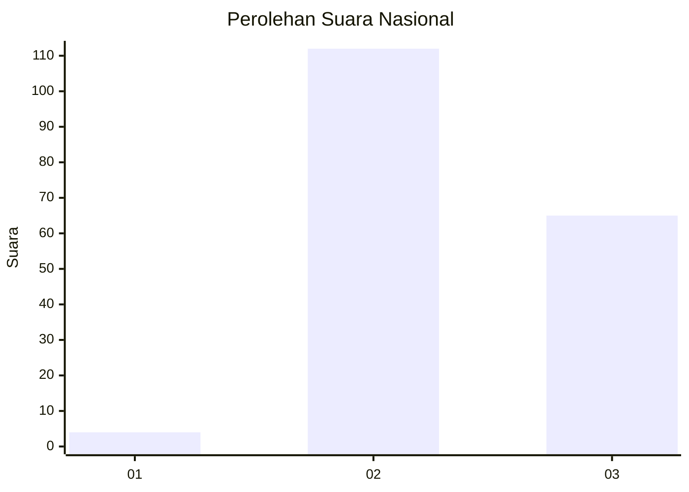
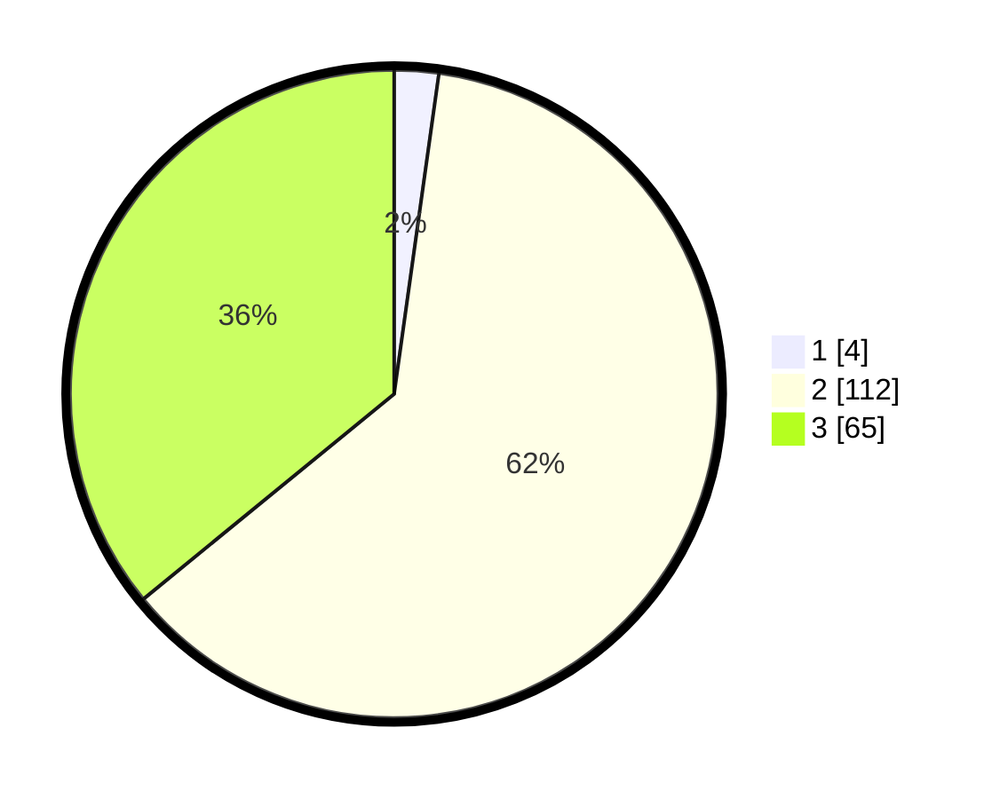

# Hasil

## Grafik

## Tabel

| No. | Nama Paslon    | Suara | Suara (raw) | Persentase |
|:--- |:-------------- | -----:| -----------:| ----------:|
| 1   | ANIES MUHAIMIN | 4     | [4][p-1]    | 2,21       |
| 2   | PRABOWO GIBRAN | 112   | [112][p-2]  | 61,88      |
| 3   | GANJAR MAHFUD  | 65    | [65][p-3]   | 35,91      |

[p-1]: https://github.com/gigit-pemilu/pemilu-2024/blob/main/pilpres/hitung-suara/sub/51-bali/sub/08-buleleng/sub/02-seririt/sub/2009-kalianget/sub/008-tps/sub/paslon-1.txt
[p-2]: https://github.com/gigit-pemilu/pemilu-2024/blob/main/pilpres/hitung-suara/sub/51-bali/sub/08-buleleng/sub/02-seririt/sub/2009-kalianget/sub/008-tps/sub/paslon-2.txt
[p-3]: https://github.com/gigit-pemilu/pemilu-2024/blob/main/pilpres/hitung-suara/sub/51-bali/sub/08-buleleng/sub/02-seririt/sub/2009-kalianget/sub/008-tps/sub/paslon-3.txt

## Foto C Plano

https://sirekap-obj-formc.kpu.go.id/96c5/pemilu/ppwp/51/08/02/20/09/5108022009008-20240215-030430--fd4b0378-0ae2-4594-abe8-fd82e9d4f0ce.jpg

https://sirekap-obj-formc.kpu.go.id/96c5/pemilu/ppwp/51/08/02/20/09/5108022009008-20240215-030513--f4c198ad-7824-499b-9244-d1178aee0848.jpg

https://sirekap-obj-formc.kpu.go.id/96c5/pemilu/ppwp/51/08/02/20/09/5108022009008-20240215-030622--a0db05fe-f485-4c6d-ab56-616cdddf01d3.jpg

## Metadata

| Key        | Value               |
| ---------- | ------------------- |
| Time Stamp | 2024-02-25 12:00:00 |

