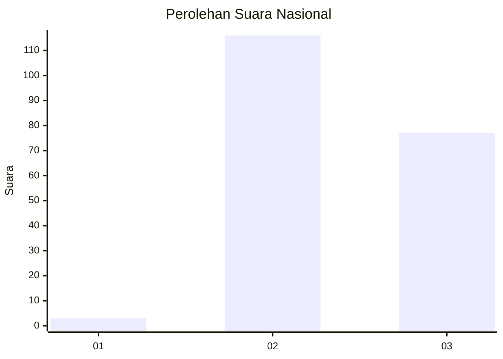
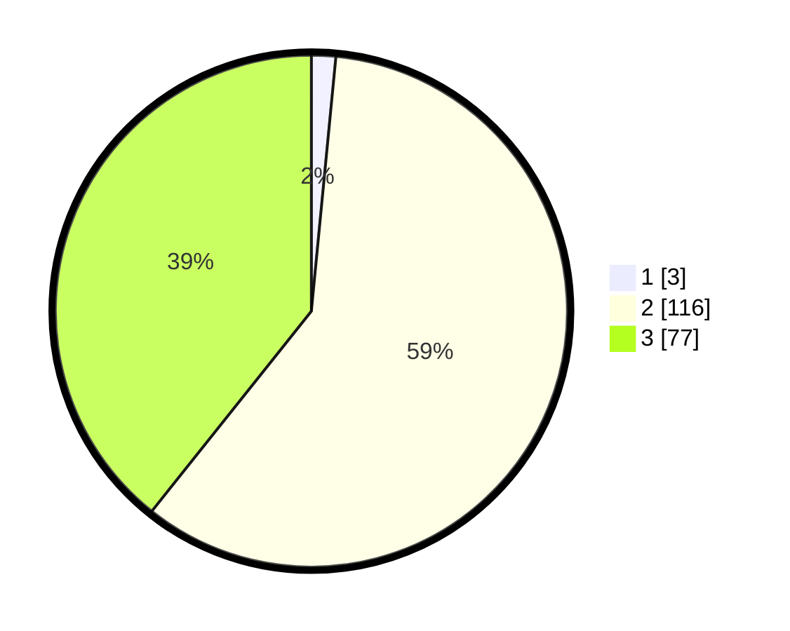

# Hasil

## Grafik

## Tabel

| No. | Nama Paslon    | Suara | Suara (raw) | Persentase |
|:--- |:-------------- | -----:| -----------:| ----------:|
| 1   | ANIES MUHAIMIN | 3     | [3][p-1]    | 1,53       |
| 2   | PRABOWO GIBRAN | 116   | [116][p-2]  | 59,18      |
| 3   | GANJAR MAHFUD  | 77    | [77][p-3]   | 39,29      |

[p-1]: https://github.com/gigit-pemilu/pemilu-2024/blob/main/pilpres/hitung-suara/sub/51-bali/sub/08-buleleng/sub/02-seririt/sub/2009-kalianget/sub/010-tps/sub/paslon-1.txt
[p-2]: https://github.com/gigit-pemilu/pemilu-2024/blob/main/pilpres/hitung-suara/sub/51-bali/sub/08-buleleng/sub/02-seririt/sub/2009-kalianget/sub/010-tps/sub/paslon-2.txt
[p-3]: https://github.com/gigit-pemilu/pemilu-2024/blob/main/pilpres/hitung-suara/sub/51-bali/sub/08-buleleng/sub/02-seririt/sub/2009-kalianget/sub/010-tps/sub/paslon-3.txt

## Foto C Plano

https://sirekap-obj-formc.kpu.go.id/37f8/pemilu/ppwp/51/08/02/20/09/5108022009010-20240215-025833--49b85d8e-4ff1-4a65-9303-355a51931b1e.jpg

https://sirekap-obj-formc.kpu.go.id/37f8/pemilu/ppwp/51/08/02/20/09/5108022009010-20240215-031839--3791e3bd-83cd-422d-90c9-88d32b0314ef.jpg

https://sirekap-obj-formc.kpu.go.id/37f8/pemilu/ppwp/51/08/02/20/09/5108022009010-20240215-032453--04ff5d35-5202-4282-8e6c-590ee4d23ebf.jpg

## Metadata

| Key        | Value               |
| ---------- | ------------------- |
| Time Stamp | 2024-02-24 22:31:28 |

