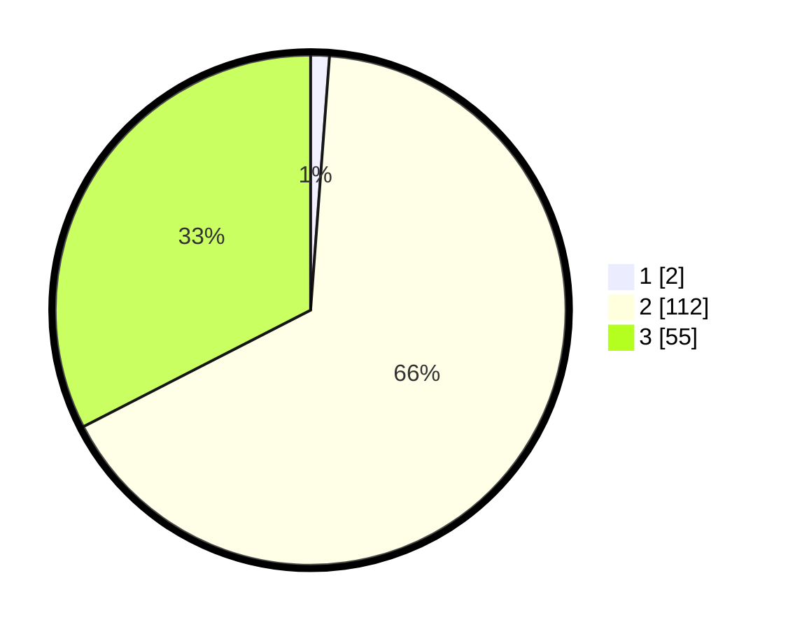

# Hasil

## Grafik

## Tabel

| No. | Nama Paslon    | Suara | Suara (raw) | Persentase |
|:--- |:-------------- | -----:| -----------:| ----------:|
| 1   | ANIES MUHAIMIN | 2     | [2][p-1]    | 1,18       |
| 2   | PRABOWO GIBRAN | 112   | [112][p-2]  | 66,27      |
| 3   | GANJAR MAHFUD  | 55    | [55][p-3]   | 32,54      |

[p-1]: https://github.com/gigit-pemilu/pemilu-2024-51-bali/blob/main/pilpres/hitung-suara/sub/51-bali/sub/08-buleleng/sub/02-seririt/sub/2009-kalianget/sub/012-tps/sub/paslon-1.txt
[p-2]: https://github.com/gigit-pemilu/pemilu-2024-51-bali/blob/main/pilpres/hitung-suara/sub/51-bali/sub/08-buleleng/sub/02-seririt/sub/2009-kalianget/sub/012-tps/sub/paslon-2.txt
[p-3]: https://github.com/gigit-pemilu/pemilu-2024-51-bali/blob/main/pilpres/hitung-suara/sub/51-bali/sub/08-buleleng/sub/02-seririt/sub/2009-kalianget/sub/012-tps/sub/paslon-3.txt

## Foto C Plano

https://sirekap-obj-formc.kpu.go.id/6e0e/pemilu/ppwp/51/08/02/20/09/5108022009012-20240214-233407--a40cb83b-09b5-4d35-b5b8-2753269060d8.jpg

https://sirekap-obj-formc.kpu.go.id/6e0e/pemilu/ppwp/51/08/02/20/09/5108022009012-20240214-233612--edad5d01-e336-417e-99fa-f5414e1efcc1.jpg

https://sirekap-obj-formc.kpu.go.id/6e0e/pemilu/ppwp/51/08/02/20/09/5108022009012-20240214-233800--66a944ba-5b38-4b6b-aa58-9466e1b90ac9.jpg

## Metadata

| Key        | Value               |
| ---------- | ------------------- |
| Time Stamp | 2024-02-24 22:31:28 |

