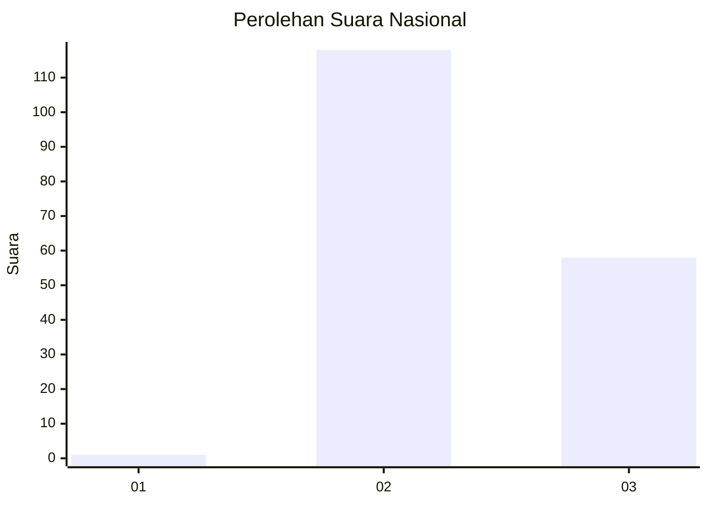
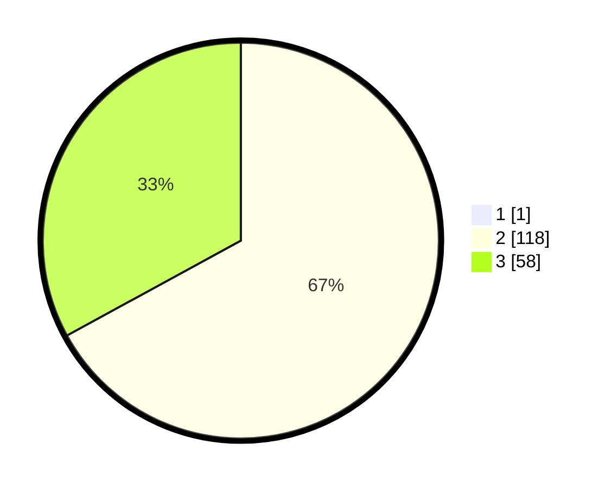

# Hasil

## Grafik

## Tabel

| No. | Nama Paslon    | Suara | Suara (raw) | Persentase |
|:--- |:-------------- | -----:| -----------:| ----------:|
| 1   | ANIES MUHAIMIN | 1     | [1][p-1]    | 0,56       |
| 2   | PRABOWO GIBRAN | 118   | [118][p-2]  | 66,67      |
| 3   | GANJAR MAHFUD  | 58    | [58][p-3]   | 32,77      |

[p-1]: https://github.com/gigit-pemilu/pemilu-2024/blob/main/pilpres/hitung-suara/sub/51-bali/sub/08-buleleng/sub/02-seririt/sub/2009-kalianget/sub/013-tps/sub/paslon-1.txt
[p-2]: https://github.com/gigit-pemilu/pemilu-2024/blob/main/pilpres/hitung-suara/sub/51-bali/sub/08-buleleng/sub/02-seririt/sub/2009-kalianget/sub/013-tps/sub/paslon-2.txt
[p-3]: https://github.com/gigit-pemilu/pemilu-2024/blob/main/pilpres/hitung-suara/sub/51-bali/sub/08-buleleng/sub/02-seririt/sub/2009-kalianget/sub/013-tps/sub/paslon-3.txt

## Foto C Plano

https://sirekap-obj-formc.kpu.go.id/0908/pemilu/ppwp/51/08/02/20/09/5108022009013-20240215-014011--be325207-ca32-428f-b1b3-ba5d78735114.jpg

https://sirekap-obj-formc.kpu.go.id/0908/pemilu/ppwp/51/08/02/20/09/5108022009013-20240215-014211--456475b4-8a9b-4a68-88e5-53e6b2812d9e.jpg

https://sirekap-obj-formc.kpu.go.id/0908/pemilu/ppwp/51/08/02/20/09/5108022009013-20240215-013329--be828f15-c239-40df-b837-e765d38ed445.jpg

## Metadata

| Key        | Value               |
| ---------- | ------------------- |
| Time Stamp | 2024-02-24 22:31:28 |

