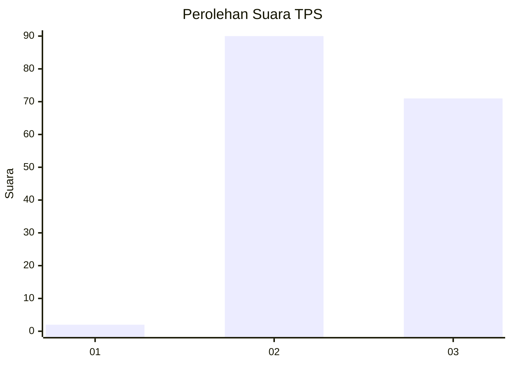
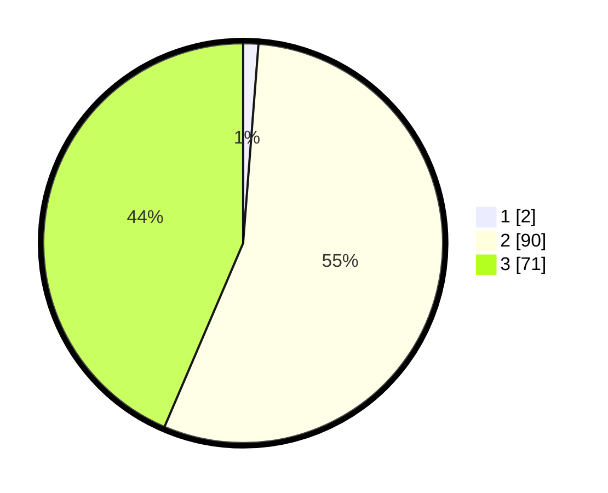

# Hasil

## Grafik

## Tabel

| No. | Nama Paslon    | Suara | Suara (raw) | Persentase |
|:--- |:-------------- | -----:| -----------:| ----------:|
| 1   | ANIES MUHAIMIN | 2     | [2][p-1]    | 1,23       |
| 2   | PRABOWO GIBRAN | 90    | [90][p-2]   | 55,21      |
| 3   | GANJAR MAHFUD  | 71    | [71][p-3]   | 43,56      |

[p-1]: https://github.com/gigit-pemilu/pemilu-2024-51-bali/blob/main/pilpres/hitung-suara/sub/51-bali/sub/08-buleleng/sub/02-seririt/sub/2010-joanyar/sub/002-tps/sub/paslon-1.txt
[p-2]: https://github.com/gigit-pemilu/pemilu-2024-51-bali/blob/main/pilpres/hitung-suara/sub/51-bali/sub/08-buleleng/sub/02-seririt/sub/2010-joanyar/sub/002-tps/sub/paslon-2.txt
[p-3]: https://github.com/gigit-pemilu/pemilu-2024-51-bali/blob/main/pilpres/hitung-suara/sub/51-bali/sub/08-buleleng/sub/02-seririt/sub/2010-joanyar/sub/002-tps/sub/paslon-3.txt

## Foto C Plano

https://sirekap-obj-formc.kpu.go.id/fcb5/pemilu/ppwp/51/08/02/20/10/5108022010002-20240215-004422--0b3e521e-29a1-41dd-901c-6a74fd1d028b.jpg

https://sirekap-obj-formc.kpu.go.id/fcb5/pemilu/ppwp/51/08/02/20/10/5108022010002-20240215-004940--3fd868ed-a7d6-4d85-9fbc-8d17453e1201.jpg

https://sirekap-obj-formc.kpu.go.id/fcb5/pemilu/ppwp/51/08/02/20/10/5108022010002-20240215-005025--b2b74ec6-ee97-42c1-8d57-ae281989b75f.jpg

## Metadata

| Key        | Value               |
| ---------- | ------------------- |
| Time Stamp | 2024-02-27 15:00:00 |

