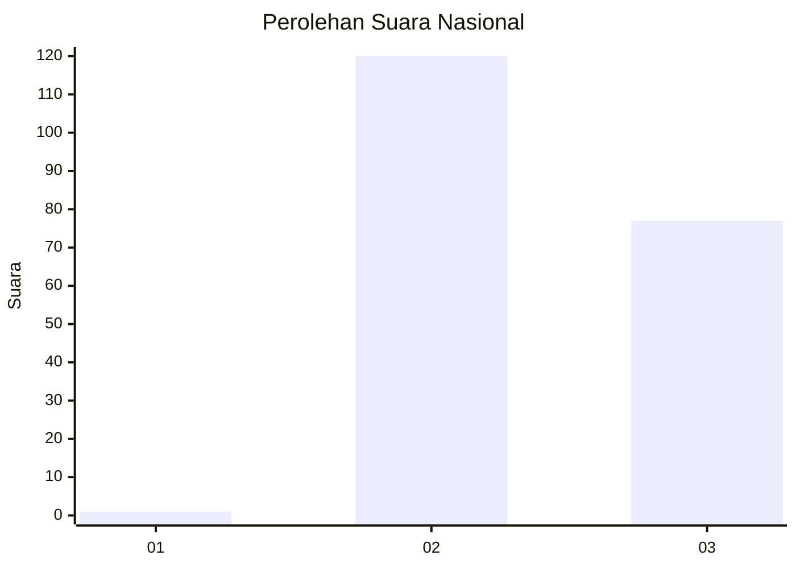
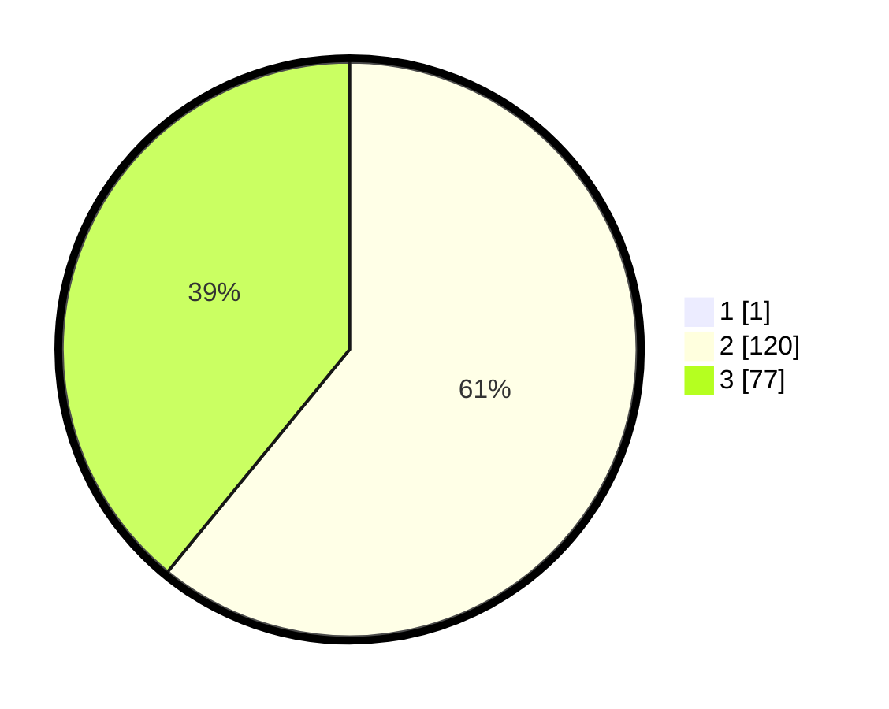

# Hasil

## Grafik

## Tabel

| No. | Nama Paslon    | Suara | Suara (raw) | Persentase |
|:--- |:-------------- | -----:| -----------:| ----------:|
| 1   | ANIES MUHAIMIN | 1     | [1][p-1]    | 0,51       |
| 2   | PRABOWO GIBRAN | 120   | [120][p-2]  | 60,61      |
| 3   | GANJAR MAHFUD  | 77    | [77][p-3]   | 38,89      |

[p-1]: https://github.com/gigit-pemilu/pemilu-2024/blob/main/pilpres/hitung-suara/sub/51-bali/sub/08-buleleng/sub/02-seririt/sub/2010-joanyar/sub/003-tps/sub/paslon-1.txt
[p-2]: https://github.com/gigit-pemilu/pemilu-2024/blob/main/pilpres/hitung-suara/sub/51-bali/sub/08-buleleng/sub/02-seririt/sub/2010-joanyar/sub/003-tps/sub/paslon-2.txt
[p-3]: https://github.com/gigit-pemilu/pemilu-2024/blob/main/pilpres/hitung-suara/sub/51-bali/sub/08-buleleng/sub/02-seririt/sub/2010-joanyar/sub/003-tps/sub/paslon-3.txt

## Foto C Plano

https://sirekap-obj-formc.kpu.go.id/5c45/pemilu/ppwp/51/08/02/20/10/5108022010003-20240215-015632--262a160f-179a-4e74-99a1-21c4bfd7f93e.jpg

https://sirekap-obj-formc.kpu.go.id/5c45/pemilu/ppwp/51/08/02/20/10/5108022010003-20240215-020010--585df042-50bd-4421-97b1-7fd55baf7c95.jpg

https://sirekap-obj-formc.kpu.go.id/5c45/pemilu/ppwp/51/08/02/20/10/5108022010003-20240215-020336--25903a71-8ec2-4458-b4a6-e48d04597e11.jpg

## Metadata

| Key        | Value               |
| ---------- | ------------------- |
| Time Stamp | 2024-02-24 22:31:28 |

