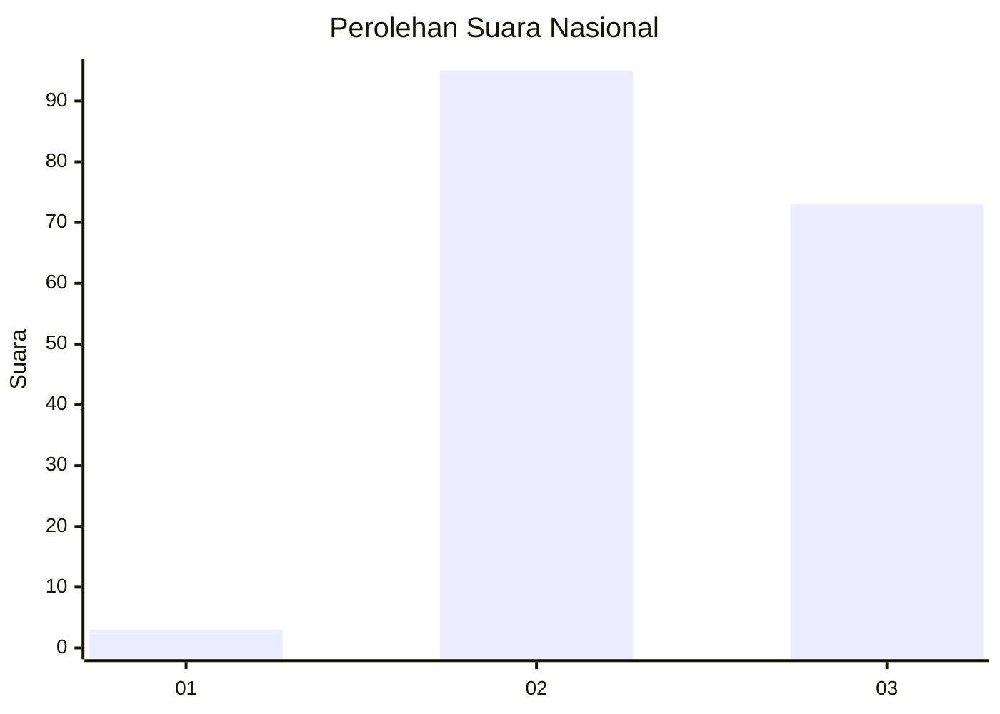
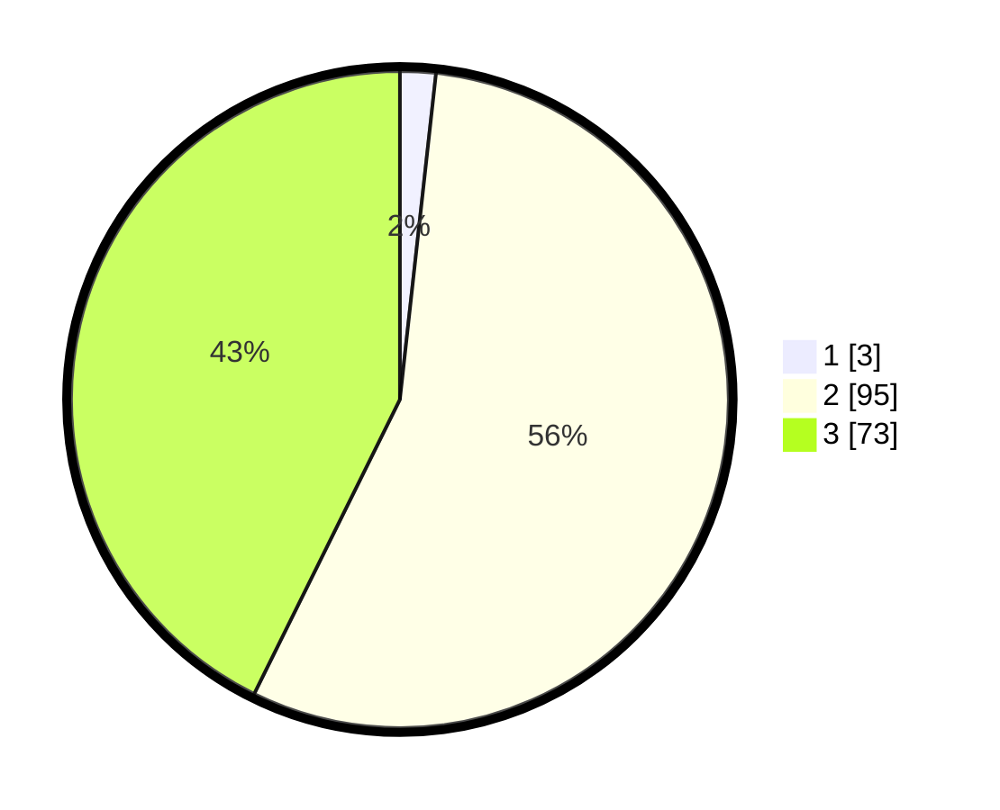

# Hasil

## Grafik

## Tabel

| No. | Nama Paslon    | Suara | Suara (raw) | Persentase |
|:--- |:-------------- | -----:| -----------:| ----------:|
| 1   | ANIES MUHAIMIN | 3     | [3][p-1]    | 1,75       |
| 2   | PRABOWO GIBRAN | 95    | [95][p-2]   | 55,56      |
| 3   | GANJAR MAHFUD  | 73    | [73][p-3]   | 42,69      |

[p-1]: https://github.com/gigit-pemilu/pemilu-2024/blob/main/pilpres/hitung-suara/sub/51-bali/sub/08-buleleng/sub/02-seririt/sub/2010-joanyar/sub/004-tps/sub/paslon-1.txt
[p-2]: https://github.com/gigit-pemilu/pemilu-2024/blob/main/pilpres/hitung-suara/sub/51-bali/sub/08-buleleng/sub/02-seririt/sub/2010-joanyar/sub/004-tps/sub/paslon-2.txt
[p-3]: https://github.com/gigit-pemilu/pemilu-2024/blob/main/pilpres/hitung-suara/sub/51-bali/sub/08-buleleng/sub/02-seririt/sub/2010-joanyar/sub/004-tps/sub/paslon-3.txt

## Foto C Plano

https://sirekap-obj-formc.kpu.go.id/1a19/pemilu/ppwp/51/08/02/20/10/5108022010004-20240214-194650--b2b43493-5ef9-4566-9fe9-c31bd374bece.jpg

https://sirekap-obj-formc.kpu.go.id/1a19/pemilu/ppwp/51/08/02/20/10/5108022010004-20240214-194905--937a4cc4-8e66-4925-bb2d-483d6bc9664c.jpg

https://sirekap-obj-formc.kpu.go.id/1a19/pemilu/ppwp/51/08/02/20/10/5108022010004-20240214-195100--914b2c34-70f7-4691-b7c3-8d143f04c9db.jpg

## Metadata

| Key        | Value               |
| ---------- | ------------------- |
| Time Stamp | 2024-02-24 22:31:28 |

