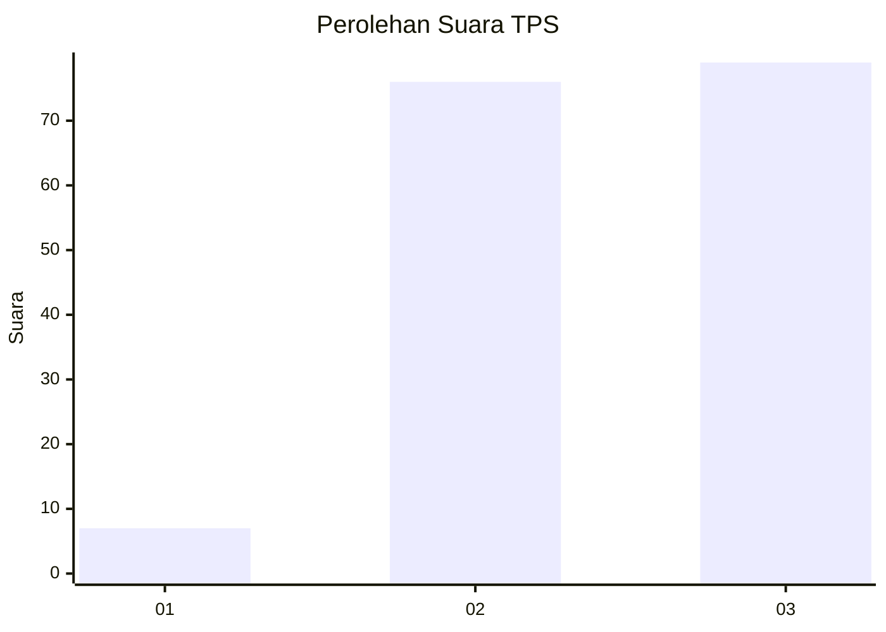
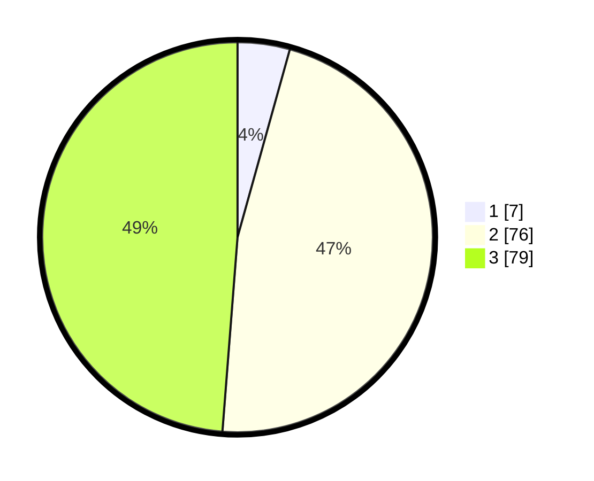

# Hasil

## Grafik

## Tabel

| No. | Nama Paslon    | Suara | Suara (raw) | Persentase |
|:--- |:-------------- | -----:| -----------:| ----------:|
| 1   | ANIES MUHAIMIN | 7     | [7][p-1]    | 4,32       |
| 2   | PRABOWO GIBRAN | 76    | [76][p-2]   | 46,91      |
| 3   | GANJAR MAHFUD  | 79    | [79][p-3]   | 48,77      |

[p-1]: https://github.com/gigit-pemilu/pemilu-2024-51-bali/blob/main/pilpres/hitung-suara/sub/51-bali/sub/08-buleleng/sub/02-seririt/sub/2010-joanyar/sub/005-tps/sub/paslon-1.txt
[p-2]: https://github.com/gigit-pemilu/pemilu-2024-51-bali/blob/main/pilpres/hitung-suara/sub/51-bali/sub/08-buleleng/sub/02-seririt/sub/2010-joanyar/sub/005-tps/sub/paslon-2.txt
[p-3]: https://github.com/gigit-pemilu/pemilu-2024-51-bali/blob/main/pilpres/hitung-suara/sub/51-bali/sub/08-buleleng/sub/02-seririt/sub/2010-joanyar/sub/005-tps/sub/paslon-3.txt

## Foto C Plano

https://sirekap-obj-formc.kpu.go.id/2953/pemilu/ppwp/51/08/02/20/10/5108022010005-20240215-001152--e74df498-88c9-4ae3-82ef-fde016901d48.jpg

https://sirekap-obj-formc.kpu.go.id/2953/pemilu/ppwp/51/08/02/20/10/5108022010005-20240215-001433--57925620-b356-4179-9a88-b84119a0fa0c.jpg

https://sirekap-obj-formc.kpu.go.id/2953/pemilu/ppwp/51/08/02/20/10/5108022010005-20240215-003638--c0fd2be7-f402-44a0-9626-66e817c15a70.jpg

## Metadata

| Key        | Value               |
| ---------- | ------------------- |
| Time Stamp | 2024-02-24 22:31:28 |

