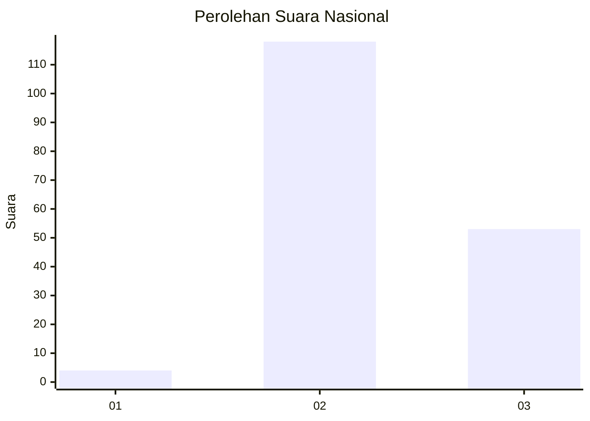

# Hasil

## Grafik

## Tabel

| No. | Nama Paslon    | Suara | Suara (raw) | Persentase |
|:--- |:-------------- | -----:| -----------:| ----------:|
| 1   | ANIES MUHAIMIN | 4     | [4][p-1]    | 2,29       |
| 2   | PRABOWO GIBRAN | 118   | [118][p-2]  | 67,43      |
| 3   | GANJAR MAHFUD  | 53    | [53][p-3]   | 30,29      |

[p-1]: https://github.com/gigit-pemilu/pemilu-2024/blob/main/pilpres/hitung-suara/sub/51-bali/sub/08-buleleng/sub/02-seririt/sub/2010-joanyar/sub/007-tps/sub/paslon-1.txt
[p-2]: https://github.com/gigit-pemilu/pemilu-2024/blob/main/pilpres/hitung-suara/sub/51-bali/sub/08-buleleng/sub/02-seririt/sub/2010-joanyar/sub/007-tps/sub/paslon-2.txt
[p-3]: https://github.com/gigit-pemilu/pemilu-2024/blob/main/pilpres/hitung-suara/sub/51-bali/sub/08-buleleng/sub/02-seririt/sub/2010-joanyar/sub/007-tps/sub/paslon-3.txt

## Foto C Plano

https://sirekap-obj-formc.kpu.go.id/c62e/pemilu/ppwp/51/08/02/20/10/5108022010007-20240215-011503--2be6bb93-07f0-49b6-b43d-25243dae987d.jpg

https://sirekap-obj-formc.kpu.go.id/c62e/pemilu/ppwp/51/08/02/20/10/5108022010007-20240214-224254--1349dd95-df99-4e92-8f73-9b40229c4973.jpg

https://sirekap-obj-formc.kpu.go.id/c62e/pemilu/ppwp/51/08/02/20/10/5108022010007-20240215-011651--ce307253-8313-42a6-8d26-34c5b08fbf08.jpg

## Metadata

| Key        | Value               |
| ---------- | ------------------- |
| Time Stamp | 2024-02-24 23:00:00 |

