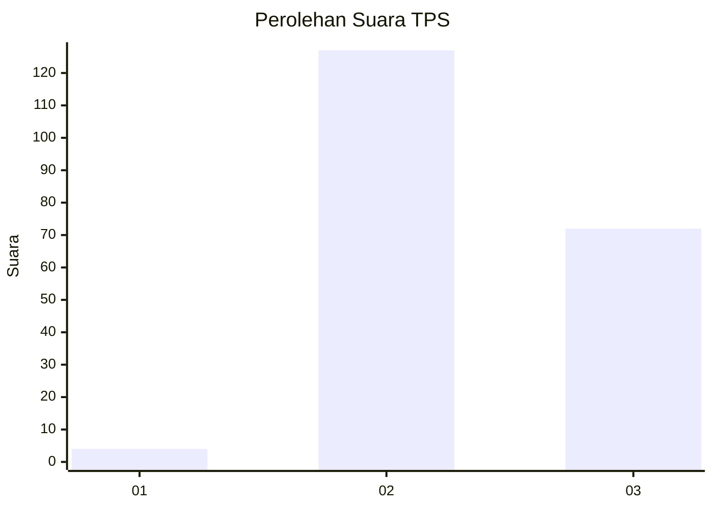
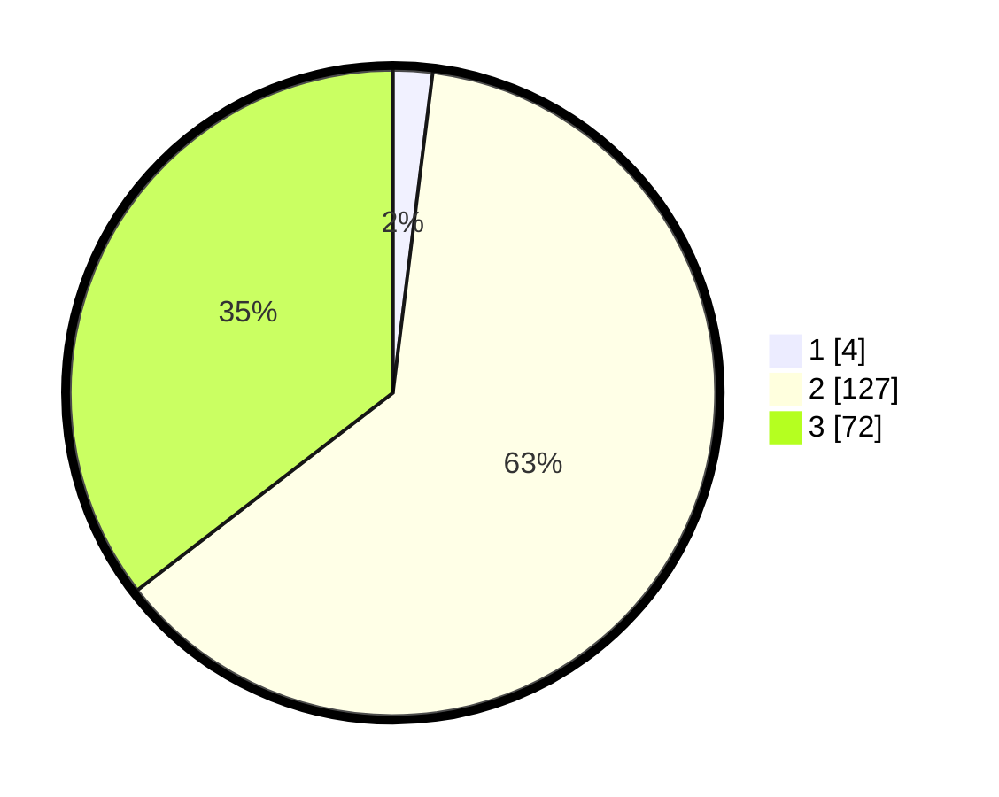

# Hasil

## Grafik

## Tabel

| No. | Nama Paslon    | Suara | Suara (raw) | Persentase |
|:--- |:-------------- | -----:| -----------:| ----------:|
| 1   | ANIES MUHAIMIN | 4     | [4][p-1]    | 1,97       |
| 2   | PRABOWO GIBRAN | 127   | [127][p-2]  | 62,56      |
| 3   | GANJAR MAHFUD  | 72    | [72][p-3]   | 35,47      |

[p-1]: https://github.com/gigit-pemilu/pemilu-2024-51-bali/blob/main/pilpres/hitung-suara/sub/51-bali/sub/08-buleleng/sub/02-seririt/sub/2010-joanyar/sub/010-tps/sub/paslon-1.txt
[p-2]: https://github.com/gigit-pemilu/pemilu-2024-51-bali/blob/main/pilpres/hitung-suara/sub/51-bali/sub/08-buleleng/sub/02-seririt/sub/2010-joanyar/sub/010-tps/sub/paslon-2.txt
[p-3]: https://github.com/gigit-pemilu/pemilu-2024-51-bali/blob/main/pilpres/hitung-suara/sub/51-bali/sub/08-buleleng/sub/02-seririt/sub/2010-joanyar/sub/010-tps/sub/paslon-3.txt

## Foto C Plano

https://sirekap-obj-formc.kpu.go.id/7cb7/pemilu/ppwp/51/08/02/20/10/5108022010010-20240215-001140--75bb07c2-0701-4912-8542-1dd380d7cc7e.jpg

https://sirekap-obj-formc.kpu.go.id/7cb7/pemilu/ppwp/51/08/02/20/10/5108022010010-20240215-001247--7269b467-8105-4c34-95da-ba002dce4507.jpg

https://sirekap-obj-formc.kpu.go.id/7cb7/pemilu/ppwp/51/08/02/20/10/5108022010010-20240215-001434--344d3589-97f7-4ffa-957f-8ee92f68525a.jpg

## Metadata

| Key        | Value               |
| ---------- | ------------------- |
| Time Stamp | 2024-02-24 22:31:28 |

