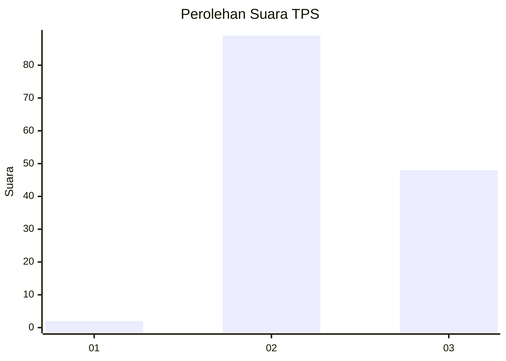
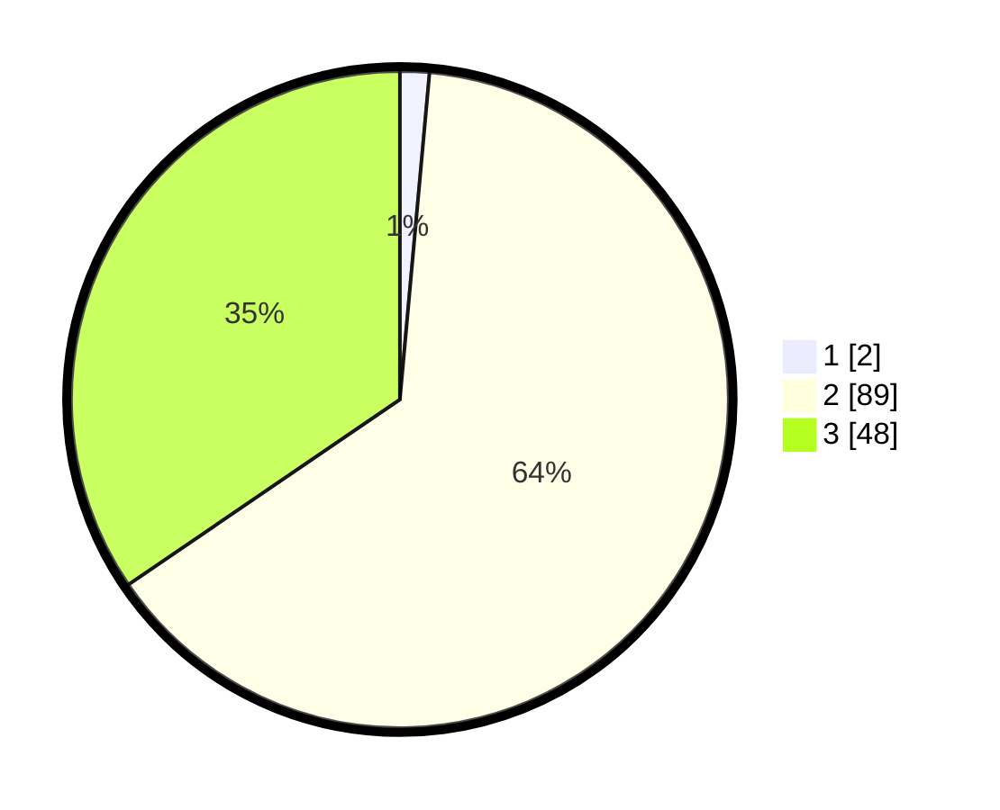

# Hasil

## Grafik

## Tabel

| No. | Nama Paslon    | Suara | Suara (raw) | Persentase |
|:--- |:-------------- | -----:| -----------:| ----------:|
| 1   | ANIES MUHAIMIN | 2     | [2][p-1]    | 1,44       |
| 2   | PRABOWO GIBRAN | 89    | [89][p-2]   | 64,03      |
| 3   | GANJAR MAHFUD  | 48    | [48][p-3]   | 34,53      |

[p-1]: https://github.com/gigit-pemilu/pemilu-2024-51-bali/blob/main/pilpres/hitung-suara/sub/51-bali/sub/08-buleleng/sub/02-seririt/sub/2011-tangguwisia/sub/004-tps/sub/paslon-1.txt
[p-2]: https://github.com/gigit-pemilu/pemilu-2024-51-bali/blob/main/pilpres/hitung-suara/sub/51-bali/sub/08-buleleng/sub/02-seririt/sub/2011-tangguwisia/sub/004-tps/sub/paslon-2.txt
[p-3]: https://github.com/gigit-pemilu/pemilu-2024-51-bali/blob/main/pilpres/hitung-suara/sub/51-bali/sub/08-buleleng/sub/02-seririt/sub/2011-tangguwisia/sub/004-tps/sub/paslon-3.txt

## Foto C Plano

https://sirekap-obj-formc.kpu.go.id/c3c6/pemilu/ppwp/51/08/02/20/11/5108022011004-20240214-212937--a004f526-7cd0-419c-b294-6d2abdf7999b.jpg

https://sirekap-obj-formc.kpu.go.id/c3c6/pemilu/ppwp/51/08/02/20/11/5108022011004-20240214-213736--c47668fd-967c-464b-84d5-10bc55695966.jpg

https://sirekap-obj-formc.kpu.go.id/c3c6/pemilu/ppwp/51/08/02/20/11/5108022011004-20240214-213618--3641f209-b870-4e8e-88c3-1772551b6c3e.jpg

## Metadata

| Key        | Value               |
| ---------- | ------------------- |
| Time Stamp | 2024-02-25 15:00:00 |

