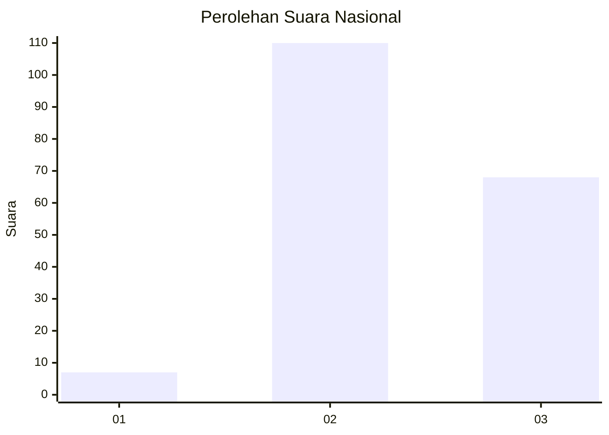
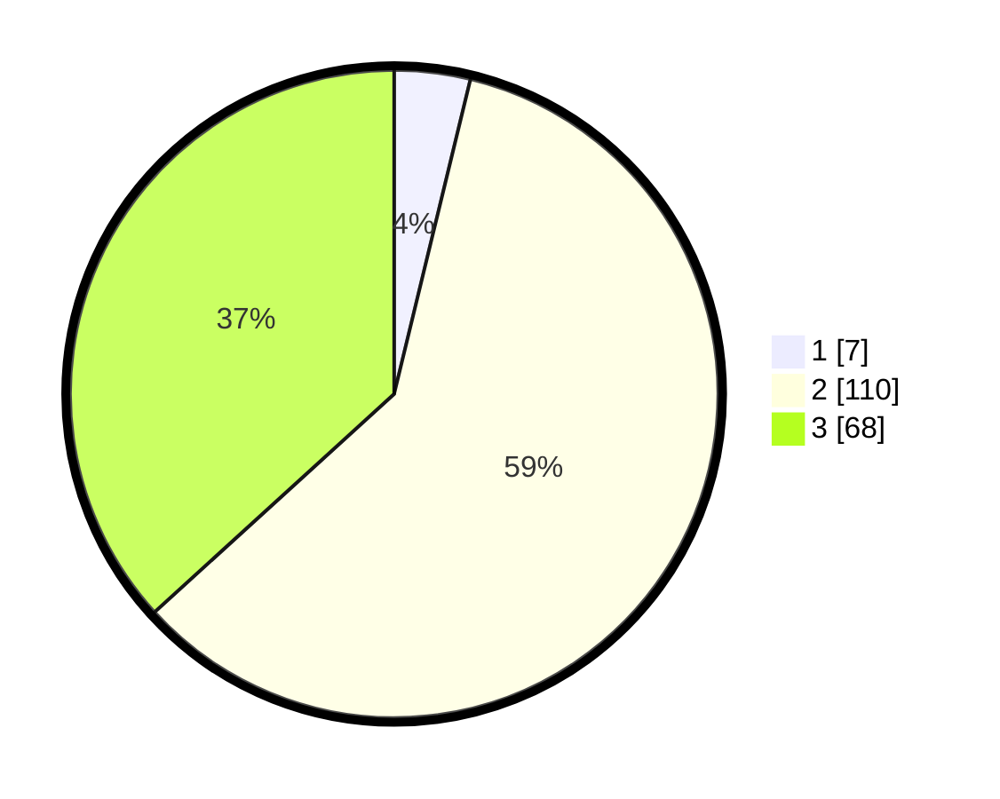

# Hasil

## Grafik

## Tabel

| No. | Nama Paslon    | Suara | Suara (raw) | Persentase |
|:--- |:-------------- | -----:| -----------:| ----------:|
| 1   | ANIES MUHAIMIN | 7     | [7][p-1]    | 3,78       |
| 2   | PRABOWO GIBRAN | 110   | [110][p-2]  | 59,46      |
| 3   | GANJAR MAHFUD  | 68    | [68][p-3]   | 36,76      |

[p-1]: https://github.com/gigit-pemilu/pemilu-2024/blob/main/pilpres/hitung-suara/sub/51-bali/sub/08-buleleng/sub/02-seririt/sub/2011-tangguwisia/sub/005-tps/sub/paslon-1.txt
[p-2]: https://github.com/gigit-pemilu/pemilu-2024/blob/main/pilpres/hitung-suara/sub/51-bali/sub/08-buleleng/sub/02-seririt/sub/2011-tangguwisia/sub/005-tps/sub/paslon-2.txt
[p-3]: https://github.com/gigit-pemilu/pemilu-2024/blob/main/pilpres/hitung-suara/sub/51-bali/sub/08-buleleng/sub/02-seririt/sub/2011-tangguwisia/sub/005-tps/sub/paslon-3.txt

## Foto C Plano

https://sirekap-obj-formc.kpu.go.id/b92c/pemilu/ppwp/51/08/02/20/11/5108022011005-20240215-014121--2c0145cd-569b-450f-a746-e1c5e61d7542.jpg

https://sirekap-obj-formc.kpu.go.id/b92c/pemilu/ppwp/51/08/02/20/11/5108022011005-20240215-014657--1f9d4975-de81-4511-b728-8fc6faa7b675.jpg

## Metadata

| Key        | Value               |
| ---------- | ------------------- |
| Time Stamp | 2024-02-24 22:31:28 |

