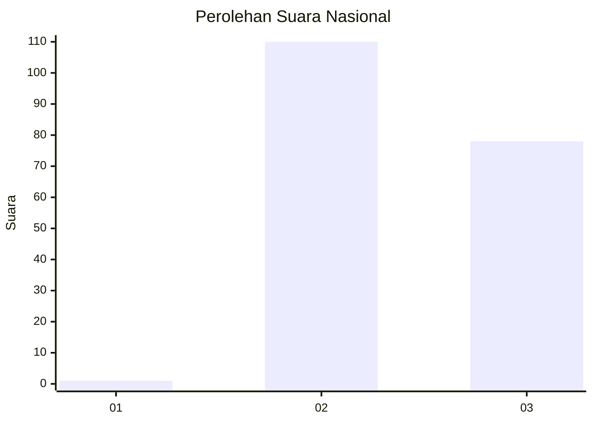
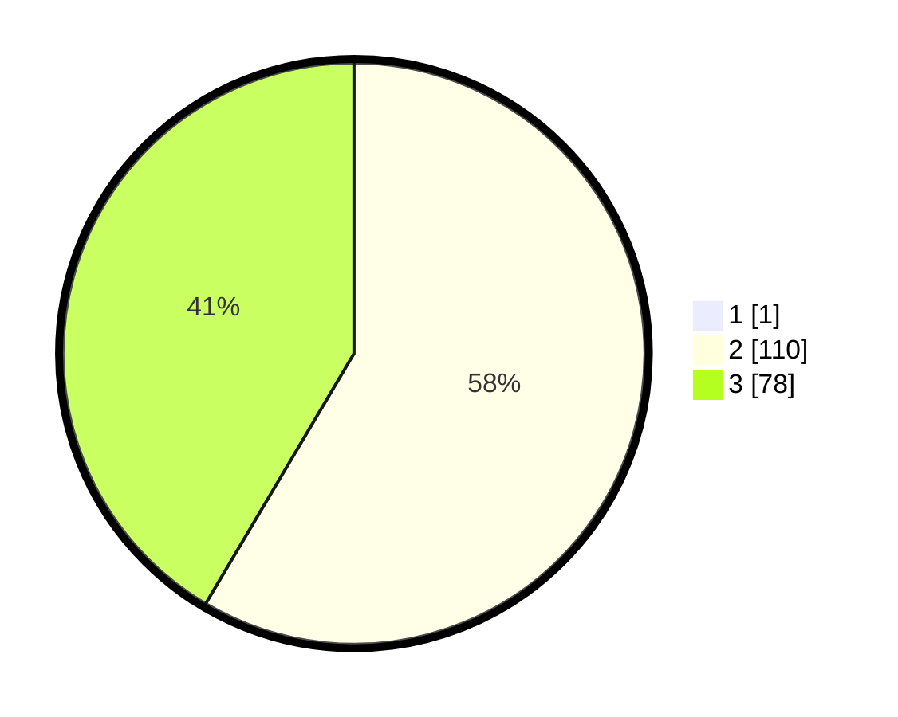

# Hasil

## Grafik

## Tabel

| No. | Nama Paslon    | Suara | Suara (raw) | Persentase |
|:--- |:-------------- | -----:| -----------:| ----------:|
| 1   | ANIES MUHAIMIN | 1     | [1][p-1]    | 0,53       |
| 2   | PRABOWO GIBRAN | 110   | [110][p-2]  | 58,20      |
| 3   | GANJAR MAHFUD  | 78    | [78][p-3]   | 41,27      |

[p-1]: https://github.com/gigit-pemilu/pemilu-2024/blob/main/pilpres/hitung-suara/sub/51-bali/sub/08-buleleng/sub/02-seririt/sub/2011-tangguwisia/sub/008-tps/sub/paslon-1.txt
[p-2]: https://github.com/gigit-pemilu/pemilu-2024/blob/main/pilpres/hitung-suara/sub/51-bali/sub/08-buleleng/sub/02-seririt/sub/2011-tangguwisia/sub/008-tps/sub/paslon-2.txt
[p-3]: https://github.com/gigit-pemilu/pemilu-2024/blob/main/pilpres/hitung-suara/sub/51-bali/sub/08-buleleng/sub/02-seririt/sub/2011-tangguwisia/sub/008-tps/sub/paslon-3.txt

## Foto C Plano

https://sirekap-obj-formc.kpu.go.id/ecdd/pemilu/ppwp/51/08/02/20/11/5108022011008-20240215-074826--1025250f-5326-41dc-aa24-4a7e4f7bd74d.jpg

https://sirekap-obj-formc.kpu.go.id/ecdd/pemilu/ppwp/51/08/02/20/11/5108022011008-20240215-074833--97c37a38-bf83-456a-81f3-7f864cdc2e3d.jpg

## Metadata

| Key        | Value               |
| ---------- | ------------------- |
| Time Stamp | 2024-02-24 22:31:28 |

