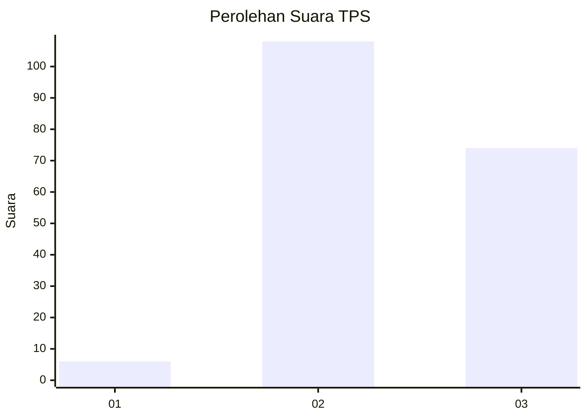
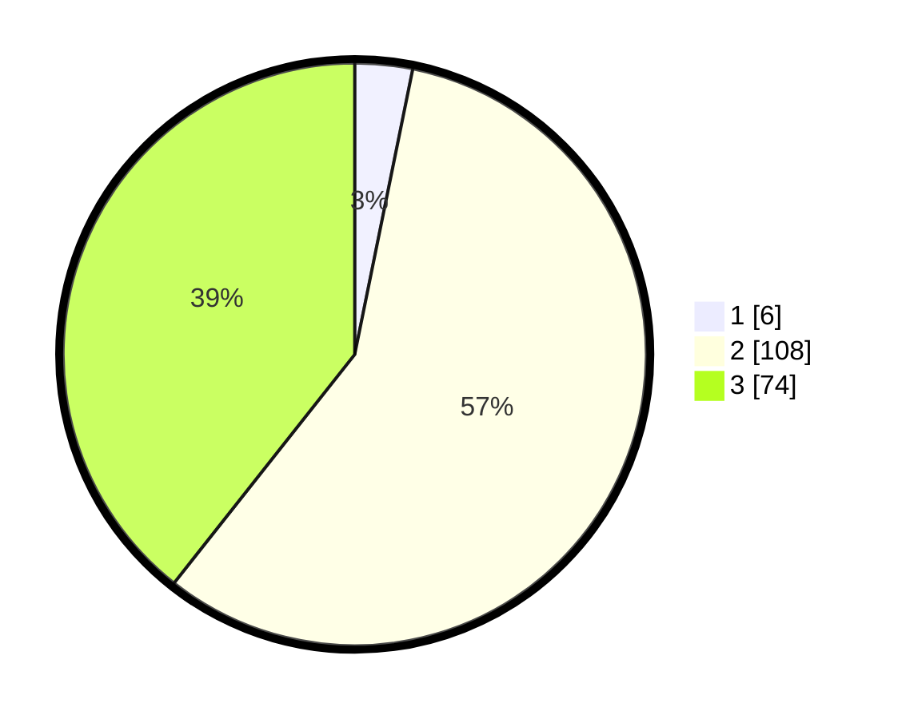

# Hasil

## Grafik

## Tabel

| No. | Nama Paslon    | Suara | Suara (raw) | Persentase |
|:--- |:-------------- | -----:| -----------:| ----------:|
| 1   | ANIES MUHAIMIN | 6     | [6][p-1]    | 3,19       |
| 2   | PRABOWO GIBRAN | 108   | [108][p-2]  | 57,45      |
| 3   | GANJAR MAHFUD  | 74    | [74][p-3]   | 39,36      |

[p-1]: https://github.com/gigit-pemilu/pemilu-2024-51-bali/blob/main/pilpres/hitung-suara/sub/51-bali/sub/08-buleleng/sub/02-seririt/sub/2012-sulanyah/sub/001-tps/sub/paslon-1.txt
[p-2]: https://github.com/gigit-pemilu/pemilu-2024-51-bali/blob/main/pilpres/hitung-suara/sub/51-bali/sub/08-buleleng/sub/02-seririt/sub/2012-sulanyah/sub/001-tps/sub/paslon-2.txt
[p-3]: https://github.com/gigit-pemilu/pemilu-2024-51-bali/blob/main/pilpres/hitung-suara/sub/51-bali/sub/08-buleleng/sub/02-seririt/sub/2012-sulanyah/sub/001-tps/sub/paslon-3.txt

## Foto C Plano

https://sirekap-obj-formc.kpu.go.id/c80b/pemilu/ppwp/51/08/02/20/12/5108022012001-20240214-210446--52b34a9d-51bb-4f19-bf60-eb548e1ef6f3.jpg

https://sirekap-obj-formc.kpu.go.id/c80b/pemilu/ppwp/51/08/02/20/12/5108022012001-20240214-210527--cb68b91d-fdc4-47ef-bc8c-179b2ff8def0.jpg

https://sirekap-obj-formc.kpu.go.id/c80b/pemilu/ppwp/51/08/02/20/12/5108022012001-20240214-210609--154d4f74-d51e-4f6f-ae58-47bee57c4ca8.jpg

## Metadata

| Key        | Value               |
| ---------- | ------------------- |
| Time Stamp | 2024-02-15 00:41:44 |

## DATA PEMILIH TETAP

Jumlah pemilih dalam DPT: **261**.
 * L: **125**.
 * P: **136**.

## DATA PENGGUNA HAK PILIH

Jumlah pengguna hak pilih dalam DPT: **189**.
 * L: **95**.
 * P: **94**.

Jumlah pengguna hak pilih dalam DPTb: **2**.
 * L: **1**.
 * P: **1**.

Jumlah pengguna hak pilih dalam DPK: **0**.
 * L: **0**.
 * P: **0**.

Jumlah pengguna hak pilih: **191**.
 * L: **96**.
 * P: **95**.

## JUMLAH SUARA SAH DAN TIDAK SAH

JUMLAH SELURUH SUARA SAH: **188**.

JUMLAH SUARA TIDAK SAH: **3**.

JUMLAH SELURUH SUARA SAH DAN SUARA TIDAK SAH: **191**.

