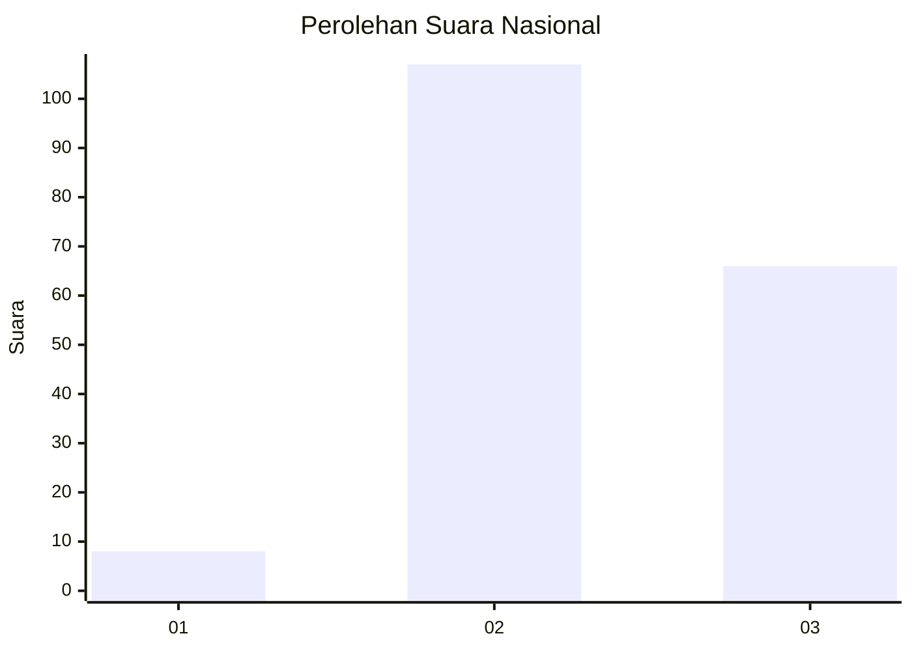
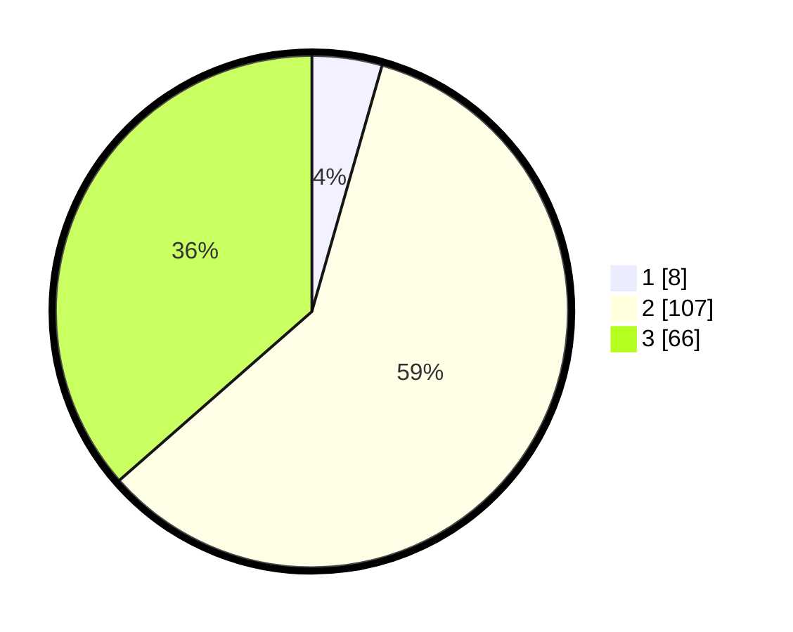

# Hasil

## Grafik

## Tabel

| No. | Nama Paslon    | Suara | Suara (raw) | Persentase |
|:--- |:-------------- | -----:| -----------:| ----------:|
| 1   | ANIES MUHAIMIN | 8     | [8][p-1]    | 4,42       |
| 2   | PRABOWO GIBRAN | 107   | [107][p-2]  | 59,12      |
| 3   | GANJAR MAHFUD  | 66    | [66][p-3]   | 36,46      |

[p-1]: https://github.com/gigit-pemilu/pemilu-2024/blob/main/pilpres/hitung-suara/sub/51-bali/sub/08-buleleng/sub/02-seririt/sub/2012-sulanyah/sub/002-tps/sub/paslon-1.txt
[p-2]: https://github.com/gigit-pemilu/pemilu-2024/blob/main/pilpres/hitung-suara/sub/51-bali/sub/08-buleleng/sub/02-seririt/sub/2012-sulanyah/sub/002-tps/sub/paslon-2.txt
[p-3]: https://github.com/gigit-pemilu/pemilu-2024/blob/main/pilpres/hitung-suara/sub/51-bali/sub/08-buleleng/sub/02-seririt/sub/2012-sulanyah/sub/002-tps/sub/paslon-3.txt

## Foto C Plano

https://sirekap-obj-formc.kpu.go.id/5dc3/pemilu/ppwp/51/08/02/20/12/5108022012002-20240214-221809--2e6ae8b1-7bd8-4819-8579-be6a7175109d.jpg

https://sirekap-obj-formc.kpu.go.id/5dc3/pemilu/ppwp/51/08/02/20/12/5108022012002-20240214-221831--926f6973-7e0f-4af6-b3df-f4a018e35369.jpg

https://sirekap-obj-formc.kpu.go.id/5dc3/pemilu/ppwp/51/08/02/20/12/5108022012002-20240214-221836--5ecc232f-1c64-4b55-914f-bb6709db20f8.jpg

## Metadata

| Key        | Value               |
| ---------- | ------------------- |
| Time Stamp | 2024-02-25 17:00:00 |

