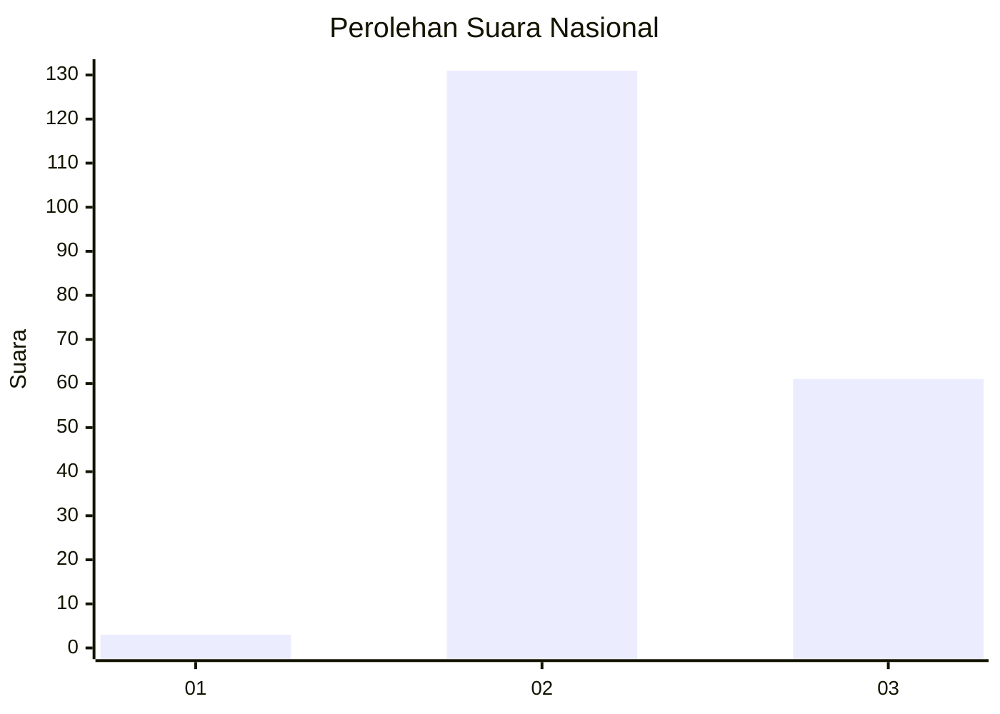
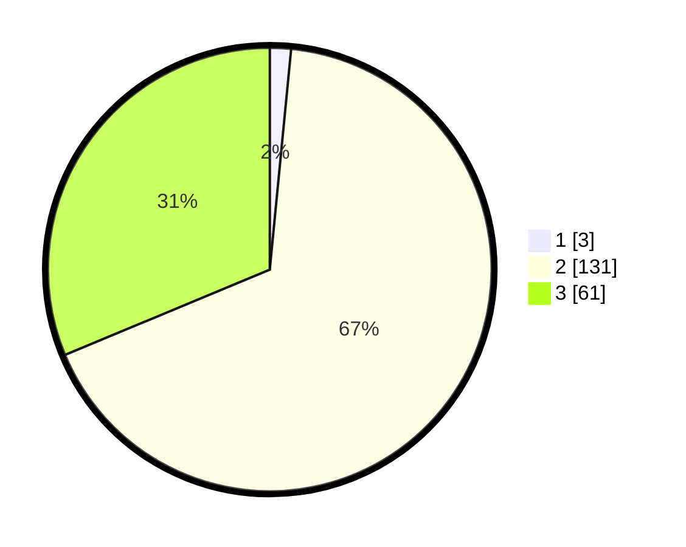

# Hasil

## Grafik

## Tabel

| No. | Nama Paslon    | Suara | Suara (raw) | Persentase |
|:--- |:-------------- | -----:| -----------:| ----------:|
| 1   | ANIES MUHAIMIN | 3     | [3][p-1]    | 1,54       |
| 2   | PRABOWO GIBRAN | 131   | [131][p-2]  | 67,18      |
| 3   | GANJAR MAHFUD  | 61    | [61][p-3]   | 31,28      |

[p-1]: https://github.com/gigit-pemilu/pemilu-2024/blob/main/pilpres/hitung-suara/sub/51-bali/sub/08-buleleng/sub/02-seririt/sub/2012-sulanyah/sub/003-tps/sub/paslon-1.txt
[p-2]: https://github.com/gigit-pemilu/pemilu-2024/blob/main/pilpres/hitung-suara/sub/51-bali/sub/08-buleleng/sub/02-seririt/sub/2012-sulanyah/sub/003-tps/sub/paslon-2.txt
[p-3]: https://github.com/gigit-pemilu/pemilu-2024/blob/main/pilpres/hitung-suara/sub/51-bali/sub/08-buleleng/sub/02-seririt/sub/2012-sulanyah/sub/003-tps/sub/paslon-3.txt

## Foto C Plano

https://sirekap-obj-formc.kpu.go.id/2206/pemilu/ppwp/51/08/02/20/12/5108022012003-20240214-235504--db9fe1fb-1a9e-44ac-aae6-5eeefebad335.jpg

https://sirekap-obj-formc.kpu.go.id/2206/pemilu/ppwp/51/08/02/20/12/5108022012003-20240214-235756--81cb5e79-8d4f-4fff-a6ce-0114cd2f3cdf.jpg

https://sirekap-obj-formc.kpu.go.id/2206/pemilu/ppwp/51/08/02/20/12/5108022012003-20240214-225521--f6d5e73b-2113-4891-a953-cdd65aa50357.jpg

## Metadata

| Key        | Value               |
| ---------- | ------------------- |
| Time Stamp | 2024-02-26 11:00:00 |

