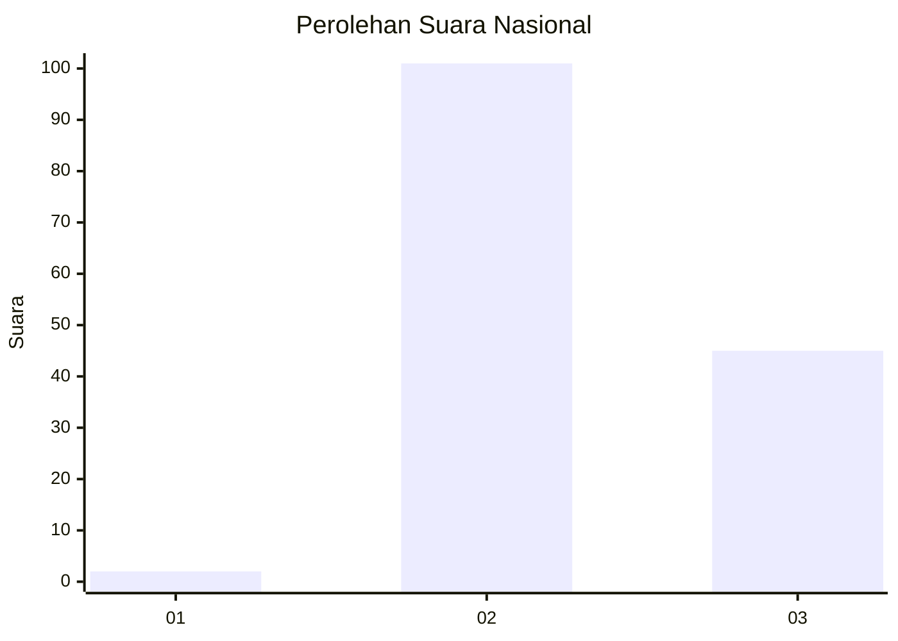

# Hasil

## Grafik

## Tabel

| No. | Nama Paslon    | Suara | Suara (raw) | Persentase |
|:--- |:-------------- | -----:| -----------:| ----------:|
| 1   | ANIES MUHAIMIN | 2     | [2][p-1]    | 1,35       |
| 2   | PRABOWO GIBRAN | 101   | [101][p-2]  | 68,24      |
| 3   | GANJAR MAHFUD  | 45    | [45][p-3]   | 30,41      |

[p-1]: https://github.com/gigit-pemilu/pemilu-2024/blob/main/pilpres/hitung-suara/sub/51-bali/sub/08-buleleng/sub/02-seririt/sub/2012-sulanyah/sub/006-tps/sub/paslon-1.txt
[p-2]: https://github.com/gigit-pemilu/pemilu-2024/blob/main/pilpres/hitung-suara/sub/51-bali/sub/08-buleleng/sub/02-seririt/sub/2012-sulanyah/sub/006-tps/sub/paslon-2.txt
[p-3]: https://github.com/gigit-pemilu/pemilu-2024/blob/main/pilpres/hitung-suara/sub/51-bali/sub/08-buleleng/sub/02-seririt/sub/2012-sulanyah/sub/006-tps/sub/paslon-3.txt

## Foto C Plano

https://sirekap-obj-formc.kpu.go.id/2ef4/pemilu/ppwp/51/08/02/20/12/5108022012006-20240214-233515--4ab91149-1a12-4dde-97bf-04726a1041d0.jpg

https://sirekap-obj-formc.kpu.go.id/2ef4/pemilu/ppwp/51/08/02/20/12/5108022012006-20240214-233717--db2b90b2-4259-462f-83eb-424fd30c90fa.jpg

https://sirekap-obj-formc.kpu.go.id/2ef4/pemilu/ppwp/51/08/02/20/12/5108022012006-20240214-233831--f4209af3-72b1-48ec-b637-b67ddf8fc325.jpg

## Metadata

| Key        | Value               |
| ---------- | ------------------- |
| Time Stamp | 2024-02-24 22:31:28 |

