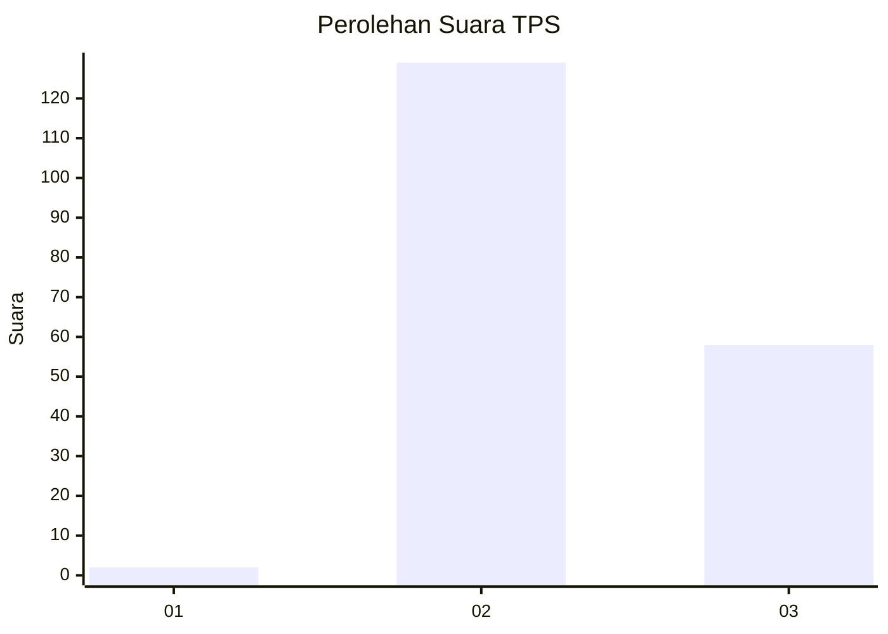
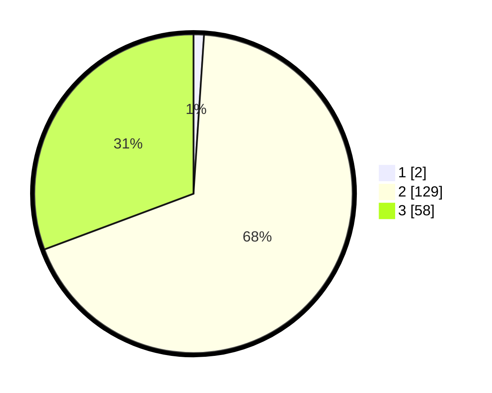

# Hasil

## Grafik

## Tabel

| No. | Nama Paslon    | Suara | Suara (raw) | Persentase |
|:--- |:-------------- | -----:| -----------:| ----------:|
| 1   | ANIES MUHAIMIN | 2     | [2][p-1]    | 1,06       |
| 2   | PRABOWO GIBRAN | 129   | [129][p-2]  | 68,25      |
| 3   | GANJAR MAHFUD  | 58    | [58][p-3]   | 30,69      |

[p-1]: https://github.com/gigit-pemilu/pemilu-2024-51-bali/blob/main/pilpres/hitung-suara/sub/51-bali/sub/08-buleleng/sub/02-seririt/sub/2013-bubunan/sub/002-tps/sub/paslon-1.txt
[p-2]: https://github.com/gigit-pemilu/pemilu-2024-51-bali/blob/main/pilpres/hitung-suara/sub/51-bali/sub/08-buleleng/sub/02-seririt/sub/2013-bubunan/sub/002-tps/sub/paslon-2.txt
[p-3]: https://github.com/gigit-pemilu/pemilu-2024-51-bali/blob/main/pilpres/hitung-suara/sub/51-bali/sub/08-buleleng/sub/02-seririt/sub/2013-bubunan/sub/002-tps/sub/paslon-3.txt

## Foto C Plano

https://sirekap-obj-formc.kpu.go.id/eb11/pemilu/ppwp/51/08/02/20/13/5108022013002-20240215-005827--21d73858-2bfc-4e16-a48a-566caeff7976.jpg

https://sirekap-obj-formc.kpu.go.id/eb11/pemilu/ppwp/51/08/02/20/13/5108022013002-20240215-010138--23cc7957-664c-4f7a-b281-94ddd5091d7f.jpg

https://sirekap-obj-formc.kpu.go.id/eb11/pemilu/ppwp/51/08/02/20/13/5108022013002-20240215-010239--04992764-ee05-44b3-b8fd-7c96fe8616df.jpg

## Metadata

| Key        | Value               |
| ---------- | ------------------- |
| Time Stamp | 2024-02-24 22:31:28 |

