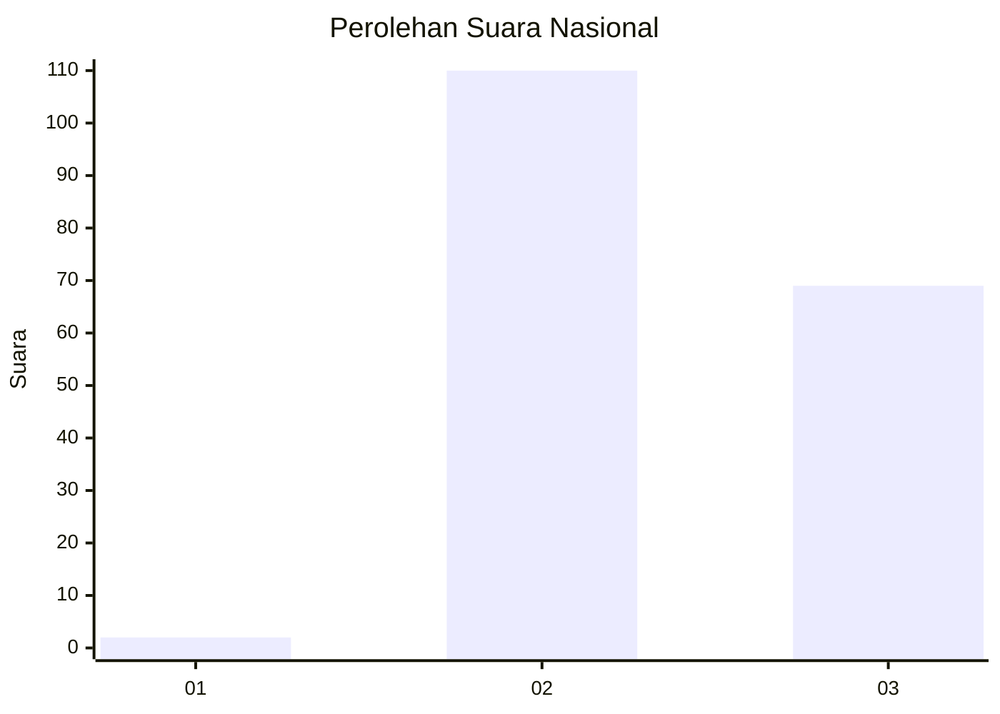
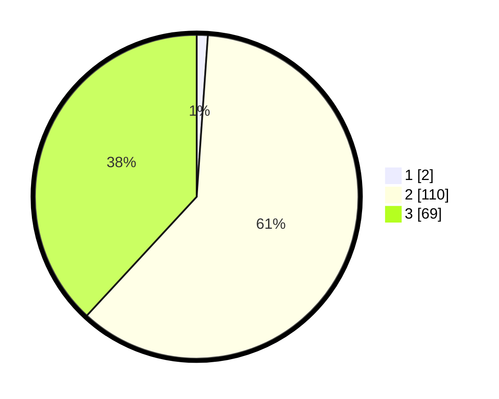

# Hasil

## Grafik

## Tabel

| No. | Nama Paslon    | Suara | Suara (raw) | Persentase |
|:--- |:-------------- | -----:| -----------:| ----------:|
| 1   | ANIES MUHAIMIN | 2     | [2][p-1]    | 1,10       |
| 2   | PRABOWO GIBRAN | 110   | [110][p-2]  | 60,77      |
| 3   | GANJAR MAHFUD  | 69    | [69][p-3]   | 38,12      |

[p-1]: https://github.com/gigit-pemilu/pemilu-2024/blob/main/pilpres/hitung-suara/sub/51-bali/sub/08-buleleng/sub/02-seririt/sub/2013-bubunan/sub/004-tps/sub/paslon-1.txt
[p-2]: https://github.com/gigit-pemilu/pemilu-2024/blob/main/pilpres/hitung-suara/sub/51-bali/sub/08-buleleng/sub/02-seririt/sub/2013-bubunan/sub/004-tps/sub/paslon-2.txt
[p-3]: https://github.com/gigit-pemilu/pemilu-2024/blob/main/pilpres/hitung-suara/sub/51-bali/sub/08-buleleng/sub/02-seririt/sub/2013-bubunan/sub/004-tps/sub/paslon-3.txt

## Foto C Plano

https://sirekap-obj-formc.kpu.go.id/7238/pemilu/ppwp/51/08/02/20/13/5108022013004-20240214-233207--cd40b5c3-b4d5-4ab1-958b-4efbd9b90835.jpg

https://sirekap-obj-formc.kpu.go.id/7238/pemilu/ppwp/51/08/02/20/13/5108022013004-20240214-233509--75e43ea2-001b-4d3b-9678-45aa30c61e5d.jpg

https://sirekap-obj-formc.kpu.go.id/7238/pemilu/ppwp/51/08/02/20/13/5108022013004-20240214-233515--b07c7679-42b5-4282-bdfc-b618935e2eff.jpg

## Metadata

| Key        | Value               |
| ---------- | ------------------- |
| Time Stamp | 2024-02-24 22:31:28 |

