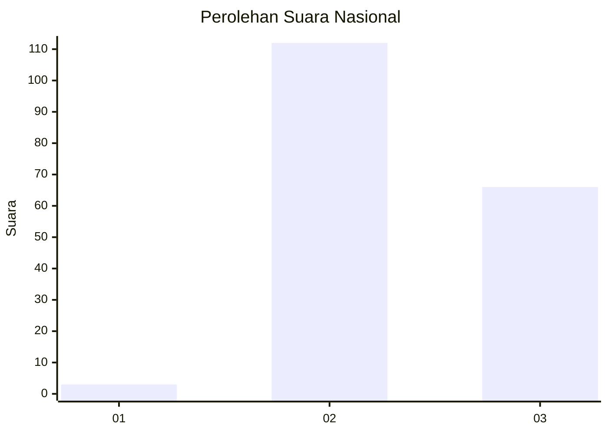
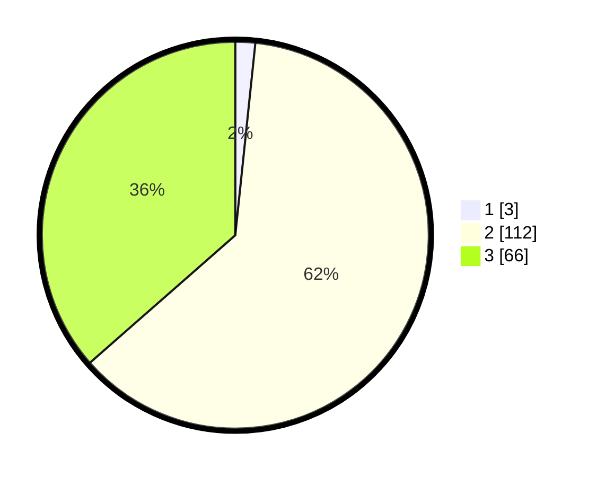

# Hasil

## Grafik

## Tabel

| No. | Nama Paslon    | Suara | Suara (raw) | Persentase |
|:--- |:-------------- | -----:| -----------:| ----------:|
| 1   | ANIES MUHAIMIN | 3     | [3][p-1]    | 1,66       |
| 2   | PRABOWO GIBRAN | 112   | [112][p-2]  | 61,88      |
| 3   | GANJAR MAHFUD  | 66    | [66][p-3]   | 36,46      |

[p-1]: https://github.com/gigit-pemilu/pemilu-2024/blob/main/pilpres/hitung-suara/sub/51-bali/sub/08-buleleng/sub/02-seririt/sub/2013-bubunan/sub/005-tps/sub/paslon-1.txt
[p-2]: https://github.com/gigit-pemilu/pemilu-2024/blob/main/pilpres/hitung-suara/sub/51-bali/sub/08-buleleng/sub/02-seririt/sub/2013-bubunan/sub/005-tps/sub/paslon-2.txt
[p-3]: https://github.com/gigit-pemilu/pemilu-2024/blob/main/pilpres/hitung-suara/sub/51-bali/sub/08-buleleng/sub/02-seririt/sub/2013-bubunan/sub/005-tps/sub/paslon-3.txt

## Foto C Plano

https://sirekap-obj-formc.kpu.go.id/c1b5/pemilu/ppwp/51/08/02/20/13/5108022013005-20240214-133417--74b62d43-9bb2-45a7-a0d9-0f2f26fc2adf.jpg

https://sirekap-obj-formc.kpu.go.id/c1b5/pemilu/ppwp/51/08/02/20/13/5108022013005-20240214-131941--dab58fb9-bbab-4cb8-bb47-2bca272df37c.jpg

## Metadata

| Key        | Value               |
| ---------- | ------------------- |
| Time Stamp | 2024-02-15 07:00:44 |

