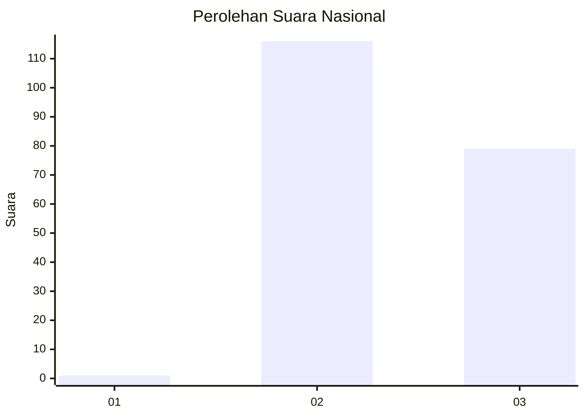
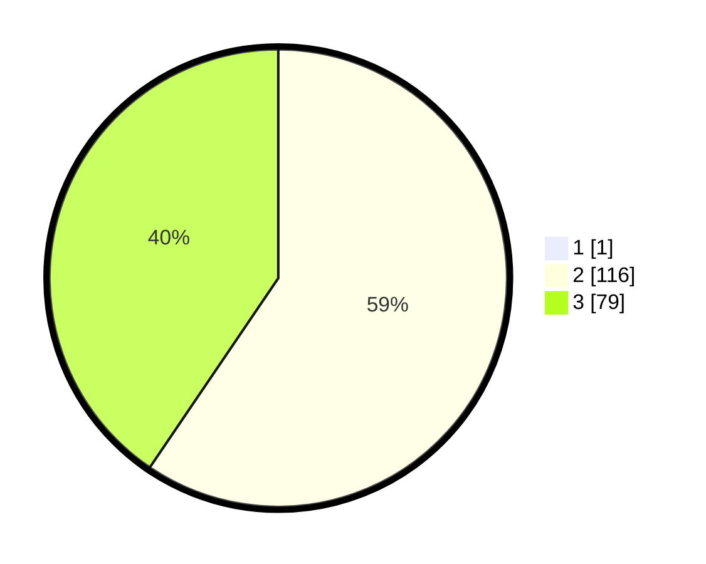

# Hasil

## Grafik

## Tabel

| No. | Nama Paslon    | Suara | Suara (raw) | Persentase |
|:--- |:-------------- | -----:| -----------:| ----------:|
| 1   | ANIES MUHAIMIN | 1     | [1][p-1]    | 0,51       |
| 2   | PRABOWO GIBRAN | 116   | [116][p-2]  | 59,18      |
| 3   | GANJAR MAHFUD  | 79    | [79][p-3]   | 40,31      |

[p-1]: https://github.com/gigit-pemilu/pemilu-2024/blob/main/pilpres/hitung-suara/sub/51-bali/sub/08-buleleng/sub/02-seririt/sub/2013-bubunan/sub/009-tps/sub/paslon-1.txt
[p-2]: https://github.com/gigit-pemilu/pemilu-2024/blob/main/pilpres/hitung-suara/sub/51-bali/sub/08-buleleng/sub/02-seririt/sub/2013-bubunan/sub/009-tps/sub/paslon-2.txt
[p-3]: https://github.com/gigit-pemilu/pemilu-2024/blob/main/pilpres/hitung-suara/sub/51-bali/sub/08-buleleng/sub/02-seririt/sub/2013-bubunan/sub/009-tps/sub/paslon-3.txt

## Foto C Plano

https://sirekap-obj-formc.kpu.go.id/b338/pemilu/ppwp/51/08/02/20/13/5108022013009-20240215-005146--232faf95-ab13-40fa-b50a-3466249e9f34.jpg

https://sirekap-obj-formc.kpu.go.id/b338/pemilu/ppwp/51/08/02/20/13/5108022013009-20240215-005408--0f79aa46-d7f1-4488-b58a-16afca9d271e.jpg

https://sirekap-obj-formc.kpu.go.id/b338/pemilu/ppwp/51/08/02/20/13/5108022013009-20240215-005633--d94586fb-b05f-4cc3-8a94-5f1959a6ef07.jpg

## Metadata

| Key        | Value               |
| ---------- | ------------------- |
| Time Stamp | 2024-02-24 22:31:28 |

