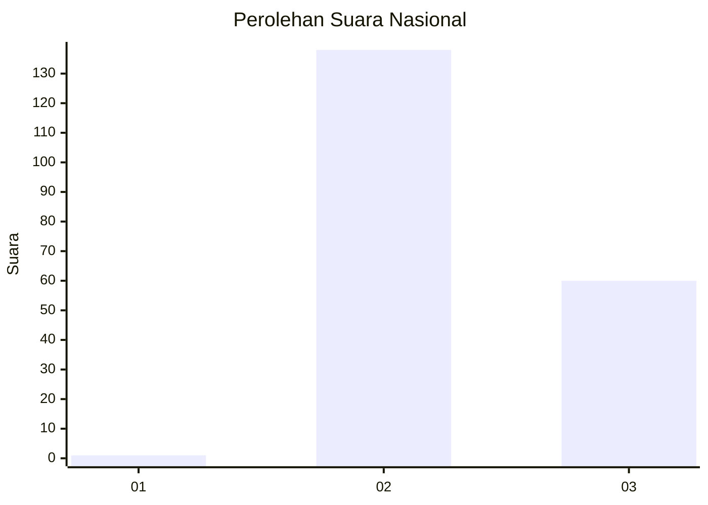
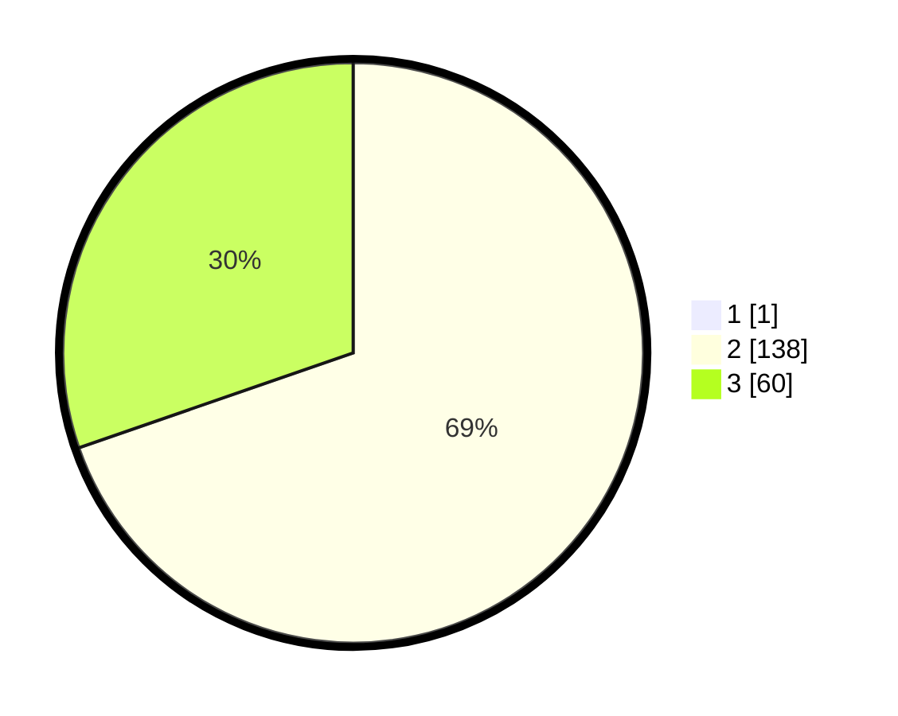

# Hasil

## Grafik

## Tabel

| No. | Nama Paslon    | Suara | Suara (raw) | Persentase |
|:--- |:-------------- | -----:| -----------:| ----------:|
| 1   | ANIES MUHAIMIN | 1     | [1][p-1]    | 0,50       |
| 2   | PRABOWO GIBRAN | 138   | [138][p-2]  | 69,35      |
| 3   | GANJAR MAHFUD  | 60    | [60][p-3]   | 30,15      |

[p-1]: https://github.com/gigit-pemilu/pemilu-2024/blob/main/pilpres/hitung-suara/sub/51-bali/sub/08-buleleng/sub/02-seririt/sub/2013-bubunan/sub/011-tps/sub/paslon-1.txt
[p-2]: https://github.com/gigit-pemilu/pemilu-2024/blob/main/pilpres/hitung-suara/sub/51-bali/sub/08-buleleng/sub/02-seririt/sub/2013-bubunan/sub/011-tps/sub/paslon-2.txt
[p-3]: https://github.com/gigit-pemilu/pemilu-2024/blob/main/pilpres/hitung-suara/sub/51-bali/sub/08-buleleng/sub/02-seririt/sub/2013-bubunan/sub/011-tps/sub/paslon-3.txt

## Foto C Plano

https://sirekap-obj-formc.kpu.go.id/562d/pemilu/ppwp/51/08/02/20/13/5108022013011-20240214-233357--ba58549f-23b6-432a-a09b-07ca9035b697.jpg

https://sirekap-obj-formc.kpu.go.id/562d/pemilu/ppwp/51/08/02/20/13/5108022013011-20240214-233519--b92176b0-c816-4fd9-8e5b-3114e6d84a3a.jpg

https://sirekap-obj-formc.kpu.go.id/562d/pemilu/ppwp/51/08/02/20/13/5108022013011-20240214-233615--df443a90-9ba1-419c-ab77-834ad2bb7fcb.jpg

## Metadata

| Key        | Value               |
| ---------- | ------------------- |
| Time Stamp | 2024-02-24 22:31:28 |

