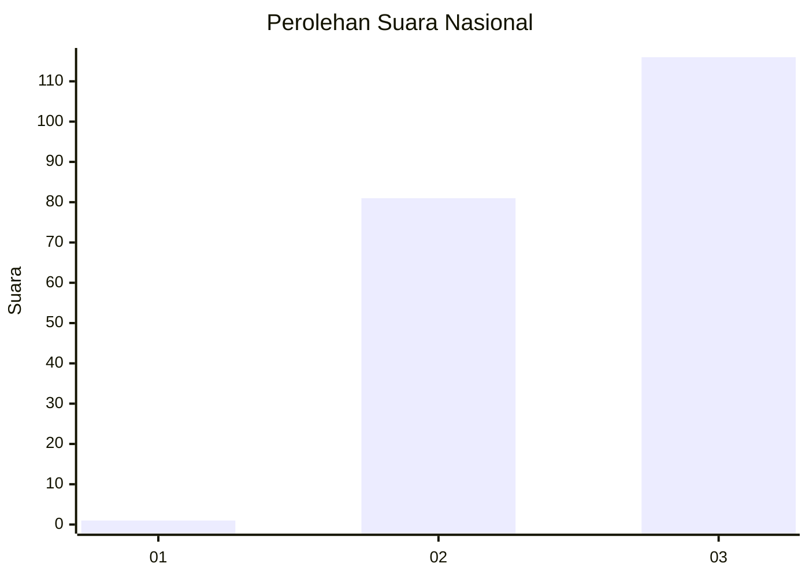
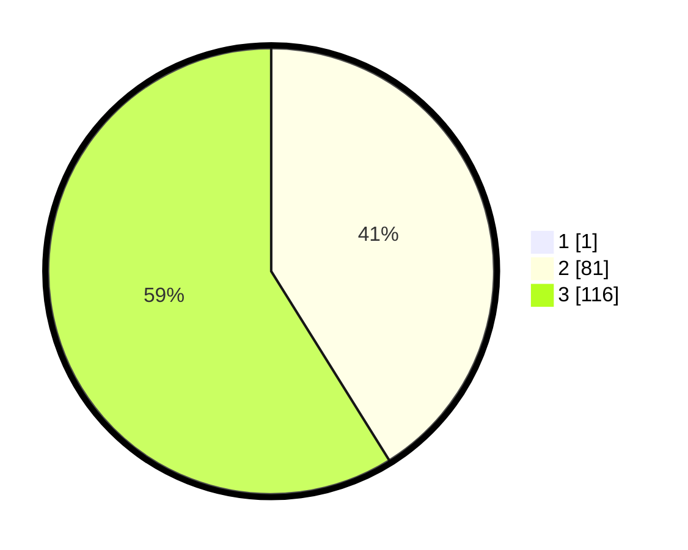

# Hasil

## Grafik

## Tabel

| No. | Nama Paslon    | Suara | Suara (raw) | Persentase |
|:--- |:-------------- | -----:| -----------:| ----------:|
| 1   | ANIES MUHAIMIN | 1     | [1][p-1]    | 0,51       |
| 2   | PRABOWO GIBRAN | 81    | [81][p-2]   | 40,91      |
| 3   | GANJAR MAHFUD  | 116   | [116][p-3]  | 58,59      |

[p-1]: https://github.com/gigit-pemilu/pemilu-2024/blob/main/pilpres/hitung-suara/sub/51-bali/sub/08-buleleng/sub/02-seririt/sub/2013-bubunan/sub/012-tps/sub/paslon-1.txt
[p-2]: https://github.com/gigit-pemilu/pemilu-2024/blob/main/pilpres/hitung-suara/sub/51-bali/sub/08-buleleng/sub/02-seririt/sub/2013-bubunan/sub/012-tps/sub/paslon-2.txt
[p-3]: https://github.com/gigit-pemilu/pemilu-2024/blob/main/pilpres/hitung-suara/sub/51-bali/sub/08-buleleng/sub/02-seririt/sub/2013-bubunan/sub/012-tps/sub/paslon-3.txt

## Foto C Plano

https://sirekap-obj-formc.kpu.go.id/9990/pemilu/ppwp/51/08/02/20/13/5108022013012-20240214-222733--43b55b52-d771-484b-9c89-607626ed9c62.jpg

https://sirekap-obj-formc.kpu.go.id/9990/pemilu/ppwp/51/08/02/20/13/5108022013012-20240214-221003--a1da7bfb-6451-4a3a-9fa3-dbcf6b51bdf1.jpg

https://sirekap-obj-formc.kpu.go.id/9990/pemilu/ppwp/51/08/02/20/13/5108022013012-20240214-221122--37b06474-2bbb-4d57-93ac-138efe6f9f52.jpg

## Metadata

| Key        | Value               |
| ---------- | ------------------- |
| Time Stamp | 2024-02-24 22:31:28 |

